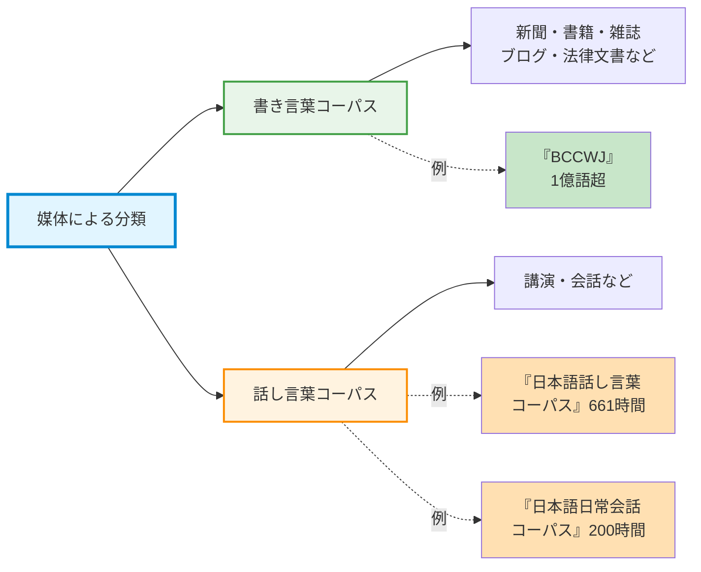
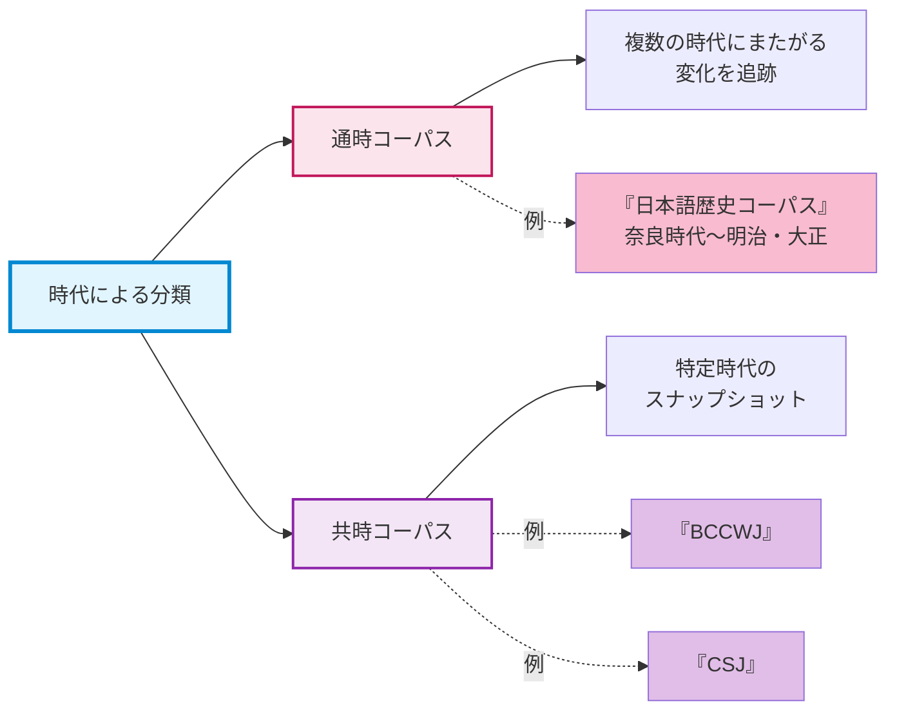
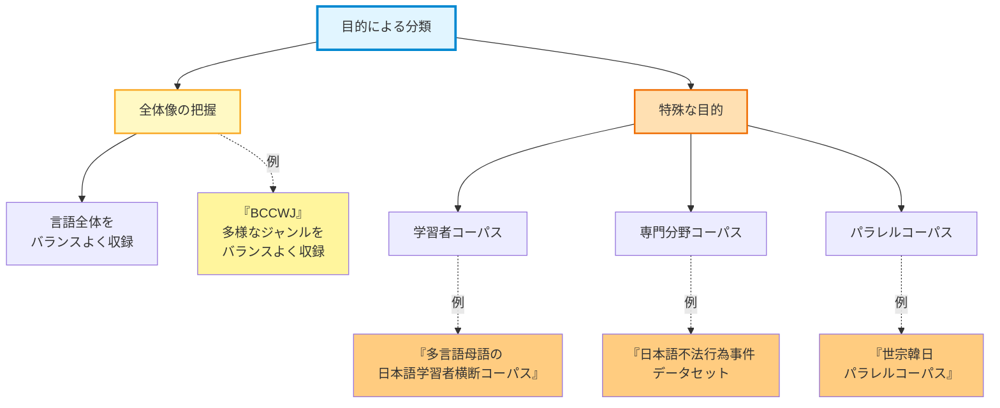
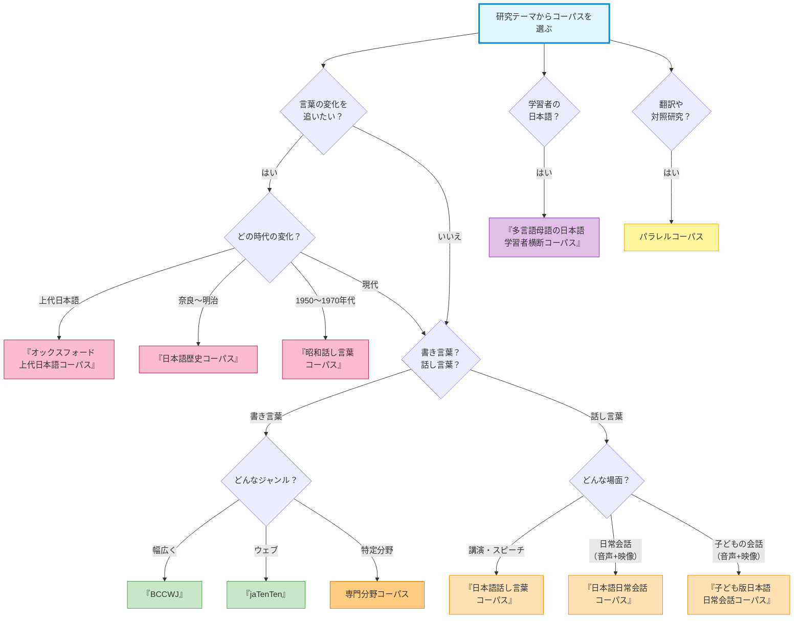

# コーパスの種類
## どんな「謎」を解きたいか？
[__1. 言語研究の技法__](01-language-research.md)で、私たちは「コーパス」という、言葉の謎を解き明かすための強力な探偵の道具を手に入れました。しかし、一口にコーパスと言っても、その種類は実に様々です。これは、冒険に出る際に、目的地に合わせて「世界地図」「登山マップ」「グルメガイド」といった異なる地図を使い分けるのに似ています。

もし、「昔と今で、言葉の使われ方はどう変わったんだろうか？」が気になるのであれば、時代の変化がわかる地図（コーパス）が必要。「日本語を学ぶ外国人は、どんな間違いをしやすいんだろう？」という疑問を調べたいのであれば、外国人が話したり、書いたりした日本語だけを集めた特殊な地図（コーパス）が役立つでしょう。また、「小説と新聞記事では、一文の長さに違いはあるのかな？」と思ったことがあれば、書き言葉を集めた地図（コーパス）を広げてみると、その違いがわかってくるかもしれません。

この章では、あなたが探求したい「問い」に応じて、最適なコーパスという「地図」を選び出すための知識を学びます。コーパスの様々な分類方法を知ることは、あなたの研究を成功に導くための、最も重要な第一歩になるでしょう。おいしいランチを食べたいのに、登山マップを広げていては、ランチにありつく確率は低い。登山マップではなく、グルメガイドを確認すべきです。

!!! Info "この章で学ぶこと"
- コーパスの基本的な分類軸（媒体、時代、目的など）を理解する。
- 具体的な日本語コーパスの例を知り、それぞれの特徴を説明できるようになる。
- 自分の研究テーマに最適なコーパスは何かを、判断できるようになる。

## 媒体の違い—書き言葉 vs 話し言葉
まず最も基本的なコーパスの分類は、「書かれた言葉」を集めたものか、「話された言葉」を集めたものか、という違いです。

### 書き言葉コーパス
新聞・書籍・雑誌・ブログ、さらには法律の条文まで、「書かれた言葉」の種類は豊富にあります。このような種類の言葉を集めたものが**書き言葉コーパス**です。

!!! note "日本語の書き言葉コーパスといえば『BCCWJ』"
    日本の書き言葉コーパスの代表格が、[__1. 言語研究の技法__](01-language-research.md)で取り上げた『BCCWJ』です。書籍・雑誌・新聞・ブログ・教科書など、様々なジャンルのテキストをバランス良く集めており、その規模は1億語以上。まさに現代日本語の縮図とも言えるコーパスで、多くの研究者に利用されています。[__1. 言語研究の技法__](01-language-research.md)で使ってみた少納言も、この『BCCWJ』を対象として検索しています。

書き言葉のコーパスを使えば、たとえば、「夏目漱石は『[吾輩は猫である](https://www.aozora.gr.jp/cards/000148/files/789_14547.html)』の中で『こと』と『もの』をどう使い分けていたか？」といった研究から、「最近のブログ記事で『マジ』という言葉はどんな言葉と結びつきやすいか？」といった現代語の分析まで、幅広い調査ができるでしょう。

!!! warning "コーパスには「賞味期限」がある？"
    「現代日本語」とはいつからいつまでを指しているのでしょうか。一つの考え方としては、戦後を基準にして現在までを現代日本語として捉えることができます。『BCCWJ』に入っている「現代語」は、時間の幅としては1976年から2005年までの約30年間となっています[@maekawa2011]。つまり、この文章を書いている2025年から約20年前の当時を基準とした日本語ということです。たとえば、みなさんの手元にある「スマホ」という語を『BCCWJ』で検索しても、用例は一つも出てこないでしょう。そのため、研究テーマによっては、より新しい言語資源（e.g. ブログ、SNSなど）を自分で集める必要があります（これについては[__8. 資料収集__](08-data-collection.md)で学びます）。

### 話し言葉コーパス
一方、日常の様々な場面における会話を録音した、巨大な音声アーカイブのようなものが、**話し言葉コーパス**です。書き言葉もそうですが、話し言葉も多種多様です。たとえば、友達との雑談、大学での講義や講演会のようなフォーマル度がやや高いスピーチもあれば、病院で交わす医師や看護師との会話などもあります。さらには、喧嘩の場面で交わされる話し言葉も考えられます。このような生の声を、コンピュータで検索できるように文字化（書き起こし）し、収録したものが、話し言葉コーパスです。

話し言葉には、「えーっと」「あのー」といったフィラー（言いよどみ）や、文の途中で言い直したり、相手の言葉に相槌を打ったりと、書き言葉には見られないような特徴がたくさん詰まっています。「会話を盛り上げる相槌にはどんなパターンがあるのか？」「プレゼンテーションが上手な人は、どんな言葉の選び方をしているのか？」といった問いを探求するには、話し言葉コーパスがいいかもしれません。

!!! note "日本語の話し言葉コーパス"
    日本語の話し言葉を、コーパスを利用して研究してみたいのであれば、国立国語研究所の『[**日本語話し言葉コーパス**](https://clrd.ninjal.ac.jp/csj/)』（Corpus of Spontaneous Japanese, **CSJ**）を確認してみるといいでしょう。学会講演や模擬講演を中心に、約661時間の話し言葉データが収録されています。話し言葉コーパスではあるものの、実際の音声もいっしょに聞くためには、[有償版](https://clrd.ninjal.ac.jp/csj/fee.html#:~:text=2021%E5%B9%B410%E6%9C%8801%E6%97%A5%E4%BB%A5%E9%99%8D%E3%81%AE%E5%88%A9%E7%94%A8%E8%A8%B1%E8%AB%BE%E6%96%99)を購入する必要があります。

## 時代の違い—通時コーパス vs 共時コーパス
次に重要な分類軸が「時間」です。ある一時点の言語を分析したいのか、それとも時代を通した言語の変化を追いたいのか。目的によって、使うべき地図も異なってきます。

### 通時コーパス
**通時コーパス**は、複数の時代にまたがる言語資料を集めた、歴史地図のようなものです。これを使えば、言葉が時代と共にどう生まれ、どう変化し、そして時には消えていったのか、そのダイナミックな変遷を追跡することができるでしょう。

!!! note "日本語の通時コーパス"
    国立国語研究所が公開している『[**日本語歴史コーパス**](https://clrd.ninjal.ac.jp/chj/)』（Corpus of Historical Japanese, **CHJ**）は、奈良時代から明治・大正時代までの日本語資料を網羅した通時コーパスです。時代劇で聞くような言葉遣いが、実際に当時どのように使われていたのかを、自分の手で調べることができます。明治・大正編の一部の資料は、音声を聞くこともできます。

たとえば、「『全然』は、昔は否定的な文脈でしか使われなかったのに、なぜ今は『全然あり』のように肯定的な意味でも使われるようになったのか？」という疑問は、通時コーパスを使うことで、その変化の過程をデータで追いかけることができるでしょう。

!!! warning "言語学ですか？全然面白いです。"
    「『全然』という言葉は否定表現と使わないといけないのに、最近は肯定表現とも使う」という、マスコミや学生のレポート、書籍などでよく取り上げられ、全然新鮮味がないこのネタ。この疑問については、国立国語研究所が運営している「[ことば研究館](https://kotobaken.jp/)」にも「[全然おいしい](https://kotobaken.jp/qa/yokuaru/qa-10/)」というタイトルの記事があります。
    
### 共時コーパス
**共時コーパス**は、ある特定の時代の言語スナップショットです。『BCCWJ』や『CSJ』は、主に2000年代初頭から2010年代にかけての「現代日本語」を切り取ったものなので、共時コーパスに分類されます。

なお、「通時」と「共時」にまたがるコーパスとして、『[昭和話し言葉コーパス](https://www2.ninjal.ac.jp/conversation/showaCorpus/)』があります。このコーパスには、「[1950年代から1970年代にかけて国立国語研究所で録音された音声資料](https://www2.ninjal.ac.jp/conversation/showaCorpus/#:~:text=1950%E5%B9%B4%E4%BB%A3%E3%81%8B%E3%82%891970%E5%B9%B4%E4%BB%A3%E3%81%AB%E3%81%8B%E3%81%91%E3%81%A6%E5%9B%BD%E7%AB%8B%E5%9B%BD%E8%AA%9E%E7%A0%94%E7%A9%B6%E6%89%80%E3%81%A7%E9%8C%B2%E9%9F%B3%E3%81%95%E3%82%8C%E3%81%9F%E9%9F%B3%E5%A3%B0%E8%B3%87%E6%96%99)」が含まれています。独話と会話からなる約44時間分のデータがあり、会話の中には、2025年現在から約70年前（1952年）の女子大生の雑談も収録されています。当時の大学生は、どういう雑談をしていたのでしょうか。旅行の話で盛り上がったりして（e.g. C52_09_CT）。

その他の例として、オックスフォード大学と国立国語研究所が構築した『[オックスフォード上代日本語コーパス](https://oncoj.ninjal.ac.jp/)』が挙げられます。古事記や万葉集などのテキストに形態論情報、構文解析情報などの注釈を付けています。

!!! example "上代日本語の紫"
    『[オックスフォード上代日本語コーパス](https://oncoj.ninjal.ac.jp/)』に接続して「username」と「password」を確認し、「[辞書](https://oncoj.orinst.ox.ac.uk/cgi-bin/oncoj_dictionary.sh)」ページに接続してみましょう。検索窓に「murasaki」を入力して検索すると、検索結果に「051539 (frequency 17)」と表示されます。「051539」をクリックしてみると、実際の用例を確認することができます。

## 目的の違い—何を知るための地図か？
これまで紹介してきたコーパス、特に『BCCWJ』は、どちらかというと日本語の全体像を知るためのコーパスと言えます。地図だったら、総合地図になるでしょう。しかし、もっと特別な目的を持った冒険者のための特殊な地図（e.g. 宝の地図）もあるでしょう。コーパスも、特定の「目的」に応じて作られることがあります。

### 学習者の足跡をたどる「学習者コーパス」
「日本語を学ぶ外国人は、どんな間違いをしやすいんだろう？」「英語を母語とする人と、中国語を母語とする人とでは、日本語の習得において違いがあるのだろうか？」

これらの問いを明らかにするための方法として、日本語の学習者が話したり書いたりした日本語を大量に集めて**学習者コーパス**を作ることが考えられます。

このコーパスを分析すると、学習者がどこで道に迷い（＝誤用し）、どんな新しいルートを開拓しようとしているのか（＝独自の表現）がわかるでしょう。これは、より効果的な日本語教育の方法を考えるとき、貴重な資料となります。

!!! note "外国人日本語学習者の日本語を集める"
    国立国語研究所が公開している『[**多言語母語の日本語学習者横断コーパス**](https://www2.ninjal.ac.jp/jll/lsaj/)』（International Corpus of Japanese as a Second Language, **I-JAS**）は、様々な母語を持つ日本語学習者の日本語を集めた学習者コーパスです。学習者の母語や日本語レベルといった情報も付与されているため、「〜語圏の初級学習者は、助詞『は』と『が』の使い分けで、このような間違いをしやすい」といった、分析が可能になるでしょう。現在は「[中納言](https://chunagon.ninjal.ac.jp/)」から利用できます。

### 特定の分野を探る「専門分野コーパス」
「法律の文章って、どうしてあんなに独特の言い回しが多いんだろう？」
「医学論文と新聞の科学記事では、同じ専門用語でも使われ方に違いはあるのか？」

このような特定の専門分野（法律、医療、IT、ビジネスなど）の言葉遣いに焦点を当てたい場合は、それぞれの分野の言葉を集めて専門分野コーパスを構築するといいでしょう。このようなコーパスを使うと、総合地図では省略されてしまうような細かな道や、その土地特有のルール（＝専門用語の使われ方や独特な文体）を、詳しく知ることができます。

2001年から2010年までの約10年間のケータイメイルからなっている『[加藤安彦ケータイメイルコーパス](https://www.gsk.or.jp/catalog/gsk2023-b)』や、⺠事事件判決書に基づいて構築された『[日本語不法行為事件データセット](https://www.gsk.or.jp/catalog/gsk2024-a)』などが挙げられます。このような特殊な目的で構築されたコーパスは、有償のものが多いです。

!!! warning "「均衡」と「専門」の間"
    『BCCWJ』のようなコーパスは、様々なジャンルを「バランス良く」集めているため、**均衡コーパス**（balanced corpus）と呼ばれます。それに対し、専門分野コーパスは、あえてそのバランスを崩し、特定のジャンルに的を絞っているのが特徴です。どちらが良い・悪いではなく、目的によって使い分けることが重要です。「均衡＝万能」でもなければ、**代表性**（representativeness）を崇拝することも、あまりいい姿勢ではありません。たとえば、均衡コーパスのデータにおいて書き手（もしくは話し手）の性比を揃えたとしても、聞き手とのバランスは揃えていないという点では、大きく不均衡になりえます。どちらか一方ではなく、どちらも使うという選択肢も考えられます。

### 二つの言語の架け橋となる「パラレルコーパス」
「『よろしくお願いします』って、英語ではどう訳すのが一番自然なんだろう？」「日本語の小説を英訳するときに、主語が補われる割合はどのくらいだろう？」

二つの異なる言語間の文法の違いや翻訳の研究などを目的で構築されるのが、原文とその翻訳からなるパラレルコーパスです（対訳コーパスとも）。パラレルコーパスは、語単位で揃えることもあれば、文単位を基準にすることもあります。このコーパスの例として、すでに[__1. 言語研究の技法__](01-language-research.md)で「[オンライン世宗韓日パラレルコーパス検索システム](http://corpus.mireene.com/nara.php)」を触ってみて確認しましたね。

翻訳作品を利用してパラレルコーパスを構築するときには、翻訳家の文体に依存することが多いという点に注意する必要があります。また、映画やドラマの字幕を利用してパラレルコーパスを構築するときには、字幕の文字数制限により、[簡潔な文になる](https://youtu.be/-FzDN86CskA?t=203)ことが多い点にも注意すべきです。

### 複数の事象を統合的に解析できる「マルチモーダル・コーパス」
マルチモーダル・コーパスを使うと「テキスト」はもちろん、「音声」に「映像」まで見聞きすることができます。このようなコーパスを使えば、発話者が具体的にどのような状況において特定の発話をしたのかを、映像を観察しながら分析することができるでしょう。言語要素だけでなく、ジェスチャーや表情といった非言語情報の分析にも使用することができます。

このコーパスの例としては、国立国語研究所の『[**日本語日常会話コーパス**](https://www2.ninjal.ac.jp/conversation/)』（Corpus of Everyday Japanese Conversation, **CEJC**）が挙げられます。同じく国立国語研究所で構築している『[子ども版日本語日常会話コーパス](https://www2.ninjal.ac.jp/conversation/cejc-childM.html)』（現在はモニター版公開中）も、音声と映像を含むマルチモーダル・コーパスの例です。

## その他のコーパス
### ウェブコーパス
ウェブ上の文書を収集して作ったコーパスのことです。文書の収集には、**クローラ**（crawler）と呼ばれるものが使われています。日本語の例としては、現在は個人としては利用ができないのですが、100億語規模の『[日本語ウェブコーパス](https://masayu-a.github.io/NWJC/)』があります（国立国語研究所と共同研究を申請する場合は利用可能）。

他の日本語のウェブコーパスの例として、「[Sketch Engine](https://www.sketchengine.eu/)」が提供している80億語規模の『jaTenTen』が挙げられます。有料サービスですが、「[30-day free trial](https://www.sketchengine.eu/price-list/)」を利用して試してみることができます。クレカの登録も必要ありません。

!!! note "検索エンジンとクローラ"
    Googleのような検索エンジンでは、クローラを利用して、ウェブサイトのコピーを自動的に収集しています。たとえば、私が作成した「[コーパスを使って韓国語の用例を検索してみる](https://korean-ehime-u.com/%E3%82%B3%E3%83%BC%E3%83%91%E3%82%B9%E3%82%92%E4%BD%BF%E3%81%A3%E3%81%A6%E9%9F%93%E5%9B%BD%E8%AA%9E%E3%81%AE%E7%94%A8%E4%BE%8B%E3%82%92%E6%A4%9C%E7%B4%A2%E3%81%97%E3%81%A6%E3%81%BF%E3%82%8B/)」というブログ記事は、[Googleで検索してみる](https://www.google.com/search?q=%22%E3%82%B3%E3%83%BC%E3%83%91%E3%82%B9%E3%82%92%E4%BD%BF%E3%81%A3%E3%81%A6%E9%9F%93%E5%9B%BD%E8%AA%9E%E3%81%AE%E7%94%A8%E4%BE%8B%E3%82%92%E6%A4%9C%E7%B4%A2%E3%81%97%E3%81%A6%E3%81%BF%E3%82%8B%22&oq=%22%E3%82%B3%E3%83%BC%E3%83%91%E3%82%B9%E3%82%92%E4%BD%BF%E3%81%A3%E3%81%A6%E9%9F%93%E5%9B%BD%E8%AA%9E%E3%81%AE%E7%94%A8%E4%BE%8B%E3%82%92%E6%A4%9C%E7%B4%A2%E3%81%97%E3%81%A6%E3%81%BF%E3%82%8B%22&gs_lcrp=EgZjaHJvbWUyBggAEEUYOdIBCDI4OTRqMGo0qAIAsAIB&sourceid=chrome&ie=UTF-8)と、キャッシュが保存されていることがわかります。最近は、生成AIの学習のために、ウェブ上の文書を収集するクローラも活発に働いています。

### 文法解析情報付きコーパス
文法解析情報付きコーパス『[かいのきツリーバンク](https://kainoki.github.io/front_page_j.html)』は、単なる文字列や品詞情報だけではなく、「第一目的語」「第二目的語」「場所」といった抽象的な概念や、句・節レベルで検索することができます。また、検索した語を含む文を、**樹形図**（tree diagram）とともに見ることもできます。樹形図は「語と語がどのような関係にあるのか」や「どのような構造をなしているのか」を視覚的にわかりやすく表します。

!!! example "検索パターンに基づく検索"
    『[かいのきツリーバンク](https://kainoki.github.io/front_page_j.html)に接続して「username」と「password」を確認し、「[検索インターフェース](https://oncoj.orinst.ox.ac.uk/cgi-bin/overview.sh?db=Kainoki)」にログインしてみましょう。「[TGrep2 search expression](https://oncoj.orinst.ox.ac.uk/cgi-bin/overview.sh?db=Kainoki#:~:text=TGrep2%20search%20expression:)」に[間接受動文](https://kainoki.github.io/invitation_j.html#:~:text=1.2%20%20%20%E9%96%93%E6%8E%A5%E5%8F%97%E5%8B%95%E6%96%87)を表すパターンをコピペして検索すると、間接受動文だけを取り出すことができます。

## 💻 やってみよう！
今まで作成したことがあるレポートのテーマや、今後、取り組んでみたいと思っている研究テーマは、どのようなコーパスと相性が良いのでしょうか。上で紹介したコーパスや、以下のウェブサイトに掲載されている色々な種類のコーパスを確認して、テーマに適していると思われるコーパスをいくつか選んでみましょう。

- [日本の言語資源・ツールのカタログ](https://www.jaist.ac.jp/project/NLP_Portal/doc/LR/lr-cat-j.html)
- [情報学研究データリポジトリ](https://www.nii.ac.jp/dsc/idr/datalist.html)
- [Digital Humanities Japan wiki](https://dhjapan.org/wiki/doku.php?id=datasets) 
- [GSK公開言語資源](https://www.gsk.or.jp/catalog/)

<iframe src="../../assets/viz/mkdocs_memo_widget.html" width="100%" height="380" frameborder="0" style="border: none; display: block;"></iframe>

