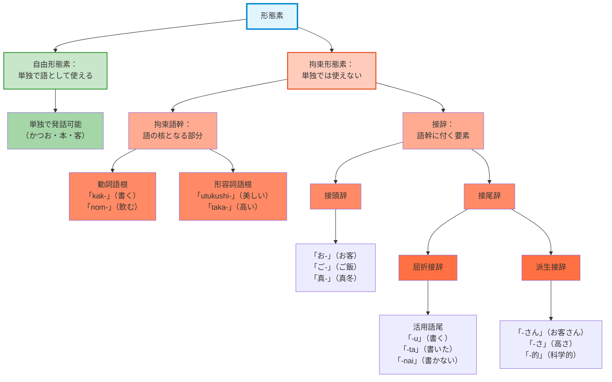
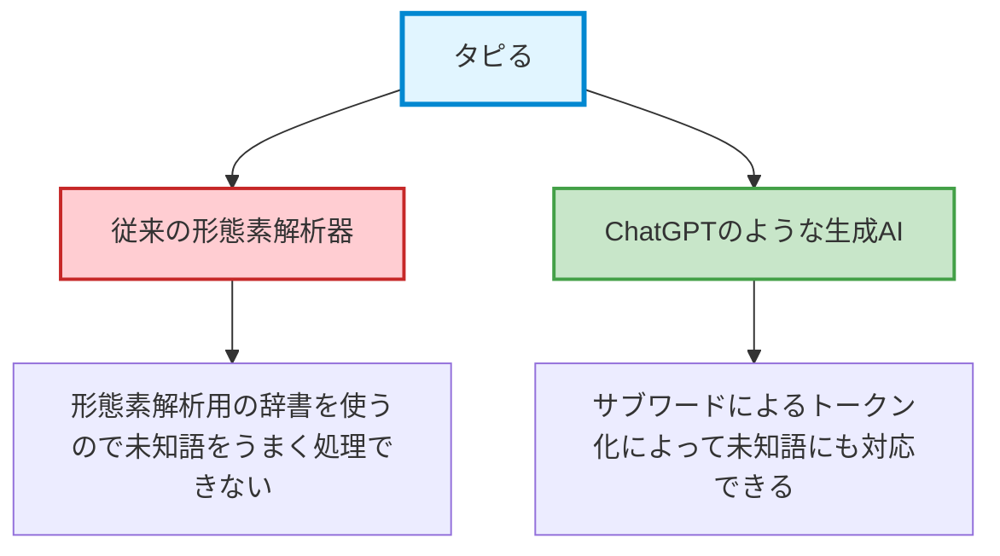

# 形態素と形態素解析
## コンピュータは「証拠」を読めない
[__1. 言語研究の技法__](01-language-research.md)で、私たちは「言葉のアンテナ」を立てる探偵になりました。[__2. コーパスの種類__](02-corpus.md)では「コーパス」という「道具」を、[__3. 言語研究とAI__](03-ai.md)では「AI」という優秀な「新人アシスタント」を手に入れました。

さて、私たちが捜査現場で「`すもももももももものうち`」という、一見して奇妙な「証拠（テキスト）」を発見したとしましょう。探偵である私たちは、これを「スモモも桃も、桃の仲間だ」という意味だと理解できます。しかし、コンピュータは、日本語の「単語の境界」がわかりません。コンピュータの目にこの証拠は、次のように、意味不明な「文字の羅列」にしか見えないでしょう。

`す` `も` `も` `も` `も` `も` `も` `も` `も` `の` `う` `ち`

これでは、捜査（研究）が進みませんので、コンピュータに「スモモ…」なのか、「巣も…」なのかを、教えてあげる必要があります。そこで私たちは、この証拠を「鑑識課」に回送します。鑑識課の仕事は、この証拠を科学的に分析し、「どこからどこまでが意味を持つ塊なのか」を明らかにすることです。

この章で学ぶ知識は、証拠保管庫（コーパス）を精密に検索したり、（それほど遠くない未来）AIに的確な分析を指示したりするために必要な、捜査の土台となるものです。

!!! Info "この章で学ぶこと"
    - 形態素と語彙素の概念を理解し、両者の違いを知る。
    - 日本語の形態素解析器の使い方を身につける。

## 形態素と語彙素
### 形態素
単語、または、**語**（word）という用語があるのに、どうしてまた形態素という用語を使う必要があるのでしょうか。ときどき、「これは語なのか？」と思わせるような言葉を目にすることがあります。日本一長い校名「[高知県宿毛市愛媛県南宇和郡愛南町篠山小中学校組合立篠山小学校](https://sasayama-e.esnet.ed.jp/)」は、一つの語と言えるのでしょうか。このような形式的な側面を基準に「これは語だ」「それは語ではない」と決めるのは、なかなか難しい。この長い校名は、みなさんが言語学の知識がなくてもなんとなく、「高知県、宿毛市（すくもし）、愛媛県、南宇和郡（みなみうわぐん）…」のように分けられると考えるのではないでしょうか。

言語学者たちは、語という概念の限界に気づき、形態素という新たな概念を提案しました。**形態素**（morpheme）は、意味を持つ最小の言語単位のことです。たとえば、先ほどの学校の名前にある「高知県」は「高知」と「県」、「小学校」も「小」と「学校」の二つの形態素に分けられます。語は、一つ以上の形態素からなるものなので、「学校」は形態素とも語とも捉えることができます。そして、二つの形態素からなっている「小学校」は、一つの語と考えることができます。

まだ高知に行ったことがない私の知識には、「高知県といえばかつお」というのがあります。「かつお」をさらに、「か」と「つお」、あるいは、「かつ」と「お」のように分けても、それらが意味を持つ小さい単位であるとは言えません。なので「かつお」は「かつお」それ自体が一つの形態素（または語）になります。

!!! example "頭の体操"
    以下の文を、形態素ごとに分けて、形態素解析をしてみましょう。この文は、複数の解釈ができるので、正解は一つではありません。

    - うらにわにはにわにわにはにわにわとりがいる。

<iframe src="../../assets/viz/mkdocs_memo_widget.html" width="100%" height="380" frameborder="0" style="border: none; display: block;"></iframe>

形態素には、実は色々な種類があります。研究者によって見解の違いはありますが、たとえば、以下のように分類することができるでしょう。

### 語彙素
形態素解析をするときに知っておくといいもう一つの知識が「語彙素」です。形態素と同じく「素」が入っていますが、今回は「語彙」です。**語彙素**（lexeme）は、異なる語の形を、一つの形にまとめたものです。

形態素と語彙素の違いを理解するために、日本語の例を見てみましょう。探偵の比喩を続けるなら、「容疑者の素顔（変わらない本質）」が語彙素に該当します。警察に追われている容疑者は、上手に変装する必要がある。そのような「容疑者の変装（場面によって変わる姿）」のことは、語の形、つまり**語形**（word form）に該当します。

「飲む」を使って考えてみましょう。語彙素「飲む」は、「飲む」という姿以外にも、場面に応じて様々な姿に変わります。

| 語形（変装後の姿） | 例                          |
|---------------------|-----------------------------------------------|
| 飲み（ます）           | 今日は飲みます！           |
| 飲も（う）             | せっかくだから、今晩は飲もう。             |
| のむ           | おびーるをのむ       |

コーパスから「飲む」を調べるとき、「飲む」という形だけを検索すると、上のように変装している「飲み」や「飲もう」「のむ」などは漏れてしまいます。

!!! example "ウォーリーをさがせ!"
    「[少納言](https://shonagon.ninjal.ac.jp/)」から「飲む」を検索して「検索文字列」の部分を確認してみましょう。容疑者の素顔以外に、変装した姿は見えますか。見えないのであれば、今度は「飲も」や「のむ」などで検索して探してみましょう。

このようにバラバラになっている「飲む」の他の例を、まとめて見つけることができるといいかもしれません。もし、形態素解析をして「科学捜査」が済んでいるのであれば、このような「飲む」の別の形をまとめて検索することができます。

!!! example "みいつけた!"
    今回は「[中納言](https://chunagon.ninjal.ac.jp/)」に接続して、みなさんのアカウントを使ってログインしてみましょう。そして、『BCCWJ』に入り、「キー」の下にある「書字形出現形」を「語彙素」にしてから、「飲む」を検索してみましょう。

「少納言」で単に文字列検索をしたときとは違って、「中納言」では容疑者の素顔、つまり、語彙素で検索をしたので、容疑者の変装にも対応ができています。他の例として「締め切り」は、「締切」や「締切り」もあるし、「〆切」が使われることもあるでしょう。

## 形態素解析

「どこからどこまでが意味を持つ塊なのか」を明らかにするために必要な作業が、**形態素解析**（morphological analysis）です。形態素解析は、一つの証拠品（文）を、「指紋」「繊維」「火薬の痕跡」といった、意味を持つ最小単位に分解する作業です。さらに、分解した要素が何であるかを特定する（「`これは名詞`」「`これは助詞`」）タグ付け作業を**品詞**（part of speech）の付与と呼びます。品詞とは、語を文法的な観点から分類したもので、「名詞」や「助詞」、「動詞」「形容詞」などのことです。

コーパスを対象に語彙素で検索して、複数の語形が含まれている文を網羅的に取り出すためには、あらかじめ文を形態素に分けておく必要があります。日本語とは違って、英語は文を形態素に分けるとき、それほど苦労しません。というのも、英語の場合はスペースを使って分かち書きをしているからです。

!!! note "例外はあらゆるところに存在する"
    英語の場合、一見すると形態素解析は不要に見えます。しかし、「don't」（do not）や「I'm」（I am）、「New York」、「running」などを適切に処理するためには、英語でも形態素解析に相当する処理が必要になります。日本語は単語の境界がないため、この問題がより顕著になるということです。

英語のように分かち書きをしない日本語の場合、形態素を特定することは簡単ではありません。でも大丈夫。形態素解析のために開発された**形態素解析器**と**辞書**があります。

2025年現在から約20年前に開発された[**MeCab**](https://taku910.github.io/mecab/)という形態素解析器があります。MeCabは日本語の形態素解析器として広く知られていて、韓国語の形態素解析にも使われることがあります。2013年を最後にアップデートは止まっているのですが、現在も日本語の形態素解析の場面ではよく使われています。

形態素解析器は、辞書を参照しながら、形態素を切り分けます。なので、辞書が貧弱だと、新語や俗語などにうまく対応することができません。形態素解析に使われる辞書にも、いくつか種類があります。MeCabが標準で使っている辞書は、やや古い**IPAdic**というものです。MeCabといっしょに使われる他の辞書として、国立国語研究所が開発した[UniDic](https://clrd.ninjal.ac.jp/unidic/)があります。

!!! example "ウェブ de 形態素解析"
    MeCabと辞書を使うには、本来は自分のパソコンに（辞書とともに）インストールする必要があったのですが、最近はウェブ上で試してみることもできるようになっています。

    1. 国立国語研究所で開発・公開している「[Web茶まめ](https://chamame.ninjal.ac.jp/)」に接続すると、手軽に形態素解析を試してみることができます。
    2. もはや使う人はいないのではないかと思われる「タピる」を入力してみましょう。
    3. 「現代語」「現代語話し言葉」「近現代口語小説」など、色々な種類の辞書があって、二つまで選べます。最後に「解析する」ボタンを押すと…

この実習で、「タピる」のような新語（データベースにない指紋）がうまく扱えない、という問題に直面したはずです。これが、鑑識ツールが完璧ではないことの証拠であり、私たち探偵がツールの「クセ」を熟知しておくべき理由です。

!!! tip "韓国語の形態素解析"
    「Web茶まめ」のように、ウェブ上で簡単に韓国語の形態素解析を試してみることができるウェブサイトがあります。「韓国語は分かち書きをするので形態素解析は必要ないのでは？」と思うかもしれませんが、韓国語も日本語のような**膠着語**です。韓国語（朝鮮語）を書くときに、分かち書きが使われるようになったのは、19世紀後半になってからです。

    - [바른 형태소 분석기](https://bareun.ai/analyze)
    - [Kiwi](https://lab.bab2min.pe.kr/kiwi)
        - [Kiwi : 지능형 한국어 형태소 분석기(Korean Intelligent Word Identifier)](https://github.com/bab2min/Kiwi)

## AI用の鑑識キット
ここまでやってきたことを、2025年11月現在のAIにやらせてみると、それなりの精度で形態素を区別してくれます。たとえば、「すもももももももものうち」の形態素解析を試してみると問題なく、形態素解析をしてくれるでしょう。

しかし、両者が文を分ける仕組みには差があります。AIの場合、「統計的にどれくらい頻繁に出現するか」を基準に、文を**サブワード**（subword）と呼ばれるパーツに分解します。たとえば、「食べます」は統計的な頻度を利用して「食」「べ」「ます」に分けます。このような手法の長所としては、「タピる」のような未知の単語も、「タ」「ピ」「る」のように、さらに細かいパーツに分解できるため、原理的に「未知の証拠」が発生しない点です。AIアシスタントが非常に賢く、どんな新語にも対応できるように見えるのは、この「未知語が出ない」特殊な鑑識キット（**トークナイザー**（tokenizer））を使っているからです。

!!! warning "言語研究には形態素解析器を"
    AIは、伝統的な意味での「形態素解析」を行っていません。私たち探偵が「『飲む』という動詞の活用形を調べる」といった文法的な捜査を行いたい場合、AIの鑑識キットは（今のところは）役に立ちません。私たちは、MeCabのような「言語学的な鑑識キット」を使う必要があります。
    
    もちろん、AIの技術は急速に進化しており、将来的には言語学的な形態素解析に近い精度を持つ可能性もあります。しかし、現時点では、学術的な言語研究において、伝統的な形態素解析器とAIのトークナイザーは、目的も手法も異なる別物として扱う必要があります。

!!! example "AIの「鑑識結果」を覗いてみよう"
    Pythonの知識がなくても、AIの鑑識キットを体験できるウェブサイトがあります。OpenAIの[Tokenizer](https://platform.openai.com/tokenizer)に接続して、「タピる」を入力してみましょう。表示される結果を見ると、「タピる」がより細かく分解されていることがわかります。これが、AIが扱っている「証拠の最小単位」です。

ちょっと別のやり方で、AIがどのように語や文を分けるのか試してみたいと思います。

その前に、今回はGoogleのAI（Gemini）を使うために、APIキーからゲットしてみましょう。**API**（application programming interface）という耳慣れない略語は、企業側が自社の製品を顧客に提供するために作っておいたメニューのようなものです。たとえば、牛丼屋に行って注文するとき、「牛丼特盛に温玉を載せて、ちょうどいい具合に温玉の表面に切れ目を入れたあと、その間に黒七味をいい加減にかけてください」とは言わないはずです（普通は…）。普通は、あらかじめそのお店で決めておいたメニューを確認して、決まっている品物を出してくださいと言うでしょう。APIはそのようなメニューのようなものです。Googleが提供しているAPI（メニュー）を使うには、APIキーが必要となります。

!!! example "APIキー、ゲットだぜ‼"
    === "① Google AI Studio"
        Googleにログインした状態で[Google AI Studio](https://aistudio.google.com/)に入ってみましょう。左下に、[Get API key](https://aistudio.google.com/api-keys)があるので、そこをクリックして入りましょう。
    
    === "② APIキーを作成"
        右上に「APIキーを作成」というボタンがあるのでクリック。そのあと、「インポートしたプロジェクトを選択」から「プロジェクトを作成」を選びましょう。日本語は使えないので「linguistics-dept-ehime-u」のように英数字やハイフン、スペースなどを使って好きなプロジェクト名を入力して作成しましょう。最後に「キー名の設定」には、このキーをどこに使うのか、人間が見てわかりやすい名前を入力しておきましょう。ここには日本語の入力もできるので、たとえば「2025年11月21日（言語学特講）」のようにすることができます。「キーを作成」を押すと、APIキーが発行されます。
    
    === "③ キーをコピーして使ってみよう"
        「キー」の部分に、先ほど入力したキー名が表示されています。そこをクリックしてみると、キーについての詳細を閲覧でき、キーをコピーすることもできます。それではコピーしたキーを使って、下にある「AI鑑識ラボ」に入ってみましょう。

では、以下のAI鑑識ラボに入って、先ほど「Web茶まめ」でやってみた「タピる」を入力してみましょう。

<iframe src="../../assets/viz/morph_visualizer.html" width="100%" height="600" frameborder="0" style="border: none; display: block;"></iframe>

!!! warning "戸締まりしないと空き巣に狙われる"
    今回はAPIを無料枠で使用したのですが、有料で使うこともできます。より多くのリクエストやよりよいモデルを使うためには、クレジットカードを登録するなどして、お金を払う必要があります。そのようにして有料枠でAPIを使うときには、APIキーの管理に注意する必要があります。ウェブ上に掲載したり、人に渡したりすると、みなさんのAPIキーを使って、有料枠でAIを利用することができるようになるからです。

## 💻 やってみよう！

最近興味を持っている言葉や表現を選んで、以下の作業をしてみましょう。

1. その言葉や表現を含む文を2〜3個程度作ってみる（e.g. みんな〜！ 何が好き？ モチロン大好き AiScReam）。
2. まずは「[Web茶まめ](https://chamame.ninjal.ac.jp/)」で分析してみる。
3. 次は「AI鑑識ラボ」を使って分析してみる。
4. 以下の点を観察し、メモ帳に記録する：
    - その言葉や表現は、一つの塊として認識されたのか、それとも分解されたのか？
    - 分解された場合、どのような品詞に分けられたのか？
    - 比較的に新しい言葉（新語や俗語など）だった場合、うまく分析されたのか？

<iframe src="../../assets/viz/mkdocs_memo_widget.html" width="100%" height="380" frameborder="0" style="border: none; display: block;"></iframe>