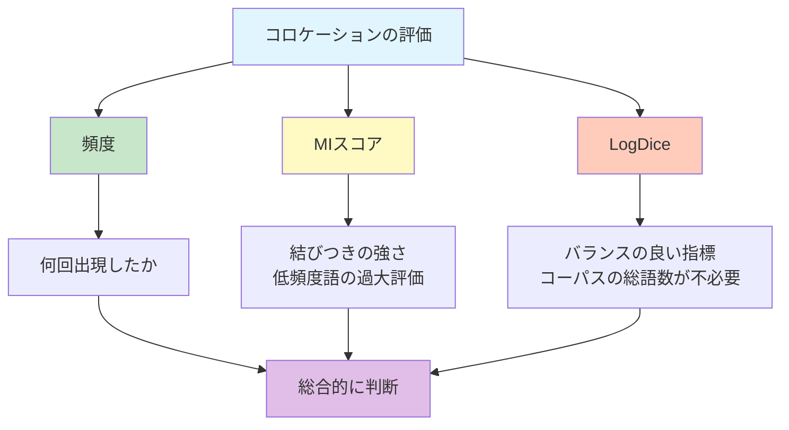

# NLBとNLT
## 言葉の「つながり」を見つける
「満面の…」と言われると、みなさんは何を思い浮かべるのでしょうか？

日本に来る前に、韓国で語学塾に通っていました。来日後、セブンイレブンのバイトをすることになり、語学塾の先生にそのことについて話したら「満面の笑みで…」（接客）とおっしゃいました。そこで初めて「満面の笑み」という表現を学習しました。

「満面の…」と言われると、その次に現れる言葉として、このように「笑み」や「笑顔」を思い浮かべる人が多いのではないかと思います。

では、「満面のスマイル」はどうでしょう。「笑み」や「笑顔」は「スマイル」と意味的には重なる部分が多いと思いますが、なんだか少し不自然に聞こえませんか？そのように聞こえるとしたら、それはなぜでしょうか。

この章では、実際にコーパスを使って、言葉の「つながり」を探る冒険に出かけます。その冒険の舞台となるのが、「NLB」と「NLT」という2つの強力な検索システムです。これらは、コーパスという広大な言葉の海から、あなたが探している「宝物」を見つけ出す探査装置のようなものです。

!!! info "この章で学ぶこと"
    - コロケーションとは何か、具体例を挙げて説明することができる。
    - コーパス検索システムを使って、コロケーションを検索できるようになる。
    - MIスコアとLogDiceという指標の意味を理解する。

## 相性の良い言葉
日本語を話したり、書いたりしていると、ある語の次に来る言葉が限定されることがあります。その例が先ほど話した「満面の…」です。その他にも「強い…」と言えば「風」や「雨」、あるいは「意志」といった言葉が続きそうです。「強い」と反義関係にある「弱い」を使って「弱い風」や「弱い雨」とは言えるけれど、「やわい風」や「柔らかい雨」などとは、あまり言いませんよね。

このような、語と語の慣習的な結びつきのことを**コロケーション**（collocation）と言います。「語と語のより自然な結びつき」[@hori2011, p.6]と言ってもいいでしょう。先ほどの「満面の笑み」については、次のような記述があります。

> 顔じゅうに笑みを浮かべることを「満面の笑み」と言う。ところがこれを「満面の笑顔」と言う人がいる。[@kaminaga2018, p.168]

「ところが」とあるので、「満面の笑顔」が否定される気がしますね。実際に「満面の笑顔」は「正しくない」「間違い」だとしている人も少なくないようです。「毎日新聞校閲センター」が運営するサイトには「[「満面に」「こぼれる」のは…「笑顔」？「笑み」？](https://salon.mainichi-kotoba.jp/archives/110553)」という記事もあります。「満面の笑顔」の方を「正しくない」としている理屈としては、そもそも「満面」に「顔」の意味が入っているので、「笑顔」にすると意味的に重複するという「理屈」です（ちなみに、これを[重言](https://ja.wikipedia.org/wiki/%E9%87%8D%E8%A8%80)と言うことがあります）。ここでは、「正しい」とか「間違い」とかは棚上げにして、言葉の使われ方をありのまま捉えることに注目したいと思います。

では、コロケーションを研究することで、どんなメリットがあるのでしょうか。たとえば、以下のような点が挙げられます。

1. 言語教育への応用：外国人学習者が、より自然な外国語を話せるようにする。
2. 言語の変化の観察：時代とともにコロケーションがどう変わるか、追跡することができる。
3. 言葉の本質の理解：語の意味は、その語が他のどんな語と結びつくかによって決まる。

コロケーションは、私たちが母語話者として無意識のうちに獲得している知識の一つです。だからこそ、外国語を学ぶときには、このコロケーションが大きな壁になります。英語で「strong tea」と言いますが、日本語の感覚で「強いお茶」とは言いませんね。また、コロケーションを調べることは、言葉の「生きた使われ方」を知ることにもつながります。

## NLB
上で引用した文献によると、本来は「満面の笑み」と言うべきところを、「満面の笑顔」と言う人がいるそうです。では、コーパスを調べてみて、その実態を一緒に確認してみることにしましょう。

[__1. 言語研究の技法__](01-language-research.md)で紹介した『BCCWJ』は、「少納言」や「中納言」以外に、**NLB**（NINJAL-LWP for BCCWJ）を使って検索することもできます。つまり、NLBは『BCCWJ』を検索することができるオンライン検索システムです。

このシステムは、国立国語研究所（The National Institute for Japanese Language and Linguistics, NINJAL）とLago言語研究所が共同開発したもので、ウェブブラウザから誰でも無料で利用できます。特別なソフトウェアのインストールも、アカウント登録も必要ありません。

NLBの最大の特徴は、コロケーションの検索に特化している点です。単に「ある言葉が何回出てくるのか」を調べるだけでなく、「その言葉はどんな言葉と一緒に使われやすいのか」を、視覚的にわかりやすく表示してくれます。たとえば、NLBを使うと、以下のようなことができます。

1. 内容語のコロケーションを簡単に把握：名詞・動詞・形容詞などが、どんな言葉と結びつきやすいのかが一目でわかる。
2. 2語の比較分析：特定の2つの言葉（e.g. 「笑み」と「笑顔」）のコロケーションを並べて比較できる。
3. 統計スコアの確認：MIスコアやLogDiceといった指標で、コロケーションの「強さ」を数値化できる。

!!! note "「内容」がある「語」"
    内容語（content word）とは、その名の通り、何かしらの内容が語に含まれている語のことで、「名詞・動詞・形容詞・副詞」などが挙げられます。一方、機能語（function word）には「冠詞・助詞・助動詞・接続詞」などが含まれます。
    
    NLBは内容語の検索に特化しているため、「を」や「が」といった助詞だけを検索することはできません。助詞を含む詳細な検索をしたい場合は、[__次の章__](06-chunagon.md)で学ぶ「中納言」を使います。

それでは、実際にNLBを使って「満面の笑み」と「満面の笑顔」、どちらが多く使われているのかを調べてみましょう。

!!! example "NLBで「満面」を検索してみる"
    
    === "① アクセスと検索"
        1. [NLB](https://nlb.ninjal.ac.jp/)に接続して「検索を開始する」をクリックします。
        2. 利用規約を読んで同意します。
        3. 検索窓に以下のいずれかを入力して検索します（ひらがなでも、カタカナでも、ローマ字でも検索可能）。
        
        ```
        満面 / まんめん / マンメン / manmen
        ```
        
    === "② 検索結果の確認"
        検索結果から、見出し「満面」をクリックすると、新しいタブが表示されます。そこには、以下のようなタブがあります。
        
        - グループ別：文法的なパターンごとにコロケーションをまとめて表示
        - パターン頻度順：よく使われる順番にコロケーションを並べて表示
        - 基本：レジスターごとの出現頻度や、どのような形・活用形で使われているのかなどについて表示
        
    === "③ グループ別タブ"
        最初は「グループ別」タブが表示されるようになっていますので、どのようなグループがあるのかを確認してみましょう。たとえば、以下のようなパターンが表示されています。
        
        - `>>助詞+動詞`：「満面」の後ろに「助詞」と「動詞」が続くパターン
        - `他の名詞との共起`：「満面」の後ろに「名詞」が共起するパターン
        - `動詞<<`：「満面」の前に「動詞」が現れるパターン
        
        !!! tip "矢印の意味"
            - `>>` は「キーワードの後ろに続く」という意味
            - `<<` は「キーワードの前に現れる」という意味
        
    === "④ パターン頻度順を見る"
        次に「パターン頻度順」タブをクリックしてみましょう。最も頻度が高いパターンは何でしょうか？「満面+助詞」や「満面+の+名詞」というパターンをクリックしてコロケーションや頻度などを確認してみてください。たとえば、「満面+の+名詞」パターンの中には、どんなコロケーションが見られるでしょうか？画面右側を見ると、以下のようなコロケーションが頻度順に並んでいます（2025年11月26日現在）。
        
        | コロケーション | 頻度 | MI | LD |
        |--------------|------|----|----|
        | 満面の笑み | 77 | 15.51 | 10.50 |
        | 満面の笑顔 | 27 | 12.80 | 7.83 |
        | ... | ... | ... | ... |


この調査結果からすると、「満面の笑み」の方が、「満面の笑顔」より、約3倍も多く使われていると言うことができます。

では、実際にどんな文脈で使われているのかを確認してみましょう。

!!! example "言語学で用例は命"
    
    === "① 用例の確認"
        今回は「満面＋助詞」というパターンをクリックして、「満面の」というコロケーションを使うことにします。「満面の」をクリックすると、右側に実際の用例が表示されます。用例は、一番上にあるものが最も短い用例となっていて、下に行くほど長くなります。
        
    === "② フィルタ機能を使う"
        画面下部の🔍（レコード検索）ボタンを押すと、フィルタ機能が使えます。たとえば、「用例」の中から「笑顔」を含むものだけを表示させてみましょう。
        
        1. フィルタにある「サブコーパス」を「用例」にします。
        2. 「次を含む」が選択された状態で「笑顔」を入力し、フィルタボタンをクリック。

        すると、「満面の」が使われている用例の中から、さらに「笑顔」が現れている例だけを抽出することができます。      

フィルタ機能を使って用例を絞った結果を見ると、32件になっています。ところで、先ほどの「満面＋の＋名詞」のパターンで確認したときには、確か27件でした。なぜこのような違いが出るのでしょうか。

!!! example "32-27="
    ===  "① 答えは用例にある"
        「満面＋助詞」パターンにある「満面の」というコロケーション。ここから「笑顔」をフィルタリングした結果の件数は32件。
    
        一方、「満面＋の＋名詞」パターンにある「満面の笑顔」というコロケーションの件数は27件。どうして5件の差が出るのか、それぞれの用例を確認して原因を探ってみましょう。

    ===  "② クリック禁止"
        フィルタ機能は、用例の中で特定の文字列（ここでは「笑顔」）が現れる位置を指定することはできません。そのため、「満面の」と「笑顔」が離れた位置にある用例も、結果に含まれることになります。「満面の」の右隣に「笑顔」が現れている用例だけを見るためには、他の方法を使う必要があります。もちろん、「満面＋の＋名詞」パターンを見ればいいという話ですが、ここでは少し遠回りすることにしましょう。

### Excelでの分析
用例は、ダウンロードすることもできます。🔍と右隣にある🔄（グリッドをリロード）ボタンを押すと、フィルタが初期化されます。これを押してから、⬇️（ダウンロード）を押してみましょう。今回は、XLS（Excelファイル）形式でダウンロードしましょう。ちなみに「CSV」は「Comma Separated Values」の略で、前文脈・キーワード・後文脈などがコンマで区切られています。ダウンロードしたファイル開くと、前文脈・キーワード・後文脈などがそれぞれの列に分かれて表示されます。

ダウンロードした用例ファイルをExcelで開くと、以下のような形の**KWIC**（Key Word In Context）形式で表示されます。

| 前文脈 | キーワード | 後文脈 | 出典 |
|--------|----------|--------|------|
| …なかなか笑わない彼女は「明日の授業は休講です」というと | 満面 | の笑みを浮かべて... | (書籍) |
| 「きびだんご食べたい人？」と言った瞬間、子どもたちは | 満面 | の笑みで駆けつけてきた。 | (雑誌) |

キーワードを中心にして前後の文脈を並べることで、検索したキーワードの前後の文脈が把握しやすくなります。もちろん、キーワードが文頭や文末に位置している場合は、その前後に何も現れないでしょう。

!!! example "Excelのフィルターで「満面の笑顔」だけを抽出"
    
    === "① ファイルを開く"
        1. ダウンロードしたExcelファイルを開きます。
        2. 「編集を有効にする」という表示が出たらをクリックして編集可能な状態にします。
        
    === "② フィルターを設定"
        1. 最初の1行目（ヘッダー行）をクリックして選択します。
        2. Excelのメニューを見ると「データ」というのがあるので、そこに入って「フィルター」を選択します。すると、各列のヘッダーに🔽ボタンが表示されます。

    === "③ 後文脈で絞り込む"
        以下のように絞り込むことで、キーワード「満面」の直後に「の笑顔」が続く用例だけが表示されます。

        Windows：

        1. 新しい窓が開いたら「（テキスト）フィルター」から「（指定の値）で始まる」を選択します。
        2. 開いた窓に「の笑顔」を入力して「OK」をクリックします。
        
        Mac：

        1. 「後文脈」列の🔽ボタンをクリックして、「フィルター」を「で始まる」にします。
        2. 「の笑顔」と入力すると、自動でフィルタリングされます。        
        
    === "④ 結果の考察"
        フィルター後の行数を確認してみましょう。27件になっているのではないでしょうか。先ほどNLBで見た「満面の笑顔」の頻度と一致しています。

## コロケーションの「強さ」を測る
ここまでで、「満面の笑み」の方が「満面の笑顔」より頻度が高いことがわかりました。しかし、コロケーションを評価する指標は、頻度だけではありません。NLBでは、MIスコアとLogDiceという2つの統計的指標も表示してくれます。これらの指標は、何を教えてくれるのでしょうか。

### MIスコア
**MIスコア**（Mutual Information score）は、「相互情報量」とも呼ばれ、2つの語がどれだけ強く結びついているかを示す指標です。言い換えるとMIスコアは、「中心語と共起語が互いに相手の情報をどの程度持っているかを示す値」です[@ishikawa2021, p.127]。

>　たとえば、「赤い色」と「赤い夕焼け」という例の場合、共起頻度では「赤い色」の方がはるかに高くなりますが、「赤い」と言えば「色」、「色」と言えば「赤い」という強い関係が成立しているわけではありません。一方、「赤い夕焼け」の場合は、「夕焼け」と言った瞬間に「赤い」の共起が強く予測されます。言い換えれば「夕焼け」という語の中には「赤い」という語の情報があらかじめ含まれていると言えます。相互情報量はこうした関係を評価します。（石川（前掲書））

### MIスコアの計算
MIスコアは、次のように「観察値（Observation）」と「期待値」で導き出すことができます。

$$
MI\text{-}score = \log_2 \frac{Obs \times TotalWords}{Freq(A) \times Freq(B) \times Span}
$$

それぞれの記号は、以下のような意味を持っています。

| 記号 | 意味 |
|------|------|
| $Obs$ | 観察値（実際に共起した回数） |
| $TotalWords$ | コーパスの総語数 |
| $Freq(A)$ | 語Aの出現頻度 |
| $Freq(B)$ | 語Bの出現頻度 |
| $Span$ | 共起語が出現しうるスロットの総数 |

ここで**Span**は、キーワードを中心に「どこまでの範囲で共起を数えるか」を決める範囲の大きさです。つまり、共起語が出現しうる位置（スロット）の総数を指します。たとえば、「眠る」というキーワードの左右4語ずつを範囲とする場合、Span = 8（左4スロット＋右4スロット）となります。

<table style="text-align: center; margin: 2em auto;">
  <tr>
    <th colspan="4" style="background:#e8f4f8;">← キーワードから左4語</th>
    <th style="background:#FFD700;">キーワード</th>
    <th colspan="4" style="background:#e8f4f8;">キーワードから右4語 →</th>
  </tr>
  <tr>
    <td>-4</td><td>-3</td><td>-2</td><td style="background:#90EE90;">-1</td>
    <td style="background:#FFD700; font-weight:bold;">0</td>
    <td>+1</td><td>+2</td><td>+3</td><td>+4</td>
  </tr>
  <tr>
    <td>昨日</td><td>は</td><td>疲れて</td><td style="background:#90EE90;">ぐっすり</td>
    <td style="background:#FFD700; font-weight:bold;">眠る</td>
    <td>こと</td><td>が</td><td>でき</td><td>た</td>
  </tr>
</table>

この例では「ぐっすり」は「眠る」の左1語目にあるため、Span=8の範囲内に入っています。したがって、この「ぐっすり」と「眠る」のペアは1回の共起としてカウントされます。なお、MIスコアの計算にSpanを入れない（つまり１とする）場合もあります。

### LogDice
ところで、MIスコアには、いくつかの短所もあります。まず、MIスコアの計算にあったように、コーパスの総語数（TotalWords）が必要となります。そして、頻度が低いコロケーションでも、スコアが高くなる点も注意点の一つです。

このようなMIスコアの弱点を補う指標として、**LogDice**（LD）があります。これは、ダイス係数（Dice coefficient）を対数化したものです[@rychly2008]。ダイス係数は、二つの領域AとBがどのくらい重なるのかを示す指標で、次のように計算することができます。

$$
D = \frac{2f_{xy}}{f_x + f_y}
$$

MIスコアの値に比べ、このダイス係数によって得られる値は0と1の間になるので、小数点以下となり、非常に小さいです。この問題を解決するために、ダイス係数を次のような対数化したものがLogDiceの値です。

$$
logDice = 14 + \log_2 D = 14 + \log_2 \frac{2f_{xy}}{f_x + f_y}
$$

LogDiceの特徴の一つとして、コーパスのサイズに影響されない点があります。そのため、異なる二つのコーパス間に見られるコロケーションを比較するのに適切です。そして、低頻度語の過大評価が避けられます。また、値の範囲が0から14程度の間に収まるという点も、LogDiceの特徴です（14に近いほど結びつきが強い）。

MIスコアとの違いは、次のようにまとめられます。

- 同じコーパス内での比較 → MIでもLogDiceでも可
- 異なるコーパス間での比較 → LogDiceが適切
- 低頻度語を含む分析 → LogDiceの方が安定

現場では、どちらの指標にも目を通して判断をした方がいいでしょう（「中庸」のことを思い出しましょう）。なお、NLBでのコロケーションの並び順は、LogDiceの降順（数値が高い順）がデフォルトとなっています。

### 「満面の笑み」の方が「強い」
それでは、NLBに「満面の…」のコロケーションとして書かれていた実際に数値を見てみましょう。

| コロケーション | 頻度 | MI | LD |
|--------------|------|----|----|
| 満面の笑み | 77 | 15.51 | 10.50 |
| 満面の笑顔 | 27 | 12.80 | 7.83 |

どちらのコロケーションも、MIスコアとLogDiceの両方、それなりに高い数値となっています。しかし、「満面の笑み」の方が、両方の指標でより高い値になっていますね。これは、「満面の笑み」が単に頻度が高いだけでなく、語と語の結びつきとしても強いことを意味しています。



最後に、ここまでやってきた内容について、AIにも聞いてみましょう。

!!! example "ウェブ上のデータを学習したAIは「満面の笑み」を選ぶだろう"
    
    === "① AIに説明を求める"
        [ChatGPT](https://chatgpt.com/)や[Gemini](https://gemini.google.com/)などに、以下のような質問をしてみましょう。
        
        ``` { .text .copy title="プロンプト" }
        日本語の「満面」という言葉は、それの右隣に、どのような言葉と一緒に現れるのだろうか？
        「満面」という日本語のコロケーションについて考えてみよう。
        なお、ウェブ上で無料で利用可能な日本語のコーパスがあれば、
        それを活用し、実際にどのようなコロケーションが見られるのかを確認してみよう。
        頻度調査をした場合には、最後調査結果を表でまとめること。
        ```
        
    === "② AIの回答とコーパスの調査結果の比較"
        AIの回答と、NLBで実際に調べた結果を比較してみましょう。
        
        - AIが挙げた例は、コーパスでも確認できる？
        - AIの説明は、統計的指標と整合性がある？
        - AIが言及していない結びつきの強い用法が、コーパスにある？

    === "③ AIエージェント"
        もう少しで終わってしまう2025年は、「AIエージェント」の年と言われています。Agentだから、私の代わりに色んなことをやってくれるわけです。どのようなことができるのか、確認してみましょう。

        ``` { .text .copy title="プロンプト" }
        日本語の「満面」という言葉は、それの右隣に、どのような言葉と一緒に現れるのだろうか？
        「満面」という日本語のコロケーションについて考えてみよう。
        なお、ウェブ上で無料で利用可能な日本語のコーパスがあれば、
        それを活用し、実際にどのようなコロケーションが見られるのかを確認してみよう。
        頻度調査をした場合には、最後調査結果を表でまとめること。
        ```

## 2語を比較する
NLBには、2つの語のコロケーションを並べて比較する便利な機能があります。これを使えば、似た意味を持つ2つの語が、実際にはどのように使い分けられているのかを、一目で理解できます。

!!! example "「笑顔」と「笑み」を比較してみる"
    
    === "① 2語を検索"
        1. NLBの検索画面の右上にある「➡２語比較検索」をクリックします。
        2. 検索窓に以下のように入力して「絞り込み」をクリックします。
        ```
        笑み 笑顔
        ```
        または
        ```
        えみ えがお
        ```
        
    === "② 2語を検索"
        「名詞」タブに「笑顔」と「笑み」が表示されるので、両方にチェックを入れて、「2語比較」ボタンをクリックします。
        
    === "③ パターンを確認"
        「パターン頻度順」タブを見てみましょう。2つの語それぞれについて、どんなパターンでよく使われるかが並んで表示されます。
        
        | 笑顔のパターン | 頻度 | 笑みのパターン | 頻度 |
        |--------------|------|--------------|------|
        | 笑顔+助詞 | 3,262 | 笑み+助詞 | 1,557 |
        | 笑顔で+動詞 | 1,039 | 笑みで+動詞 | 37 |
        | 笑顔を+動詞 | 1,007 | 笑みを+動詞 | 1,172 |
        
        「笑顔」は「で」と、「笑み」は「を」との結びつきが強いように見えます。
        
    === "④ コロケーションを比較"
        「名詞+の+笑顔」と「名詞+の+笑み」のパターンをクリックしてみましょう。画面下部の「出現位置」を「両方の語」に設定すると、2つの語に共通するコロケーションだけが表示されます。
        
    === "⑤ 並べてみる"
        LD差（LogDiceの差）を見てください。マイナスの値は、「笑み」の方が結びつきが強いことを示しています。つまり、「満面」という言葉は、「笑顔」よりも「笑み」と結びつきやすいということです。

基本的にはLD順で並びますが、「頻度」列のヘッダーをクリックすると、頻度降順に並べ替えることもできます。このように、NLBで2つの語を並べて比較することで、似た意味の語がどのように使い分けられているのかが、視覚的にもわかりやすくなります。

## NLT
### ウェブコーパス
ここまで、私たちは『BCCWJ』という均衡コーパスをNLBで検索してきました。しかし、[__2. コーパスの種類__](02-corpus.md)で学んだように、コーパスには様々な種類があります。その中でも特徴的なのが、ウェブ上の文書を収集して作った**ウェブコーパス**です。

**[NLT](https://tsukubawebcorpus.jp/)**（NINJAL-LWP for TWC）は、筑波大学で構築された約11億語規模の『**筑波ウェブコーパス**』（Tsukuba Web Corpus: **TWC**）を検索できるオンライン検索システムです。NLBと同じく、国立国語研究所とLago言語研究所が共同開発したもので、操作方法もNLBとほぼ同じです。つまり、NLBの使い方をマスターすれば、NLTもすぐに使いこなせるようになります。

!!! warning "2012年生まれのTWC"
    『筑波ウェブコーパス』を構築する際に用いられた用例の収集は、「2012年1月初旬から下旬」に行われました。そのため、その時期以降に使われるようになった表現を調べたい場合は、実際のウェブ検索やSNSの検索機能などを併用した方がいいでしょう。
    
    ただし、NLTは約11億語という大規模なデータを持っているため、低頻度の表現を調べる際には依然として有用です。

ウェブコーパスは、均衡コーパスに比べると規模がかなり大きいので、低頻度の言語現象の観察に力を発揮することがあります。また、ウェブ上のテキストも、多様なジャンルのテキストを含むので、分析の仕方によっては、興味深い研究結果を導き出すこともできます。

一方で、ウェブ上のテキストには重複が含まれている可能性があり、均衡コーパスに比べると、文章の質にばらつきがあります。また、AIで盛り上がっている今日は、ウェブ上にあるテキストが、人間が書いたものなのか、それともすべてAIによって生成されたものなのか、両者の混合なのかの区別が容易ではありません。これらの点は、ウェブコーパスを利用するうえでの短所と言えるでしょう。
    
### NLTで同じ検索をしてみる
それでは、今までNLBを使って行ってきた作業を、今度はNLTを使ってやってみましょう。

!!! example "NLTで「満面」や「笑み」「笑顔」を検索してみる"
    NLBの使い方を振り返って、[NLT](https://tsukubawebcorpus.jp/)で調査をしてみましょう。

## 💻 やってみよう！
### コロケーションを探してみる

!!! example "「強い」のコロケーションを調べる"
    1. NLBで「強い」を検索してみましょう。
    2. 「グループ別」タブで、どのようなパターンがあるのか、確認してみましょう。
    3. 「強い+名詞」のパターンをクリックして、どのような名詞と結びつきやすいのか調べてみましょう。
    4. 上位5つのコロケーションの頻度とLogDiceを記録してみましょう。
    
    「強い」と結びつく名詞に、何か共通点はあるのでしょうか。

<iframe src="../../assets/viz/mkdocs_memo_widget.html" width="100%" height="380" frameborder="0" style="border: none; display: block;"></iframe>

### 2語を比較してみる

!!! example "類義語のコロケーションを比較する"
    以下のペアから1つ選んで、NLBの2語比較検索をしてみましょう。
    
    - 「きれい」と「美しい」
    - 「大きい」と「でかい」
    - 「うれしい」と「喜ばしい」
    - 「難しい」と「困難」
    
    さらに、以下の点について調べてみましょう。
    
    1. それぞれの語がどのようなパターンで使われているのか。
    2. 共通するコロケーションはあるのか。
    3. 片方だけに見られるコロケーションは何か。
    4. LD差から何がわかるのか。

<iframe src="../../assets/viz/mkdocs_memo_widget.html" width="100%" height="380" frameborder="0" style="border: none; display: block;"></iframe>

### NLBとNLTを比較する

!!! example "均衡コーパスとウェブコーパスの違いを探る"
    今回は、二つのコーパスを調べて、どのような違いがあるのか、考えてみましょう。

    1. 興味のある言葉を1つ選ぶ。
    2. NLBとNLTの両方で検索する。
    3. 以下の点を比較する：
        - 総頻度の違い
        - 上位コロケーションの違い
        - LogDiceの値の違い

    二つのコーパスの調査結果に、違いがあるとすれば、その違いはなぜ生じるのでしょうか。また、どちらのコーパスがより「現実の言語使用」を反映していると思われますか。

<iframe src="../../assets/viz/mkdocs_memo_widget.html" width="100%" height="380" frameborder="0" style="border: none; display: block;"></iframe>

## 待ちに待った課題
自分が調べてみたい内容語を取り上げて、「NLB」と「NLT」で同じ検索語（キーワード）を検索してみましょう。そして、自分が検索した検索語には、どのような特徴的なコロケーションが見られているのか、観察をしてみましょう。今回の課題は、A4の紙（1ページ以内）に、「検索したキーワード」と「注目したコロケーション」を記入してください。レポートではないので、次のような箇条書きでもいいです。

- 検索したキーワード：満面
- 注目したコロケーション：「満面の笑み」「満面の笑顔」

その後、二つのコーパスから観察されたコロケーションを頻度とともに、一つの表にまとめてみてください（表のタイトルも入れましょう）。そして、表の下に、表についての説明を付け加えてみてください。たとえば、以下のように書くことができるでしょう。

- 「満面の笑み」というコロケーションの頻度は、『BCCWJ』において77であるのに対し、「満面の笑顔」は27であった。このような傾向は『TWC』においても見られる。『TWC』では「満面の笑み」が888、「満面の笑顔」が407であった。