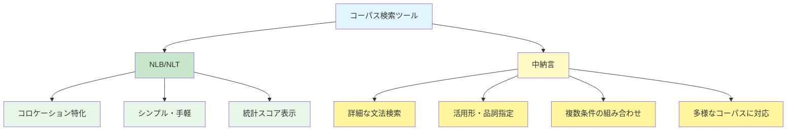
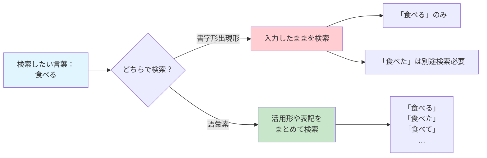
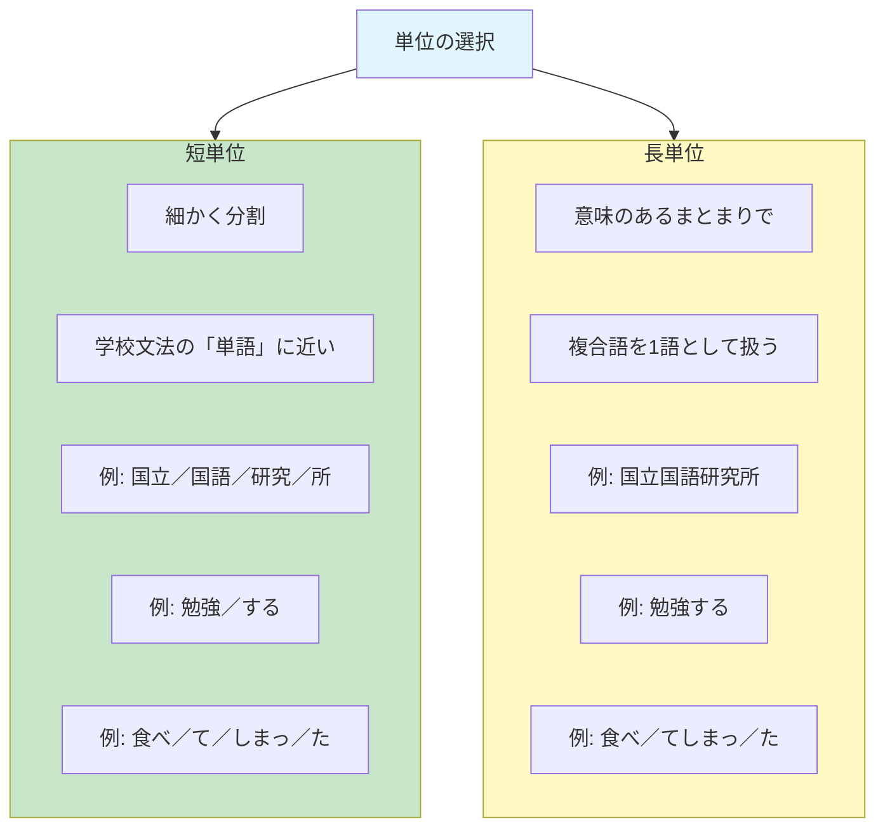

# 中納言
## 探偵道具のアップグレード

[__5. NLBとNLT__](05-nlb-nlt.md)で、私たちはコロケーション（言葉の結びつき）を調べる強力な道具を手に入れました。「満面の笑み」と「満面の笑顔」、どちらがより多く使われているのか。NLBを使えば、こうした疑問に客観的なデータで答えることができました。

しかし、言葉の探偵である私たちが持つべき道具は、これだけではありません。もしあなたが「『食べる』という動詞が、どんな活用形でどのように使われているか」を詳しく調べたいとしたら、NLBでは不十分です。NLBは「内容語」（名詞・動詞・形容詞など）のコロケーションを調べるには最適ですが、もっと細かい文法的な分析には向いていません。

そこで登場するのが、「中納言」です。中納言は、[__4. 形態素と形態素解析__](04-pos.md)で学んだ「形態素解析」の知識を存分に活かせる、より精密な検索システムです。探偵の道具に例えるなら、NLBが「手軽なルーペ」だとすれば、中納言は「高性能な顕微鏡」のようなものです。



!!! info "この章で学ぶこと"
    - 中納言の基本的な使い方を身につける。
    - 短単位と長単位の特徴を説明できるようになる。
    - 連続的・不連続的なコロケーションを検索できるようになる。

## 中納言でできること
### 中納言の主な機能

| 機能 | 説明 | 使用例 |
|-----|------|--------|
| 複数コーパスの横断検索 | 『BCCWJ』『CSJ』『CEJC』など、複数のコーパスをまとめて検索 | オノマトペが書き言葉と話し言葉でどう違うか調べる |
| 詳細な品詞・活用形検索 | 「動詞・連用形」のように細かく指定できる | 「食べ」「食べて」「食べた」をまとめて検索 |
| 短単位・長単位の切り替え | 分析の粒度を選べる | 「勉強する」を1語として見るか、2語として見るか |
| 前後の語との関係指定 | 「名詞の後に助詞『に』が来て、その後に動詞」のような複雑な検索 | 「〜にありつく」のような構文パターンを調べる |
| ワイルドカード対応 | 柔軟な文字列検索（詳しくは[__7. 正規表現__](07a-regex-basics.md)で学習） | 「〜たり」で終わる動詞をすべて検索 |

『BCCWJ』をウェブ上で検索する場合、今まで触ってみたことがある選択肢としては「少納言」「NLB」「中納言」の3つがあります。「少納言」もいいのですが、機能が限定的なので、『BCCWJ』を利用してレポートや卒業論文を書くのであれば、「NLB」か「中納言」の二択になります。

NLBは、「コロケーションを手軽に調べたい」「統計的指標（MI、LogDice）を見たい」ときに向いています。そして中納言は、「活用形や品詞を詳しく指定したい」「複雑な文法パターンを検索したい」「『BCCWJ』と他のコーパスと比較したい」「データをダウンロードして詳細に分析したい」ときに向いています。

!!! tip "国語研コーパスポータル"
    国立国語研究所のコーパスについての最新情報は、[国語研コーパスポータル](https://clrd.ninjal.ac.jp/)でも確認できます。中納言には、継続的に新しいコーパスが追加されていますので、ときどき確認してみるといいでしょう。また、「[中納言ユーザグループ](https://clrd.ninjal.ac.jp/contact.html)」というのがあり、中納言のマニュアルで解決できない問題や、応用的な事例について、関係者に質問することができます。


### まとめて検索
今（2025年）から6～7年くらい前に、「中納言」でコーパスをまとめて検索する機能が使えるようになりました。この「まとめて検索」（コーパス間の横断検索）という機能は、検索対象としている表現が、複数のコーパスの中に、どのように分布しているのかを把握するときにいい機能です。

早速使ってみましょう。今回はオノマトペの検索をしてみます。たとえば、「ぴかぴか」というオノマトペは、書き言葉と話し言葉でどちらがよく使われるのでしょうか？このような疑問を、「まとめて検索」で簡単に調べることができます。

!!! example "「ぴかぴか」を複数のコーパスで検索"
        
    === "① ひらがなで検索"
        「まとめて検索」画面で、検索窓に「ぴかぴか」を入力して、検索してみましょう。
        
    === "② カタカナでも検索"
        今回は、検索窓に「ピカピカ」とカタカナで入力して検索してみましょう。ひらがなでの検索結果と違いはあるのでしょうか。
        
    === "③ 語彙素で検索"
        「中納言」コーパス選択画面に戻り、今度は「語彙素で検索」を選択して、「ぴかぴか」と「ピカピカ」を検索してみましょう。「書字形出現形」で検索した結果と、どのような違いがあるのでしょうか。

    === "④ NLBで検索"  
        最後に、『BCCWJ』が検索の対象となっているNLBを使って「ぴかぴか」を検索してみましょう。「中納言」での「	検索結果の件数」と、NLBでの頻度に、差があるのでしょうか。

「NLB」と「中納言」における検索結果が一致しない理由は、「NLB」で使用している『BCCWJ』が「中納言」が検索対象としている『BCCWJ』と同じではないからです（詳細は「[２．使用しているコーパス](https://nlb.ninjal.ac.jp/static/pdf/NLB.manual.v.1.40.pdf)」を参照）。

### 書字形出現形と語彙素
中納言では、検索語をどのように扱うかを選択できます。それが「書字形出現形」と「語彙素」です。

書字形出現形は、あなたが入力した通りの文字列だけを検索する方法です。この方法は、表記の違いそのものを調べたいときに便利です。

一方、語彙素は[__4. 形態素と形態素解析__](04-pos.md)で学んだように、異なる語の形を一つの抽象的な形にまとめたものです。おさらいとして見ておくと、語彙素（lexeme）は、異なる語形（word form）から抽出できる抽象的なレベルの語です。水の化学式「H2O」と「水・氷・水蒸気」の関係を考えてみてください。「水・氷・水蒸気」は、それぞれ形は違いますが、いずれもH2Oであることに変わりはありません。「水・氷・水蒸気」という自然物を、科学者が抽象化し、「H2O」と呼んでいるだけです。

言語の例だと、「やはり・矢張り・やっぱり・矢っ張り・やっぱ」という複数の語形に対して、「矢張り」という一つの語彙素を設定することができるでしょう。

!!! tip "語形と書字形出現形"
    「語形」という用語は、言語学において一般に使われる用語ですが、「書字形出現形」はそうではありません。両者は「中納言」において違う機能をしていますが、ここではとりあえず、「似たような機能をしているもの」として捉えておきましょう。



それでは「めちゃ・めっちゃ」はどうでしょうか。これらの「語彙素」となるものはなんでしょうか。

## Web茶まめで語彙素を確認する
「めちゃ」「めっちゃ」を、語彙素検索でまとめて検索したいけど、どちらが語彙素になっているのかがわからない…もちろん、このように二つのみであれば、全部検索してみるといいでしょうけど、その量が多くなればなるほど大変です。こういうときに役立つのが、[__4. 形態素と形態素解析__](04-pos.md)で紹介した「Web茶まめ」です。

!!! example "Web茶まめで語彙素を特定"
    
    === "① 形態素解析"
        [Web茶まめ](https://chamame.ninjal.ac.jp/)に接続して「めっちゃ楽しかった。」を形態素解析してみましょう。「めっちゃ」の語彙素を確認し、「中納言」に戻りましょう。
        
    === "② 語彙素で検索"
        「中納言」の「まとめて検索」に戻って、「語彙素」を選択してから「めっちゃ」の語彙素を検索してみましょう。そして、「検索結果を見る」をクリックしてどのような用例が表示されるのか、確認しましょう。  

    === "③ 色々試してみる"
        その他に、気になる表現を「中納言」の「まとめて検索」と「Web茶まめ」を活用して検索し、用例を確認してみましょう。その他、コーパスの検索結果に差が出そうなものを検索してみましょう（e.g. 書き言葉と話し言葉における「副詞」の頻度）。

ここまで、中納言のキーの種類として「書字形出現形」と「語彙素」を中心に見てきたのですが、他にも「語彙素読み」「語形」「品詞」など、色々な種類があります。この授業では詳細について触れませんので、興味ある方は配付資料をご確認ください。

!!! warning "入力方法が決まっているので注意"
    それぞれのキーの種類を入力するときには、以下のように入力方法が決まっているので注意が必要です。とりわけ、全角カタカナだけが有効な「語彙素読み」「語形」「発音形出現形」を利用する際には、入力にご注意ください。

    | キーの種類       | 指定方法                                      |
    |------------------|-----------------------------------------------|
    | 書字形出現形     | 文字列を入力                                  |
    | 語彙素           | 文字列を入力                                  |
    | 語彙素読み       | 文字列を入力（全角カナのみ）                  |
    | 語形             | 文字列を入力（全角カナのみ）                  |
    | 品詞             | 大分類/中分類/小分類による選択式              |
    | 活用型           | 大分類/中分類/小分類による選択式              |
    | 活用形           | 大分類/小分類による選択式                     |
    | 書字形           | 文字列を入力                                  |
    | 発音形出現形     | 文字列を入力（全角カナのみ）                  |
    | 語種             | 選択式                                        |
    | WHERE句         | 文字列を入力                                  |


## 短単位と長単位
中納言には、「短単位」と「長単位」という2つの検索モードがあります。これは、言葉を「どこまで細かく分けるか」という粒度の違いです。両者の違いは、以下のようにまとめることができます。



「愛媛大学」の場合、短単位では「愛媛」「大学」のように、より細かく分割します。「する」を単独で調べたいというときにいいでしょう。

一方、長単位では「愛媛大学」は一つの意味のあるまとまり（複合語）として扱われます。長単位は短単位をいくつか組み合わせたものとして考えるといいでしょう。なので、複合語の分析にいいでしょう。

!!! example "『BCCWJ』の中の愛媛"
    
    === "① 短単位で検索"
        『BCCWJ』に入って、短単位検索をしてみましょう。「短単位検索」というところから、「書字形出現形」を選択して「愛媛」を検索し、KWIC形式で現れる用例や、出典などを確認してみましょう。
        
    === "② 語彙素で検索"
        今度は「語彙素」を選択して「愛媛」を検索してみましょう。語彙素がわからない場合は、「Web茶まめ」を利用して確認しましょう。
        
    === "③ 長単位で検索"
        最後に、長単位で「愛媛」や「愛媛大学」を検索してみましょう。
    
    === "③ ヘッダーでソート"
        前回の授業でExcelのヘッダーについて言及しました。「中納言」の検索結果にもヘッダーがあります。ヘッダーの列名をクリックしてソート（並び替え）機能を使ってみましょう。

        ソート機能は検索結果を「レジスター」ごとにまとめたり、「出版年」の順に並び変えるのに便利です。他のコーパス、たとえば、『日本語諸方言コーパス』の場合は、「話者生年」「話者年齢」「話者性別」などの話者属性や、地域を基準にして並び変えることも可能です。

どちらの単位を使うのかは、研究目的によって変わると思いますが、一般的には短単位を使う場面が多くなるのではないかと思います。検索をしたあとには、単に検索結果の件数だけを見るのではなく、用例にも目を通すようにしましょう。もし、「する」という動詞の検索をしたいのであれば、長単位の方が向いているでしょう。短単位で「する」を検索すると、「提供する」「処理する」なども検索結果として現れます。

## コロケーションの精密検索

ここからが中納言の真骨頂です。[__5. NLBとNLT__](05-nlb-nlt.md)では手軽にコロケーションを調べられましたが、中納言では、より複雑な条件を指定したコロケーション検索ができます。

### 連続的なコロケーション

前回の授業で「満面の笑み」のようなコロケーションを調べました。今度は、もっと複雑な例として「〜にありつく」という表現を調べてみましょう。たとえば、「やっと飯にありつけるぞ」「ついに、噂の餃子にありつけます」などのように使うことができるでしょう。私が今まで耳にしてきた「ありつく」の例は、その前に食べ物関係の名詞が来ることが多かったです。これを実際のコーパスで確認してみましょう。

!!! example "「〜にありつく」のパターンを検索"
    
    === "① 検索条件を設定"
        「短単位検索」画面で、以下のように設定します。
        
        キー（中心となる語）:

        - キーの種類：「語彙素読み」
        - 検索語：「アリツク」（全角カタカナ）
        
        前方共起条件（キーの前に来る語）:
        
        - 「前方共起条件の追加」をクリック
        - 距離：キーから「-2」（2語前）
        - 品詞：「名詞」を選択
        
        これで、「【名詞】【何かの語】【ありつく】」というパターンを検索できます。
        
    === "② AIに分析を手伝ってもらう"
        AIは今回の検索結果をどのように分析するのでしょうか。検索結果をダウンロードして、共起する名詞のパターンをAIはどのように分析するのか、確認してみましょう。そして、その結果が、みなさんの直観や観察・考察とどのような点で共通しているのか、または違うのか、考えてみましょう。
        
        ``` { .text .copy title="プロンプト" }
        「ありつく」は、「やっと飯にありつけるぞ」「ついに、噂の餃子にありつけます」などのように使うことができるでしょう。
        私が今まで耳にしてきた「ありつく」の例は、その前に食べ物関係の名詞が来ることが多かったです。
        これを実際のコーパスで調べてみました。添付ファイルがその結果です。
        このデータに基づくと、どのような分析ができるのでしょうか。
        ```

### 不連続的なコロケーション
コロケーションには、上記のような連続的なコロケーションだけでなく、不連続的なコロケーション（discontinuous collocation）もあります。たとえば、「どうりで腹が減るわけだ」といった例が挙げられます。

!!! example "道理で検索結果にないわけ"
    === "① 考えてみる"
        このようなコロケーションを検索するためには、どのようにすればいいでしょうか。検索方法は複数通りあります。色々な組み合わせで検索をしてみましょう。

    === "② 検索してみる"
        「中納言」の『BCCWJ』に接続し、次の検索条件を利用して検索してみましょう。

        1. キーの種類を「語彙素」にして、キーは「道理」にする。
        2. 「後方共起1」を「キーから1語」にし、「書字形出現形」で「で」にする。
        3. 「後方共起2」を「キーから10語以内」にし、「語彙素」で「訳」にする。
        
このコロケーションの「道理」は、「どうり」と読むのですが、話し言葉では「どおり」と言うこともあります。

> - どおりで鼻が効くわけだな。（『深夜食堂3（シーズン1/エピソード3）』）
 - あ、何だ、向こう岸か。どおりで見つかんないわけだ。（『孤独のグルメ（シーズン5/エピソード11）』）
 - この腹騒ぎは…。5時か。どおりで、腹が…減るわけだ。（『孤独のグルメ（シーズン9/エピソード1）』）

このような例もいっしょに検索するためには、二つの方法があります。一つ目は、キーを「道理」から「どおり」に変えて、キーの種類も変更する方法です。もう一つは、検索条件式を修正する方法です。以下では、後者の方法を試してみます。

!!! example "検索履歴を使いこなす"
    === "① 過去の履歴"
        「検索フォームで検索」タブから「履歴で検索」タブに切り替えます。「履歴で検索」には、今まで自分が検索した検索履歴が残っています。ここから、再度実行したい検索履歴を確認して、「編集して検索」をクリックすると「検索条件式」が出てきます。その状態で「検索」ボタンを押すと、検索条件式に書かれている内容に従って検索が行われます。

    === "② 履歴を編集"
        先ほど「検索フォームで検索」タブで行った検索は、以下のような文字列で表すことができます。
   
        ``` { .text .copy title="文字列" }
        キー: 語彙素="道理"
          AND 後方共起: 書字形出現形="で" ON 1 WORDS FROM キー DISPLAY WITH KEY
          AND 後方共起: 語彙素="訳" WITHIN 10 WORDS FROM キー DISPLAY WITH KEY
          WITH OPTIONS tglKugiri="" AND tglBunKugiri="" AND limitToSelfSentence="1" AND tglFixVariable="2" AND tglWords="20" AND unit="1" AND encoding="UTF-16LE" AND endOfLine="CRLF";
        ```
        
        ここから、キーを次のように変更して、改めて検索をしてみましょう。
   
        ``` { .text .copy title="文字列" }
        キー: (語彙素="道理" OR (書字形出現形="どおり"))
        ```

検索結果を見ると「どおりで懐かしい気がするわけだ」のように「どおり」となっている例も拾っていることがわかります。

一方、検索結果には「いつもどおりでいられるわけないじゃない！」のように、コロケーションに当てはまらない例も含まれています。なので、単に検索をして件数だけを見るのではなく、用例も丁寧に確認する必要があります。

ここでは、「道理」の後ろに現れる「訳」を、「キーから10語以内」にしています。しかし、実例の中には次のように、10語を超えて「訳」が現れる場合もあります。

> バーテンダーも変っていた。僕がこのバーテンダーに昔のことを話してみたら、「ああ、そうそう」と彼はあいづちを打った。「ここは昔、競馬の胴元とその女たちが常連のバーだったんですよ。」道理で見たとこ粋で愛想のいい連中がたくさんいて、電話がひっきりなしに鳴っていたわけだ。（『ご冗談でしょう、ファインマンさん（上）』）

!!! example "頭脳フル回転"
    === "① ショート動画を見る時間くらい考えてみる"
        「道理で～わけだ」の「～」には、10語以上の語が入る場合もある。どのようにすれば10語以上の例を拾うことができるのでしょうか。

    === "② 早く答えを"
        先ほどの検索条件式を、以下のように変えて検索してみましょう。

        ``` { .text .copy title="文字列" }
        キー: (語彙素="道理" OR (書字形出現形="どおり"))
          AND 後方共起: 書字形出現形="で" ON 1 WORDS FROM キー DISPLAY WITH KEY
          AND 後方共起: 語彙素="訳" WITHIN 20 WORDS FROM キー DISPLAY WITH KEY
          WITH OPTIONS tglKugiri="" AND tglBunKugiri="" AND limitToSelfSentence="1" AND tglFixVariable="2" AND tglWords="20" AND unit="1" AND encoding="UTF-16LE" AND endOfLine="CRLF";
        ```

        検索結果を見ると「道理でトーマス・クック国際時刻表には出ていなかったわけだ。」のように、10語を超えている例も拾っていることがわかります。

コーパスを利用するときには、自分が指定した検索で「どのような例が含まれないのか」を考えることも重要です。たとえば、「どうりで～わけだ」「道理で～はずだ」のようなコロケーションでは、文末の「わけだ」「はずだ」が現れない場合があります。

> - へえ～！どうりでね。あか抜けでるど思ったぁ。（『深夜食堂3（シーズン1/エピソード6）』）
- どうりでシュッとしとってやなぁと思いました。東京やって。（『孤独のグルメ（2021大晦日スペシャル〜激走！絶景絶品・年忘れロードムービー〜）』）

実世界には存在していても、コーパスの中には存在しないような例が、たくさんあるわけです。

!!! tip "使い回し"
    中納言で使用した検索条件式は使い回しができます。たとえば、『BCCWJ』で使用した検索条件式を、『CSJ』にそのまま貼り付けて検索することができます。

## 💻 やってみよう！

!!! example "オノマトペの分布を調べる"
    
    1. 「まとめて検索」を使って、以下のオノマトペを検索
        - ぴかぴか
        - きらきら
        - わくわく
        - どきどき
    2. 各コーパスでの出現頻度を記録
    3. 以下の点について考察：
        - ひらがな表記とカタカナ表記でどちらが多いか？
        - オノマトペによって傾向の違いはあるか？

<iframe src="../../assets/viz/mkdocs_memo_widget.html" width="100%" height="450" frameborder="0" style="border: none; display: block;"></iframe>

!!! example "「早い」の活用形を分析"
    
    1. 『BCCWJ』で、語彙素「早い」を検索
    2. 検索結果をダウンロード（Excel形式）
    3. 「活用形」列でフィルターをかけて、各活用形の頻度を数える：
        - 終止形「早い」
        - 連用形「早く」
        - 仮定形「早ければ」
        - 連体形「早い」
        
    「早い」と「速い」を比較して、活用形の分布に違いがあるか調べてみましょう。

<iframe src="../../assets/viz/mkdocs_memo_widget.html" width="100%" height="450" frameborder="0" style="border: none; display: block;"></iframe>

!!! example "興味のある表現を徹底的に調べる"
    
    [__5. NLBとNLT__](05-nlb-nlt.md)で調べたコロケーションを、今度は中納言を使ってより詳しく分析する
        
    1. 前回の課題で選んだ言葉を、中納言で検索してみる。
    2. 以下の点を調べる：
        - 書字形出現形と語彙素で、どのくらい結果が違うのか？
        - 短単位と長単位で、どのような違いがあるのか？
        - 前後に共起する語のパターンは？
    3. NLBの結果と比較して、新しく発見したことをまとめる。

<iframe src="../../assets/viz/mkdocs_memo_widget.html" width="100%" height="450" frameborder="0" style="border: none; display: block;"></iframe>
