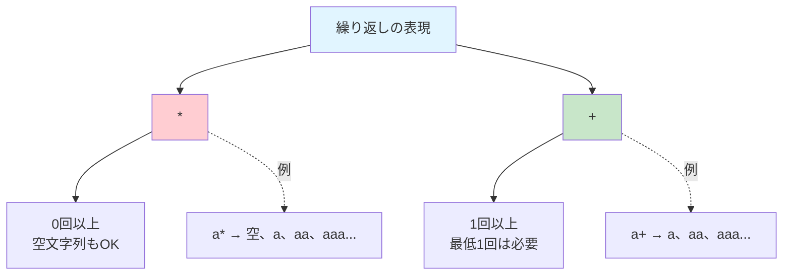
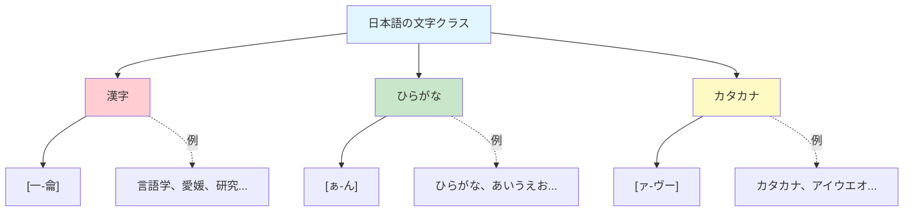

# 正規表現—基礎編
## 言葉のパターンを見抜く「魔法の呪文」

[__6. 中納言__](06-chunagon.md)で、私たちは精密な検索ツールを手に入れました。「食べる」という動詞のすべての活用形をまとめて検索したり、「〜にありつく」のような複雑なコロケーションを探したりすることができるようになりました。

しかし、探偵である私たちが解き明かしたい言葉の謎は、もっと複雑です。

- 「『〜たり』で終わる動詞をすべて検索したい」
- 「3文字のカタカナで始まる名詞を調べたい」
- 「『ぴかぴか』『きらきら』のような繰り返しのオノマトペを網羅的に探したい」

こうした「パターンを持つ文字列」を探すには、これまでの検索方法では不十分です。そこで登場するのが、「正規表現」という強力な「魔法の呪文」です。正規表現は、探偵が容疑者の特徴を「身長170〜180cm、黒髪、コンタクトレンズ着用」のように記述するのと似ています。「この特徴に当てはまる人物をすべて探せ」という指示を、コンピュータに正確に伝えるための呪文です。

!!! info "この章で学ぶこと"
    - 正規表現とは何か、その基本概念を理解する。
    - 基本的なメタ文字（`.` `*` `+` `|` `()` `[]`など）の使い方を身につける。
    - 繰り返しパターンを表現できるようになる。

## 文字列という「証拠」の世界
まず、**文字列**（string）という概念を確認しましょう。文字列とは、その名の通り、文字を並べたものです。たとえば、「文字を並べたものです」も文字列であり、「A,$^1B」や「あ方３ーヒ☆」といった意味をなさない文字の並びも文字列の例です。

コーパスは「検索可能な文字列」で構成されています。そのため、文字列の検索・操作能力は、そのままコーパスの検索・操作能力につながると考えることができます。

自分が作成したレポートや文書、あるいは、ウェブブラウザ上で特定の文字列を探した経験が1回くらいはあるのではないでしょうか。多くのアプリやウェブブラウザでは、`Ctrl+F`（`command+F`）を押すことで文字列の検索ができるボックスが現れます。

!!! example "まずは普通の検索から"
    === "① このくらいは誰でもできる"

        ウェブブラウザの検索機能を利用して、以下の文字列を検索してみてください。
        
        - 言語学
        - 日本語学
        - 心理学

    === "② これはできないかも"
        では、「言語学」「日本語学」「心理学」のように、「〜学」という言葉をすべてまとめて検索したい場合、どうすればいいでしょうか？
                
    === "③ パターンを考える"
        これらの言葉には共通のパターンがあります。

        - 言語学
        - 日本語学
        - 心理学
        
        たとえば、「漢字2文字以上」＋「学」のようなパターンがあると考えることができます。何かしらの方法で、このパターンを表現できれば、「〜学」という言葉を網羅的に検索できるはずです。

## 正規表現という「魔法の呪文」
**正規表現**（regular expression, regex）は、「パターンにマッチする文字列群を記述するための簡潔で強力なミニ言語」[@randal2018, p.121]のことです。探偵の世界で言えば、正規表現は「容疑者の特徴を記述する専門用語」のようなものです。

!!! tip "AIに正規表現を説明してもらおう"
    2025年現在、AIは正規表現の学習において非常に強力な味方になります。
    
    ``` { .text .copy title="プロンプト" }
    私は「正規表現」という表現を今日初めて聞きました。
    正規表現「[一-龠]{2,}学」について説明してください。
    - 各記号は何を意味するのか。
    - なぜこれで「言語学」「心理学」などにマッチするのか。
    - 初心者にもわかりやすく、具体例を交えて教えてください。
    ```
    
    まさか、「AIが正規表現を書いてくれたり、教えてくれたりするのであれば覚える必要がないのでは？」と思う人はいないでしょうね。

## メタ文字
[__5. NLBとNLT__](05-nlb-nlt.md)で調べた「満面の笑み」「満面の笑顔」を思い出してください。たとえば、「満面の笑み」と「満面の笑顔」「満面のスマイル」「満面の笑み（スマイル）」「満面の笑顔 (≧▽≦)」などの「満面の～」というパターンにマッチさせるために、次のような正規表現を書くことが考えられます（他にも方法はある）。

```
満面の.{2,}
```

ここで、「満面の」以外の文字列は、それぞれ次のような意味を表しています。


| 部分 | 意味 |
|------|------|
| `満面の` | 「満面の」という文字列そのもの |
| `.` | 任意の1文字 |
| `{2,}` | 2回以上の繰り返し |

つまり、「満面の＋任意の文字2文字以上」というパターンです。まだ何が何だかわからないって？それでは実際に呪文を唱えてみましょう。

!!! example "アブラカタブラ"
    
    === "① 百聞は一見にしかず"
        文字列と正規表現を入力して、正規表現が実際にどんな文字列にマッチするのかを確認してみましょう。下の方にあるかわいい「Regex Widget」を使ってみることにします。       
        
    === "② 文字列と正規表現の入力"  
        以下の文字列をコピーして、「Target Text」のところに貼り付けましょう。

        ``` { .text .copy title="文字列" }
        満面の笑み
        満面の笑顔
        満面のスマイル
        満面の
        ```
        
        そして、以下の「満面の」の次にある正規表現は、コピペではなく、「手で打ち込んで」みましょう。

        ``` { .text title="正規表現" }
        満面の.{2,}
        ```
        
        正規表現にマッチした部分はハイライトされます。「満面の」だけの行はマッチしないことを確認してください。

    === "③ 呪文を唱える"
        `{2,}`のところにある数字を変えて、どのようにハイライトが変わるのか確認してみましょう。
        
        - `{1,}` → 1文字以上
        - `{3,}` → 3文字以上
        - `{1,3}` → 1文字以上3文字以下
        - `{2}` → ちょうど2文字（カンマなし）

<iframe src="../../assets/viz/regex-visualizer-lite.html" width="100%" height="500" frameborder="0" style="border: none; display: block;"></iframe>

正規表現では、通常の文字とは別に、特別な意味を持つ**メタ文字**（metacharacter）を使います。これらは、探偵が使う「暗号」や「記号」のようなものです。

!!! warning "メタ文字は半角で！"
    正規表現に使う記号（メタ文字）は、すべて半角で入力してください。
    
    ❌ 全角：`．`　`（）`　`［］`　`＊`
    ✅ 半角：`.`　`()`　`[]`　`*`
    
    また、自分の手で入力する習慣をつけましょう。コピペだけでは身につきません。

### 任意の文字
ピリオド（`.`）は、「任意の1文字」を表します。改行以外のどんな文字にもマッチします。

```
早く家に帰りたい
```

この文字列に対して、`.`は「早」「く」「家」「に」「帰」「り」「た」「い」のそれぞれ1文字にマッチします。

!!! example "「.」を試してみる"
    
    ``` { .text .copy title="文字列" }
    あいうえお
    12345
    abc
    ```

    ``` { .text title="正規表現" }
    .
    ```
    
<iframe src="../../assets/viz/regex-visualizer-lite.html" width="100%" height="500" frameborder="0" style="border: none; display: block;"></iframe>

### 繰り返し
文字列の繰り返しを表すためには、次のようなメタ文字を使うことができます。

| メタ文字 | 意味 |
|---------|------|
| `*` | 直前のパターンの0回以上の繰り返し |
| `+` | 直前のパターンの1回以上の繰り返し |

たとえば、「早く家に帰りたい」という文字列は、任意の文字が8回繰り返されていると考えることができます。正規表現として、`.*`を入力してみましょう。今度は「*」の代わりに「+」を入れてみましょう。何が違うのでしょうか。


違いは「0回」を含むかどうかです。



!!! example "「*」と「+」の違いを体験する"
    
    === "① 言語学.*"
        
        ``` { .text .copy title="文字列" }
        言語学
        言語学者
        言語学的
        言語学についての研究
        ```
        
        ``` { .text title="正規表現" }
        言語学.*
        ```
                
    === "② 言語学.+"
    
        ``` { .text .copy title="正規表現" }
        言語学.+
        ```
            
    === "③ 違いを確認"

        `*`は「0回以上」なので、「言語学」の後ろに何もなくてもマッチします。
        
        一方、`+`は「1回以上」なので、「言語学」の後ろに最低1文字必要です。

<iframe src="../../assets/viz/regex-visualizer-lite.html" width="100%" height="500" frameborder="0" style="border: none; display: block;"></iframe>

### 繰り返し回数の指定
より細かく繰り返し回数を指定したい場合は、波括弧（`{}`）を使います。

| 記法 | 意味 |
|------|------|
| `{n}` | ちょうどn回 |
| `{n,}` | n回以上 |
| `{n,m}` | n回以上m回以下 |

!!! example "繰り返し回数を指定する"
    
    ``` { .text .copy title="文字列" }
    あ
    ああ
    あああ
    ああああ
    あああああ
    ```
    
    ``` { .text title="正規表現" }
    あ{2}
    あ{2,}
    あ{2,4}
    ```

<iframe src="../../assets/viz/regex-visualizer-lite.html" width="100%" height="500" frameborder="0" style="border: none; display: block;"></iframe>

### または

[__6. 中納言__](06-chunagon.md)で、「どうりで」と「どおりで」の両方を検索したことを思い出してください。正規表現で表す場合には、パイプ記号（`|`）で「または」を表します。

| メタ文字 | 意味 |
|---------|------|
| `|` | `|`の前後に書かれた文字列のどちらか |

つまり、`どうりで|どおりで`は、「『どうりで』または『どおりで』」という意味です。

!!! example "YES or YES"
    
    ``` { .text .copy title="文字列" }
    どうりで腹が減るわけだ
    どおりで鼻が効くわけだな
    道理で見たところ粋で愛想がいい
    ```
    
    ``` { .text title="正規表現" }
    どうりで|どおりで|道理で
    ```

<iframe src="../../assets/viz/regex-visualizer-lite.html" width="100%" height="500" frameborder="0" style="border: none; display: block;"></iframe>

### グループ化とキャプチャー
正規表現を書くときには、なるべく短く書くことが美徳とされています。たとえば、先ほどの「どうりで|どおりで」は、次のようにグループ化することでもっと短く表せます。

```
ど(う|お)りで
```

ここで丸括弧（`()`）には、2つの重要な役割があります。

| メタ文字 | 意味 |
|---------|------|
| `()` | 1. グループ化<br/>2. キャプチャー（記憶） |

#### グループ化
文字列をグループ化することで、二つ以上の選択肢を与えることができます。たとえば、`日本(そして|また|あるいは|もしくは|ないし|・)韓国`のように書くことで、`日本`と`韓国`の間に、自分が指定した接続詞や約物がある文のみを検索対象とすることができます。

- 日本______韓国においては、働き手不足によって、外国人労働者の受け入れが政府の…

!!! example "グループになりましょう"
    
    ``` { .text .copy title="文字列" }
    日本そして韓国においては、働き手不足によって、外国人労働者の受け入れが政府の…
    日本ないし韓国においては、働き手不足によって、外国人労働者の受け入れが政府の…
    日本・韓国においては、働き手不足によって、外国人労働者の受け入れが政府の…
    日本、韓国においては、働き手不足によって、外国人労働者の受け入れが政府の…
    日本、そして、韓国においては、働き手不足によって、外国人労働者の受け入れが政府の…
    日本と韓国においては、働き手不足によって、外国人労働者の受け入れが政府の…
    ```
    
    ``` { .text title="正規表現" }
    日本(そして|また|あるいは|もしくは|ないし|・)韓国
    ```
    
    マッチしていない例もマッチさせるには、どのようにすればいいでしょうか？

<iframe src="../../assets/viz/regex-visualizer-lite.html" width="100%" height="500" frameborder="0" style="border: none; display: block;"></iframe>

!!! tip "校閲者の仕事"
    好みによって、句読点「、」「，」「。」「．」の組み合わせを決めている人がいると思います。グループ化を利用すると、複数人が書いた文書の中にある記号を統一させるのも簡単にできます。たとえば、10人が書いた文書の中にある句読点をすべて「，」と「．」の組み合わせに変更することが考えられます。

#### キャプチャー機能
`()`には、キャプチャー（capture）という強力な機能もあります。キャプチャーは「記憶」と読み替えてもいいでしょう。キャプチャーしておいた文字（列）は`\1`、`\2`、`\3`などを利用して、参照することができます。

| 参照 | 意味 |
|------|------|
| `\1` | 1番目の`()`でキャプチャーした内容 |
| `\2` | 2番目の`()`でキャプチャーした内容 |
| `\3` | 3番目の`()`でキャプチャーした内容 |

!!! example "ちゃんと覚えとけ"
    === "① 言語学.*"
        ``` { .text .copy title="文字列" }
        日本と韓国は人手不足で困っている。最近は、韓国も日本のように、海外からの…
        ```

        ``` { .text title="正規表現" }
        (日本).(韓国).+\2.\1
        ```

    === "② ばかみたい"
        キャプチャーを参照するときの制限はありません。たとえば、「だめだめだめよ だめなのよ」のような文字列の場合、最初の「だめ」をキャプチャーし、2回目以降の「だめ」を参照するために、次のような正規表現を書くことができます。        
        ``` { .text .copy title="文字列" }
        だめだめだめよ だめなのよ
        ```        
        ``` { .text title="正規表現" }
        (だめ)\1\1..\1
        ```        
        上記「だめだめだめよ だめなのよ」には半角空白が一つ含まれていますが、任意の文字を意味する「.」は空白にもマッチします。

<iframe src="../../assets/viz/regex-visualizer-lite.html" width="100%" height="500" frameborder="0" style="border: none; display: block;"></iframe>

## 文字クラス
角括弧（`[]`）は、**文字クラス**（character class）を表します。文字クラスは「この中のどれか1文字」を意味します。

| メタ文字 | 意味 |
|---------|------|
| `[]` | `[]`の中にある複数の文字のうち1文字 |

先ほどの「どうりで」と「どおりで」は、グループ化以外にも、文字クラス「[]」を利用してマッチさせることもできます。

```
ど[うお]りで
```

!!! example "練習あるのみ"
    === "① 初級"
        文字クラスを利用して、「一億円・二億円・三億円」にマッチする正規表現を書いてみましょう。

        ``` { .text .copy title="文字列" }
        一億円
        二億円
        三億円
        十億円
        一億ドル
        二十億ドル
        1億円
        10億円
        50億ドル
        500億ドル
        ```

    === "② 中級"
        次は、「一億ドル」と「二十億ドル」にもいっしょにマッチさせてみましょう。

    === "③ 上級"
        最後に、数字を含むすべての文字列にマッチする正規表現を書いてみましょう。

<iframe src="../../assets/viz/regex-visualizer-lite.html" width="100%" height="500" frameborder="0" style="border: none; display: block;"></iframe>

!!! note "グループ化と文字クラスの違い"
    グループ化 `()`は、複数の文字列から選ぶことになります。

    - `(そして|また|あるいは)` → 「そして」または「また」または「あるいは」
    
    一方、文字クラス `[]`は、複数の文字から1文字を選ぶという意味です。

    - `[うお]` → 「う」または「お」（1文字）

### ハイフンで範囲を指定
文字クラスの強力な機能の一つが、ハイフン（`-`）を使った範囲指定です。これは、「～から～まで」という意味で、たとえば、「aからzまで」は`[a-z]`で表すことができます。

#### 英語・数字の場合

```
[a-z]    → 小文字のaからzまで
[A-Z]    → 大文字のAからZまで
[a-zA-Z] → すべてのアルファベット
[0-9]    → 数字（0から9まで）
[a-zA-Z0-9] → アルファベットと数字
```

!!! example "英語の文字クラスを試す"
    

    
    === "小文字のみ"
        ``` { .text .copy title="文字列" }
        It's 6 p.m. I wanna GO home.
        ```

        ``` { .text title="正規表現" }
        [a-z]+
        ```
        「I」「GO」などの大文字と、アポストロフィやピリオド、そして数字以外のすべてのアルファベットにマッチします。
        
    === "大文字も含める"
        ``` { .text title="正規表現" }
        [a-zA-Z]+
        ```
        アルファベットの1回以上の繰り返しにマッチします。
        
    === "数字も含める"
        ``` { .text title="正規表現" }
        [a-zA-Z0-9]+
        ```
        アルファベットと数字の1回以上の繰り返しにマッチします。

<iframe src="../../assets/viz/regex-visualizer-lite.html" width="100%" height="500" frameborder="0" style="border: none; display: block;"></iframe>

#### 日本語の場合
もちろん日本語の文字も、範囲指定ができます。日本語の場合、**Unicode**（文字コード）の識別番号を利用しています。



| 文字種 | 正規表現 | 説明 |
|--------|---------|------|
| 漢字 | `[一-龠]` | 常用漢字・常用外漢字 |
| ひらがな | `[ぁ-ん]` | すべてのひらがな |
| カタカナ | `[ァ-ヴー]` | すべてのカタカナ（長音を含む） |

!!! example "君の名は。"
    `[一-龠]`を利用して、自分の名前がちゃんとマッチしているのか確認してみましょう。

    ``` { .text .copy title="文字列" }
    遠藤・川澤・久保・河野・杉山・土田・松岡・大西・小掠・田中・宮内・免出・松本
    ```

<iframe src="../../assets/viz/regex-visualizer-lite.html" width="100%" height="500" frameborder="0" style="border: none; display: block;"></iframe>

!!! note "文字コードについて"
    「一」から「龠」までの範囲指定が、なぜこのように漢字をカバーすることができるのでしょうか？これは、Unicodeという国際規格で、文字に連続した番号が割り当てられているからです。
    
    - 「一」は U+4E00
    - 「龠」は U+9FA0
    
    この範囲に、日常的に使われる漢字のほとんどが含まれています。詳しく知りたい場合は、以下のサイトを参照してください。
    
    - 漢字：[https://www.tamasoft.co.jp/en/general-info/unicode.html](https://www.tamasoft.co.jp/en/general-info/unicode.html)
    - ひらがな：[https://symbl.cc/en/unicode/blocks/hiragana/](https://symbl.cc/en/unicode/blocks/hiragana/)
    - カタカナ：[https://symbl.cc/en/unicode/blocks/katakana/](https://symbl.cc/en/unicode/blocks/katakana/)

!!! example "日本語の文字クラスを試す"
    
    === "漢字のみ抽出"

        ``` { .text .copy title="文字列" }
        これは日本語のセンテンスです。
        ```
        
        ``` { .text title="正規表現" }
        [一-龠]+
        ```
        
        「日本語」にマッチします。
        
    === "ひらがなのみ抽出"
        ``` { .text title="正規表現" }
        [ぁ-ん]+
        ```
        
        「これは」「の」「です」にマッチします。
        
    === "すべての日本語"
        ``` { .text title="正規表現" }
        [一-龠ぁ-んァ-ヴー]+
        ```
        
        （約物以外）日本語の文字すべてにマッチします。

<iframe src="../../assets/viz/regex-visualizer-lite.html" width="100%" height="500" frameborder="0" style="border: none; display: block;"></iframe>

### オノマトペの検索
キャプチャーと文字クラスを組み合わせると、卒業論文の常連テーマであるオノマトペのような繰り返しパターンを検索できます。

!!! example "オノマトペを検索する"
    今回は、文字列がちょっと長いので[ここ](https://regex101.com/r/6zYFZ0/1)に接続してやってみましょう。ここで`([ぁ-ん]{2})`は「ひらがな2文字」を意味します。
    
    === "ひらがなのオノマトペ"
        ``` { .text title="正規表現" }
        ([ぁ-ん]{2})\1
        ```
        「きらきら」「あつあつ」などにマッチします。
        
    === "カタカナのオノマトペ"
        ``` { .text title="正規表現" }
        ([ァ-ヴー]{2})\1
        ```
        
        「ドキドキ」「ワクワク」「ピカピカ」などにマッチします。
        
    === "両方に対応"
        ``` { .text title="正規表現" }
        ([ぁ-んァ-ヴー]{2})\1
        ```
        
        （2文字の繰り返しが見られる）ひらがなとカタカナがのオノマトペにマッチします。

### 韓国語の文字クラス
韓国語（ハングル）も、正規表現を利用して範囲を指定することができます。

```
[가-힣]
```

この呪文は、すべてのハングル（가から힣まで）を表しています。

!!! example "韓国語を検索する"
    
    ``` { .text .copy title="文字列" }
    시작은 달콤하게 평범하게 나에게 끌려
    언제나 그랬듯이 먼저 말을 걸어와
    모든 가능성 열어둬 oh

    始まりはそうさ　こういつも平凡さ
    僕は心を　操れるから
    鍵　開けておくよ　Oh
    ```
    
    ``` { .text title="正規表現" }
    [가-힣]+
    ```

<iframe src="../../assets/viz/regex-visualizer-lite.html" width="100%" height="500" frameborder="0" style="border: none; display: block;"></iframe>

## ？
### あってもよし、なくてもよし
`?`が意味するのは、「あってもいいし、なくてもいいよ」です。外食をするとき、「お店の人に『お味はいかがでしたか』と聞かれると『おいしかったです』としか言えないじゃん」と思うときがあります。それはともかく、適切な返事として「おいしかったです」と言う場合もあれば、もっとお店の人を喜ばせるために、副詞をつけて「とてもおいしかったです」と言うこともあるでしょう。これらの用例を、正規表現を利用して同時にマッチさせる方法を考えてみましょう。

| メタ文字 | 意味 |
|---------|------|
| `?` | 直前のパターンの0、または、1回出現 |

ここで注目すべきところは「直前のパターン」です。つまり、一つの文字だけではなく、まとまった一つのパターン（グループ）も該当するということです。

!!! example "別になくてもいいけど"
    - `?`を使って「味はいかがでしたか？」と「お味はいかがでしたか？」に、同時にマッチさせてみましょう。
    - `?`を使って、「おいしかったです。」と「とてもおいしかったです。」に、同時にマッチさせてみましょう。

    ``` { .text .copy title="文字列" }
    味はいかがでしたか？
    お味はいかがでしたか？
    おいしかったです。
    とてもおいしかったです。
    ``` 

<iframe src="../../assets/viz/regex-visualizer-lite.html" width="100%" height="500" frameborder="0" style="border: none; display: block;"></iframe>

この「?」には、もう一つ、他の機能があります。**最短一致**という機能です。

### 最短一致
いきものがかりの「茜色の約束」という曲の歌詞に、次のように「も」が繰り返し現れる部分があります。

```
涙も笑顔もつないだこの手も　幾重の写真に負けない想い出
```

!!! example "貪欲は必ず身を食う"
    「も」と、その前に現れている名詞（句）を正規表現でマッチさせるつもりで、「.+も」と書くと、どのようになるのでしょうか。

    === "① 思った通りにいかない"
    
        ``` { .text .copy title="文字列" }
        涙も笑顔もつないだこの手も　幾重の写真に負けない想い出
        ``` 

    === "② 改行するとうまくいく"
    
        ``` { .text .copy title="文字列" }
        涙も
        笑顔も
        つないだこの手も
        涙も笑顔も
        涙も笑顔もつないだこの手も
        ``` 
    
    === "③ 改行しなくてもうまくいく"
        「?」を「+」の右側につけるとどのようになるのか、見てみましょう。

<iframe src="../../assets/viz/regex-visualizer-lite.html" width="100%" height="500" frameborder="0" style="border: none; display: block;"></iframe>

`+`に`?`をつけないと、欲張ってできるだけ広い範囲まで一致する文字列を探します。`+`や`*`は、**貪欲**（greedy）です。つまり、できるだけ長くマッチしようとします。そのため、「涙も笑顔もつないだこの手も」を対象に「.+も」と書くと、最初の「も」や2番目の「も」も含め、一番最後にある「も」までマッチします（最長一致）。

一方、「.+?も」のように書くと、最短一致となります。「涙も笑顔もつないだこの手も」を例にすると、「涙も」まで一致します。このように「最短一致」を表すことができる`?`は、`+`や`*`の他に、「{2,}」「{2,3}」などの**量指定子**につけられます。

## 行頭と行末
### 行頭

「今日は何をしますか」のように「何を」が文の途中に現れる場合もあれば、「何をボーっとしているんだ！」のように、「何を」が文の最初に現れる場合があります。

「何を」を含む用例が10,000行あるとしましょう。そして、レポートで取り扱ってみたいのが、文中に現れている「何を」ではなく、文頭に現れる「何を」だとしてみましょう。このような場合には、文の最初にある「何を」を含む用例だけを抜き出せばいいでしょう。そのために、`^`（「キャレット」と読みます）を使います。

| メタ文字 | 意味 |
|---------|------|
| `^` | 文字列の先頭 |

!!! example "何をぼーっとしてるの？"    
    今回は「Regex Widget」にある`m`(multilineの略)にチェックを入れてから正規表現を書いてみましょう。ここにチェックを入れることで、`^`と`$`が、それぞれの行の行頭と行末に適用されます。

    ``` { .text .copy title="文字列" }
    今日は何をしますか。
    何をボーっとしているんだ！
    今日の晩御飯は、何を作ろうかな？
    どこで？何を？
    お前、いったい何を
    貸してくれって何を
    ``` 

<iframe src="../../assets/viz/regex-visualizer-lite.html" width="100%" height="500" frameborder="0" style="border: none; display: block;"></iframe>

### 行末
今回は逆に、文の最後の方にある文字列の例を考えてみましょう。たとえば、「お前、いったい何を…」「貸してくれって、何を。」といった種類のものです。

| メタ文字 | 意味 |
|---------|------|
| `$` | 文字列の末尾 |

先ほどの例を使って、文の最後に現れている「何を」を含む行だけをマッチさせてみましょう。


!!! tip "空いてますか？"
    正規表現に「^$」を書くとどうなるのでしょうか。「^」と「$」の間に何も記入しない場合、「文字列の先頭と末尾の間に何も現れていない」という意味になりますから、これは空行を意味します。

### 文字クラスとの組み合わせ
メタ文字`^`と`[]`を組み合わせると、「『[]』の中に記入した文字以外の文字」を表すことができます。その際、「^」は左端に記入する必要があります。これは、**否定文字クラス**というものです。

!!! example "排他主義"
    以下の正規表現を書いてみましょう。
     
     ``` { .text .copy title="文字列" }
     これはひらがな
     エッホエッホエッホエッホ〜
     道後温泉駅
     Starbucks
     ```
     
     ``` { .text title="正規表現" }
     [^ぁ-ん]
     ```
     
     同じ方法で、「カタカナ以外」「漢字以外」「英語以外」にマッチさせてみましょう。

<iframe src="../../assets/viz/regex-visualizer-lite.html" width="100%" height="500" frameborder="0" style="border: none; display: block;"></iframe>

### 空白はいらない

ウェブページ上のテキスト資料を収集する場合、余計な空白が含まれている場合があります。人によって半角スペース、全角スペース、タブなど、様々です。

| メタ文字 | 意味 |
|---------|------|
| `\s` | 半角・全角スペースやタブなどの空白 |

!!! example "私には見える"
    
    === "① 空白を探し出す"
        以下の文字列には、それぞれ異なる空白が入っています。`\s`で探し出してみましょう。
        
        ``` { .text .copy title="文字列" }
        田中花子
        Tanaka Taro（半角スペース）
        鈴木　太郎（全角スペース）
        089-123-4567
        ```

        日本語では基本的に、文字と文字の間に、英語のように空白を入れることはありません。集めたテキスト資料によっては、前処理として空白を全部取り除いた方がいいときもあります。
    
    === "② 大文字と小文字の区別"
        ここで`\s`の「s」を大文字に変えると、「`\s`以外の文字」という意味になります。つまり、空白以外の文字を意味します。

<iframe src="../../assets/viz/regex-visualizer-lite.html" width="100%" height="500" frameborder="0" style="border: none; display: block;"></iframe>

このように、大文字にするのか、小文字にするのかによって、意味が変わる例として`\w`と`\W`、`\d``\D`があります。以下のメタ文字を試してみましょう。なお、`\t`は「タブ」にマッチします（ウェブブラウザ上ではタブを押すとフォーカス移動（Focus Navigation）をするのでうまくいきません）。

| メタ文字 | 意味 |
|---------|------|
| `\S` | \s 以外 |
| `\w` | ワード文字（[A-Za-z0-9_]と同じ） |
| `\W` | \w 以外 |
| `\d` | 半角の数字（[0-9]と同じ） |
| `\D` | \d 以外（[^0-9]と同じ） |
| `\t` | タブ |

!!! warning "日本語には`\w`は使えない"
    `\w`は英数字とアンダースコアにしかマッチしません。日本語の文字を検索するには、`[一-龠ぁ-んァ-ヴー]+`のように明示的に指定する必要があります。

## 💻 やってみよう！

テキスト資料を収集してコーパスを構築するときには、一行に一つの文があった方が処理をするうえではいいです。この文章は、一行に複数の文が連なっています。

たとえば、「正規表現」という文字列が入っている例文を収集する場面を考えてみましょう。以下の例では、一つの行に複数の文があって、しかも、すべての文に自分が探したい「正規表現」という文字列が入っています。
    
> 正規表現を学ぶと、私にとってどんないいことがあるのだろうか。他の事務職員がテキストファイルの修正のために、いちいち手作業で、あるいは、数十回の置換をしなければならないところを、私は正規表現を利用して一発で作業を終えることができる（かもしれない）。ありがとう、正規表現。

この文章を、一行に一つの文のみが残るようにしたい、つまり、以下のような文にすることを想定してみましょう。

```
正規表現を学ぶと、私にとってどんないいことがあるのだろうか。
他の事務職員がテキストファイルの修正のために、いちいち手作業で、あるいは、数十回の置換をしなければならないところを、私は正規表現を利用して一発で作業を終えることができる（かもしれない）。
ありがとう、正規表現。
```

必ずではありませんが、日本語の場合、一文が終わるところには句点「。」や「．」が来ます。この句点を頼りに改行をすれば、一行一文にすることができるでしょう。改行は、次のように表すことができます。

```
\r\n
```

まず、`\r`と`\n`がどういう意味なのかを見てみましょう。Wordやテキストエディタなどで見ることができる以下の「⏎」という記号は、どういう意味を表しているのでしょうか。

この記号は「←」と「↓」を組み合わせたものです。「←」は「\r」、「Carriage Return、CR」のことです。そして、「↓」は「\n」、「Line Feed、LF」のことです。タイプライターでは、キャリッジを最初の位置に持っていき（復帰）、下の行に動かすことで、文書の続きを作成することができます。正規表現では、キャリッジの復帰を`\r`、新しい行のことを`\n`で表します。ですから、`\r\n`で「改行」をすることができるのです。

!!! tip "Macでの改行"
    Mac OS X では`\n`だけで「改行」を表すことが可能です。

### テキストエディタ
それでは、正規表現を利用して改行をするために、これからは「テキストエディタ」を使ってみましょう。

!!! tip "色々なテキストエディタ"
    もし、すでに[サクラエディタ](https://sakura-editor.github.io/)や[秀丸エディタ](https://hide.maruo.co.jp/software/hidemaru.html)のようなテキストエディタを使っているのであれば、それを使っても構いません。その他のテキストエディタでもいいですが、この授業ではgrep（global regular expression print）機能を使うので、自分が使っているテキストエディタにその機能があるのか、調べてみてください。

「テキストエディタ」は、その名の通り、テキストを編集するアプリのことです。WindowsやMacには、基本的にテキストの編集ができるエディタ（メモ帳など）が搭載されています。この授業では、それらのエディタよりも、多彩な機能があるエディタを使います。

「Visual Studio Code（以下VSC）」は、主にプログラミングをするときに使うコードエディタですが、テキストエディタとして使うこともできます。

!!! example "メモ帳、さようなら"
    
    === "① ダウンロード"
        [Visual Studio Code](https://code.visualstudio.com/)のウェブサイトに接続して、VSCをダウンロードし、インストールをしましょう。
    
    === "② 日本語環境に変更"
        VSCを立ち上げて、日本語環境にしてみましょう。
        
        自分のパソコンが日本語環境の場合、「言語パック」のインストールについて聞かれることがあります。その場合は「インストールして再起動」を押しましょう。

        もし、そのようなメッセージは出ない場合は、VSCの左側にある「Extentions」ボタンを押して、検索窓に「Japanese」を入力します。一番上にある「Japanese Language Pack for Visual Studio Code」をインストールしましょう。

    === "③ Hello, World!"
        早速使ってみます。`Ctrl+N`を押して新しいファイルを作ります。「Hello」という文字列を含めて、適当に日本語を書いてみてください。

        ``` { .text .copy title="文字列" }
        こんにちは。
        これは「Hello」という挨拶です。
        ```

        `Ctrl+F`を押して文字列「Hello」を正規表現で検索してみます。正規表現を使うには、`.*`ボタン（正規表現を使用する）ボタンを押します。正規表現が問題なく動作するのかを、確認してみましょう。

### 改行を入れてみる

!!! example "メモ帳、さようなら"
    以下の例文をテキストエディタに張り付けて、改行を入れ、一行一文にしてみましょう。

    ``` { .text .copy title="文字列" }
    正規表現を学ぶと、私にとってどんないいことがあるのだろうか。他の事務職員がテキストファイルの修正のために、いちいち手作業で、あるいは、数十回の置換をしなければならないところを、私は正規表現を利用して一発で作業を終えることができる（かもしれない）。ありがとう、正規表現。
    ```
    
    今回は`Ctrl+H`を押して（あるいは検索窓の左端にある`>`を押して）、検索のところに「。」を、「置換」には「。\n」と入力して「置換」ボタン、あるいは、`Enter`を押しましょう。改行は`\r\n`と説明したのですが、エディタでは、OSがWindowsでも`\n`で改行を表すことができます。「すべて置換」ボタンを押して、一括で置き換えることもできます。