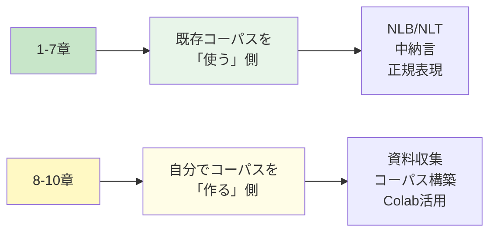
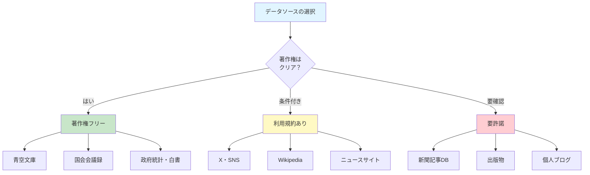

# 資料収集
## 自ら「証拠」を集める探偵になる

これまでの章では、私たちは「証拠保管庫（コーパス）」を利用する探偵でした。[__少納言__](01-language-research.md)や[__NLB__](05-nlb-nlt.md)、[__中納言__](06-chunagon.md)といった強力な検索システムを使い、『BCCWJ』という膨大な「証拠」の山から、言葉の謎を解き明かしてきました。[__正規表現__](07a-regex-basics.md)という「魔法の呪文」も習得しました。

しかし、すべての事件が既存の証拠だけで解決できるわけではありません。

「『推し活』という言葉を研究したいのに、コーパスに用例がない…」
「最新のSNS上の言葉遣いを調べたいのに、2005年までのデータしかない…」
「方言の録音データを分析したいけど、公開されているコーパスがない…」

このような場面に直面したとき、私たちは「証拠保管庫を利用する探偵」から、「自ら現場に赴き、新たな証拠を収集する探偵」へと変身する必要があります。この章から始まる第8〜10章は、まさにその変身のための旅です。



!!! info "この章で学ぶこと"
    - 既存コーパスの限界を理解し、自分でデータを集める意義を説明できる。
    - 研究目的に応じた資料収集先を選べるようになる。
    - 基本的なテキスト収集の技術を身につける。
    - 著作権や個人情報など、倫理的配慮について理解する。

## なぜ自分でデータを集めるのか

### 既存コーパスの「賞味期限」

[__2. コーパスの種類__](02-corpus.md)で少し触れたように、コーパスには「賞味期限」があります。『BCCWJ』は確かに素晴らしいコーパスですが、収録されているデータの多くは2005年以前のものです。つまり、この文章を書いている2025年から見ると、約20年前の日本語を対象としているのです。

!!! example "時代遅れの証拠保管庫"
    「[少納言](https://shonagon.ninjal.ac.jp/)」で以下の言葉を検索してみましょう。いくつの用例が見つかるでしょうか？
    
    - スマホ
    - 推し
    - 蛙化現象
    - 映え
    - エモい
    
    結果はおそらく…ゼロか、あってもごく少数のはずです。

これらの言葉は、2010年代以降に広く使われるようになったものです。『BCCWJ』には、当然ながらこれらの用例はほとんど含まれていません。これが、既存コーパスの最大の限界です。言葉は生き物のように変化し続けますが、コーパスはある時点で「冷凍保存」されてしまいます。

### 研究テーマに合ったデータがない

もう一つの問題は、あなたの研究テーマにぴったり合ったコーパスが存在しない可能性があることです。

たとえば、以下のような研究をしたいと考えてみてください。

- 特定のYouTuberの言葉遣いを分析したい
- 料理レシピの文体を研究したい
- 特定の企業のプレスリリースを時系列で比較したい
- 愛媛の方言を調べたい

これらの研究には、既存の汎用コーパスでは対応できません。自分で必要なデータを集めるしかないのです。

!!! tip "「ないなら作ればいい」の精神"
    研究者にとって、「既存のコーパスにデータがない」ことは、決して研究の終わりではありません。むしろ、それは新しい研究の始まりです。自分でデータを集め、自分だけのコーパスを作る。その過程で、既存のコーパスでは見えなかった言葉の姿が見えてくることもあります。

### 2025年の新たな課題—AI生成テキストの混在

2025年12月現在、私たちは新たな課題に直面しています。それは、**AI生成テキスト**の問題です。

2022年末にChatGPTが登場して以来、ウェブ上には大量のAI生成テキストが溢れるようになりました。ブログ記事、ニュース記事、SNSの投稿、さらには学術論文まで、AIが書いた（あるいは書くのを手伝った）テキストが、人間が書いたテキストと混在しています。

これは、コーパス言語学にとって深刻な問題です。

> もしあなたが「現代日本語の自然な表現」を研究したいと思ったとき、収集したデータにAI生成テキストが大量に含まれていたら、その研究結果は何を意味するのでしょうか？

この問題に対する完璧な解決策は、まだありません。しかし、データ収集の段階で以下の点に気をつけることは重要です。

1. データの出所を明確にする（いつ、誰が、どのような目的で書いたか）
2. 可能な限り、AI生成の可能性が低いソースを選ぶ（青空文庫のような著作権切れの作品、公式の議事録など）
3. 収集したデータにAI生成テキストが含まれる可能性があることを、研究の限界として明記する

## どこからデータを集めるか

それでは、具体的にどこからデータを集めることができるのでしょうか。ここでは、信頼性が高く、比較的簡単にアクセスできるソースを紹介します。



### 著作権フリーの宝庫—青空文庫

[**青空文庫**](https://www.aozora.gr.jp/)は、著作権が切れた文学作品を電子化して無料公開しているウェブサイトです。夏目漱石、芥川龍之介、太宰治など、日本文学の名作が、テキストファイル形式でダウンロードできます。

青空文庫の最大のメリットは、**著作権を気にせずに自由に使える**ことです。研究目的であれば、何の心配もなく、大量のテキストを収集・分析できます。

!!! example "青空文庫から作品をダウンロードする"
    
    === "① 作品を探す"
        1. [青空文庫](https://www.aozora.gr.jp/)に接続します。
        2. 「作家別」から「夏目 漱石」を探します。
        3. 「坊っちゃん（新字新仮名、作品ID：752）」をクリックします。
        
    === "② ダウンロード"
        1. ページ下部の「ファイルのダウンロード」を見つけます。
        2. 「テキストファイル(ルビあり)」をクリックしてダウンロードします。
        3. ダウンロードしたZIPファイルを解凍すると、「bocchan.txt」が現れます。
        
    === "③ ファイルを開く"
        1. [__7. 正規表現__](07a-regex-basics.md)で使ったVSCでファイルを開きます。
        2. 文字化けする場合は、右下の「UTF-8」をクリックして「Shift JIS」を選択します。
        
        ファイルを開くと、以下のようなテキストが表示されます：
        
        ```
        親譲《おやゆず》りの無鉄砲《むてっぽう》で小供の時から損ばかりしている。
        ```
        
    === "④ AIに聞いてみる"
        青空文庫には、どのような作家の作品があるのでしょうか。AIに聞いてみましょう。
        
        ``` { .text .copy title="プロンプト" }
        青空文庫で公開されている作家と作品について教えてください。
        特に、言語研究に適していそうな作品（口語体、会話が多いなど）を
        5つ程度、おすすめしてください。
        ```

青空文庫のテキストには「ルビ」が含まれています。これは、[__7. 正規表現__](07a-regex-basics.md)で学んだ技術を使って除去することができます。後ほど実習で実際にやってみましょう。

!!! note "青空文庫のテキストを一括ダウンロード"
    青空文庫のテキストは、GitHubでも公開されています。大量の作品を一度にダウンロードしたい場合は、以下のリポジトリが便利です。
    
    - [https://github.com/aozorahack/aozorabunko_text](https://github.com/aozorahack/aozorabunko_text)
    
    「Download ZIP」をクリックすれば、青空文庫の全テキストをまとめてダウンロードできます。ファイルサイズが大きいので、ダウンロードには時間がかかります。

### 公的機関のデータベース—国会会議録

[**国会会議録検索システム**](https://kokkai.ndl.go.jp/)は、国会での発言をすべて記録したデータベースです。1947年の第1回国会から現在まで、膨大な量の発言が検索・閲覧できます。

このデータの特徴は以下の通りです。

1. **公的記録である**：政府が公式に作成した記録なので、信頼性が高い。
2. **話し言葉に近い**：国会での発言は、書き言葉よりも話し言葉に近い特徴がある。
3. **時代変化が追える**：1947年から現在まで、約80年分のデータがある。
4. **APIが提供されている**：プログラムから自動的にデータを取得できる。

!!! example "国会会議録で言葉の変化を追う"
    
    === "① 検索してみる"
        1. [国会会議録検索システム](https://kokkai.ndl.go.jp/)に接続します。
        2. 「詳細検索」をクリックします。
        3. 検索語に「人工知能」と入力して検索します。
        4. 何件の発言が見つかるでしょうか？
        
    === "② 時代で絞り込む"
        1. 「開催年月日」で期間を指定します。
        2. たとえば「1980年〜1990年」と「2020年〜2025年」で比較してみましょう。
        3. 発言の内容や文脈に、どのような違いがあるでしょうか？
        
    === "③ 発言をダウンロード"
        1. 検索結果の発言をクリックして詳細を表示します。
        2. テキストを選択してコピーします。
        3. VSCに貼り付けて保存します。

国会会議録は、政治・社会・経済に関する言葉の変化を追跡するのに最適なソースです。たとえば、「AI」「人工知能」という言葉がいつ頃から国会で議論されるようになったのか、その文脈がどう変化してきたのかを調べることができます。

!!! tip "国会会議録API"
    プログラミングができる人は、[国会会議録APIを](https://kokkai.ndl.go.jp/api.html)利用して、自動的に発言を収集できます。詳細は[__10. Colabの活用__](10-colab.md)で触れる予定です。

### SNSという「生きた言葉の現場」

X（旧Twitter）をはじめとするSNSは、まさに「生きた言葉の現場」です。若者言葉、流行語、新語がリアルタイムで飛び交い、話し言葉に近いカジュアルな表現が溢れています。

ただし、SNSからのデータ収集には、いくつかの注意点があります。

1. **利用規約の確認**：各SNSには利用規約があり、データ収集に制限がある場合があります。
2. **個人情報への配慮**：ユーザー名や個人を特定できる情報の扱いには注意が必要です。
3. **API制限**：2023年以降、X（旧Twitter）のAPIは大幅に有料化され、以前のように簡単にデータを収集することが難しくなりました。

!!! warning "2025年のSNSデータ収集事情"
    2023年にXのAPIが大幅に有料化されて以来、研究者がSNSデータを収集する環境は厳しくなっています。以前は無料で大量のツイートを収集できましたが、現在は月額数百〜数千ドルの費用がかかる場合があります。
    
    ただし、Xの「高度な検索」機能を使えば、APIなしでも手動で検索・閲覧することは可能です。大量のデータを自動収集するのではなく、特定のトピックについて少量の用例を探す目的であれば、この方法で十分な場合もあります。

!!! example "Xの高度な検索を使う"
    
    === "① 高度な検索にアクセス"
        1. [Xの高度な検索](https://x.com/search-advanced?lang=ja)に接続します（ログインが必要）。
        2. 「次のキーワードを含む」に検索したい言葉を入力します。
        
    === "② 条件を絞り込む"
        高度な検索では、以下のような条件で絞り込めます：
        
        - 特定のアカウントからの投稿
        - 特定の期間の投稿
        - 特定の言語の投稿
        - リツイート数やいいね数の下限
        
    === "③ 検索演算子を活用"
        検索窓に直接入力することもできます：
        
        - `"エモい" lang:ja` → 日本語の投稿で「エモい」を含むもの
        - `"推し活" since:2024-01-01 until:2024-12-31` → 2024年の投稿
        - `"蛙化現象" min_faves:100` → 100いいね以上の投稿

### ウェブ上のその他のテキスト

ウェブ上には、上記以外にも様々なテキストソースがあります。

| ソース | 特徴 | 注意点 |
|--------|------|--------|
| Wikipedia | 百科事典的な文体、CC BY-SAライセンス | 編集履歴も研究対象になりうる |
| ニュースサイト | 報道文体、時事性が高い | 著作権あり、引用の範囲で |
| 企業プレスリリース | ビジネス文体、公式発表 | 多くの場合は引用可能 |
| 料理レシピサイト | 手順説明の文体 | 利用規約を確認 |
| 商品レビュー | 評価・感想の文体 | 利用規約を確認 |

!!! note "robots.txtを確認する習慣"
    ウェブサイトからデータを収集する前に、そのサイトの「robots.txt」を確認することをおすすめします。robots.txtは、ウェブサイトの管理者が「自動収集を許可するかどうか」を示したファイルです。
    
    たとえば、`https://example.com/robots.txt`にアクセスすると、そのサイトのルールを確認できます。
    
    ```
    User-agent: *
    Disallow: /private/
    Allow: /public/
    ```
    
    上の例では、`/private/`へのアクセスは禁止、`/public/`は許可されています。

## データ収集の技術

### 基本中の基本—コピー＆ペースト

最も簡単なデータ収集方法は、ウェブページからテキストを選択してコピーし、テキストエディタに貼り付けることです。これを**コピペ**と呼びます。

「えっ、そんな原始的な方法？」と思うかもしれませんが、以下のような場面では、コピペが最も確実で効率的な方法です。

- 収集するデータ量が少ない（数十ページ程度）
- 特定の部分だけを選択的に収集したい
- データの品質を目視で確認しながら収集したい

!!! example "効率的なコピペのコツ"
    
    === "① 範囲選択のショートカット"
        長いテキストを選択するとき、最初から最後までドラッグするのは大変です。
        
        **より効率的な方法：**
        1. テキストの最初の部分をクリック
        2. テキストの最後の部分で`Shift`を押しながらクリック
        3. 間のテキストがすべて選択されます
        
    === "② 書式を除去して貼り付け"
        ウェブページからコピーすると、フォントや色などの書式情報も一緒にコピーされることがあります。
        
        **書式なしで貼り付けるショートカット：**
        
        - Windows: `Ctrl + Shift + V`
        - Mac: `Command + Shift + V`
        
    === "③ 複数タブで効率化"
        大量のページからコピーする場合：
        
        1. 収集したいページをすべて新しいタブで開く
        2. 順番にコピー＆ペーストしていく
        3. 終わったタブは`Ctrl + W`で閉じる

### コピーできないウェブページへの対処

ウェブサイトによっては、テキストの選択やコピーが禁止されている場合があります。たとえば、歌詞サイトや一部のニュースサイトです。

!!! warning "技術的にできることと、やっていいことは違う"
    以下で紹介する方法は、「技術的にはこのようなことができる」という説明です。実際にこの方法を使うかどうかは、そのサイトの利用規約や著作権法を確認した上で、慎重に判断してください。
    
    - 個人の学習目的 → 多くの場合OK
    - 研究目的での少量の引用 → 引用の要件を満たせばOK
    - 大量のデータを収集して公開 → 多くの場合NG

テキストの選択が禁止されているウェブページでも、JavaScriptを無効にすることで選択できるようになる場合があります。

!!! example "JavaScriptを無効にする"
    
    === "① 開発者ツールを開く"
        コピーしたいウェブページ上で：
        
        - Windows: `Ctrl + Shift + I`
        - Mac: `Command + Option + I`
        
        画面の右側（または下側）に開発者ツールが表示されます。
        
    === "② 設定を開く"
        1. 開発者ツール内の歯車アイコン（⚙️）をクリック
        2. 「Preferences」または「設定」を選択
        
    === "③ JavaScriptを無効化"
        1. 「Debugger」または「デバッガー」セクションを探す
        2. 「Disable JavaScript」または「JavaScriptを無効にする」にチェック
        3. ページを再読み込み（`F5`）
        
        これで、テキストが選択できるようになる場合があります。
        
    === "④ 元に戻す"
        作業が終わったら、チェックを外してJavaScriptを有効に戻しましょう。

### YouTubeの字幕を収集する

YouTubeの動画には字幕（文字起こし）がついている場合があります。これは話し言葉のデータとして価値があります。

!!! example "YouTube字幕の取得"
    
    === "① 字幕付き動画を探す"
        1. YouTubeで動画を開く
        2. 「CC」ボタンがあれば字幕あり
        3. または[YouGlish](https://youglish.com/japanese)を使う
        
    === "② 文字起こしを表示"
        1. 動画の下にある「…」（その他）をクリック
        2. 「文字起こしを表示」を選択
        3. 右側に字幕一覧が表示される
        
    === "③ コピーする"
        1. 文字起こしの最初の行をクリック
        2. 最後の行で`Shift`を押しながらクリック
        3. `Ctrl + C`でコピー
        4. VSCに`Ctrl + V`で貼り付け
        
    === "④ タイムスタンプを除去"
        コピーした字幕にはタイムスタンプが含まれています。正規表現で除去しましょう：
        
        ``` { .text title="正規表現" }
        ^\d+:\d+\n
        ```
        
        これで「0:00」のような時刻表示を削除できます。

!!! tip "Language Reactor"
    [Language Reactor](https://www.languagereactor.com/)というブラウザ拡張機能を使うと、YouTubeやNetflixの字幕をより簡単に取得できます。語学学習用のツールですが、言語データ収集にも活用できます。

### APIという「正式な入口」

**API**（Application Programming Interface）は、ウェブサービスが提供する「正式なデータ取得窓口」です。[__4. 形態素と形態素解析__](04-pos.md)で、Google AI StudioのAPIキーを取得したことを思い出してください。

APIを使うメリットは以下の通りです。

1. **合法的**：サービス提供者が許可した方法でデータを取得できる
2. **効率的**：プログラムで自動的に大量のデータを取得できる
3. **構造化されている**：データが整理された形式（JSON、XMLなど）で提供される

ただし、APIの利用には以下の点に注意が必要です。

- 多くのAPIは利用登録が必要
- 無料プランには制限がある場合が多い
- 利用規約に従う必要がある

!!! note "2025年のAPI事情"
    2023年以降、多くのウェブサービスがAPIの有料化や制限強化を進めています。特にX（旧Twitter）のAPI有料化は、言語研究者に大きな影響を与えました。
    
    一方で、政府や公的機関が提供するAPIは、引き続き無料で利用できるものが多いです。国会会議録APIや各種オープンデータAPIなどがその例です。

### ウェブスクレイピング—自動収集の入り口

**ウェブスクレイピング**（web scraping）は、ウェブページからデータを自動的に抽出する技術です。Pythonなどのプログラミング言語を使って、大量のウェブページから必要な情報を収集できます。

ただし、この授業ではウェブスクレイピングの詳細には踏み込みません。理由は以下の通りです。

1. プログラミングの知識が必要
2. 法的・倫理的な問題が複雑
3. 初学者には他の方法で十分

ウェブスクレイピングに興味がある方は、[__10. Colabの活用__](10-colab.md)で基礎を学んだ後、専門の書籍やオンラインコースで学ぶことをおすすめします。

!!! warning "スクレイピングの法的リスク"
    ウェブスクレイピングは、やり方によっては法律に違反する可能性があります。
    
    - 利用規約で禁止されているサイトへのスクレイピング
    - サーバーに過度な負荷をかける頻繁なアクセス
    - 著作物の無断複製
    
    「できるからやる」ではなく、「やっていいのか」を常に確認しましょう。

### AIを活用したデータ収集の支援

2025年現在、AIはデータ収集においても強力な支援者になります。

!!! example "AIにデータ収集を相談する"
    
    ``` { .text .copy title="プロンプト" }
    私は「日本語の謝罪表現」について研究したいと考えています。
    
    以下について教えてください：
    1. どのようなソースからデータを集めるのが適切か？
    2. 著作権や倫理的に問題のないソースはどれか？
    3. 効率的なデータ収集の方法は？
    
    なお、プログラミングの知識は初心者レベルです。
    ```

AIは、あなたの研究テーマに適したデータソースの提案や、収集方法のアドバイスをしてくれます。ただし、AIの回答を鵜呑みにせず、実際にそのソースが利用可能か、著作権や利用規約に問題がないかは、自分で確認しましょう。

## 収集したデータの整理

データを収集したら、次は分析に使えるように整理する必要があります。この過程を「**テキストクリーニング**」または「**前処理**」と呼びます。

### よくある「ノイズ」の種類

ウェブから収集したテキストには、様々な「ノイズ」が含まれています。

| ノイズの種類 | 例 | 対処法 |
|------------|-----|--------|
| HTMLタグ | `<p>`, `<br>`, `<div>` | 正規表現で削除 |
| 余分な空白 | 半角・全角スペースの混在 | 正規表現で統一 |
| ルビ | 親譲《おやゆず》り | 正規表現で削除 |
| 注釈記号 | ※、＊、† | 正規表現で削除 |
| ヘッダー・フッター | 著作権表示、ナビゲーション | 手動または正規表現で削除 |

### 正規表現でノイズを除去する

[__7. 正規表現__](07a-regex-basics.md)で学んだ技術が、ここで活躍します。

!!! example "青空文庫のルビを削除する"
    
    青空文庫のテキストには、以下のようなルビが含まれています：
    
    ```
    親譲《おやゆず》りの無鉄砲《むてっぽう》で小供の時から損ばかりしている。
    ```
    
    === "① パターンを確認"
        ルビのパターンは「《》で囲まれた部分」です。
        
        ``` { .text title="正規表現" }
        《.+?》
        ```
        
        - `《` → 開きカッコ
        - `.+?` → 任意の文字の1回以上（最短一致）
        - `》` → 閉じカッコ
        
    === "② 置換する"
        VSCで`Ctrl + H`を押して置換ウィンドウを開きます。
        
        - 検索：`《.+?》`
        - 置換：（空欄のまま）
        - 「正規表現を使用」をオンにする
        - 「すべて置換」をクリック
        
    === "③ 結果を確認"
        ```
        親譲りの無鉄砲で小供の時から損ばかりしている。
        ```
        
        ルビが削除され、本文だけが残りました。

!!! example "HTMLタグを削除する"
    
    ウェブページからコピーしたテキストには、HTMLタグが残っている場合があります。
    
    ```html
    <p>これは<strong>重要な</strong>文章です。</p>
    ```
    
    ``` { .text title="正規表現" }
    <[^>]+>
    ```
    
    - `<` → 開き山括弧
    - `[^>]+` → `>`以外の文字の1回以上
    - `>` → 閉じ山括弧
    
    これで「これは重要な文章です。」だけが残ります。

### 一行一文にする

テキストを分析する際、「一行に一文」という形式に整えると便利な場合があります。

!!! example "句点で改行する"
    
    === "① 現状を確認"
        ```
        親譲りの無鉄砲で小供の時から損ばかりしている。小学校に居る時分学校の二階から飛び降りて一週間ほど腰を抜かした事がある。
        ```
        
    === "② 置換する"
        VSCで`Ctrl + H`を押します。
        
        - 検索：`。`
        - 置換：`。\n`
        - 「すべて置換」をクリック
        
    === "③ 結果を確認"
        ```
        親譲りの無鉄砲で小供の時から損ばかりしている。
        小学校に居る時分学校の二階から飛び降りて一週間ほど腰を抜かした事がある。
        ```

### フォーマットの統一

複数のソースからデータを集めた場合、表記やフォーマットがバラバラになりがちです。

| 統一すべき項目 | 例 |
|--------------|-----|
| 文字コード | UTF-8に統一 |
| 改行コード | LF（`\n`）に統一 |
| 句読点 | 「、」「。」または「，」「．」 |
| 数字 | 半角または全角 |
| 空白 | 半角または全角 |

!!! tip "VSCでの文字コード変換"
    1. ファイルを開く
    2. 右下の文字コード表示（例：「Shift JIS」）をクリック
    3. 「エンコード付きで再度開く」を選択
    4. 「UTF-8」を選択

## 研究者としての責任—倫理的配慮

データ収集は、研究者としての倫理観が問われる場面でもあります。「技術的にできること」と「やっていいこと」は、必ずしも一致しません。

### 著作権を理解する

**著作権**は、創作物（文章、音楽、画像など）を作った人に与えられる権利です。他人の著作物を無断で複製・公開することは、原則として著作権侵害になります。

ただし、以下の場合は例外として認められています。

| 例外 | 条件 | 例 |
|------|------|-----|
| 私的使用 | 個人的な学習目的 | 自分のパソコンにコピー |
| 引用 | 出典明記、主従関係、必然性 | レポートでの引用 |
| 著作権切れ | 作者の死後70年経過 | 青空文庫の作品 |
| CCライセンス | ライセンス条件に従う | Wikipedia |

!!! warning "「研究目的だから大丈夫」は危険"
    「研究目的だから著作権は関係ない」という誤解がありますが、これは間違いです。研究目的であっても、著作権法の範囲内で利用する必要があります。
    
    大量のテキストを収集してコーパスを作成し、それを公開する場合は、著作権者の許諾が必要になる場合があります。

### 個人情報への配慮

SNSやウェブから収集したデータには、個人情報が含まれている場合があります。

- ユーザー名・アカウント名
- 位置情報
- 個人を特定できる内容

研究でこれらのデータを使用する場合は、以下の対応が必要です。

1. **匿名化**：個人を特定できる情報を削除・置換
2. **倫理審査**：大学の研究倫理委員会への申請
3. **同意取得**：場合によっては本人の同意が必要

!!! note "卒業論文での注意点"
    卒業論文でSNSのデータを使用する場合：
    
    - ユーザー名は伏せる（「Aさん」「@user1」など）
    - 投稿内容をそのまま引用する場合は最小限に
    - 個人を特定できる文脈は避ける
    - 可能であれば指導教員に相談する

### 利用規約を読む習慣

ウェブサービスには必ず「利用規約」があります。データ収集を始める前に、必ず利用規約を確認しましょう。

!!! example "利用規約のチェックポイント"
    
    以下の点を確認しましょう：
    
    - [ ] データの収集・ダウンロードは許可されているか？
    - [ ] 自動収集（スクレイピング）は許可されているか？
    - [ ] 収集したデータの利用目的に制限はあるか？
    - [ ] 収集したデータを第三者と共有できるか？
    - [ ] 研究目的での利用に特別な条件はあるか？

### AI生成テキストへの対応

2025年現在、ウェブ上のテキストにはAI生成テキストが混在している可能性があります。これは、言語研究において新たな課題です。

**現時点での対応策：**

1. **データの出所を明確にする**：いつ、どこから、どのように収集したかを記録
2. **信頼性の高いソースを選ぶ**：青空文庫、国会会議録など
3. **限界を認識する**：AI生成テキストが含まれる可能性を論文に明記
4. **AIに相談する**：収集したテキストがAI生成かどうか、AIに分析してもらう（参考程度に）

!!! tip "AIにAI生成テキストを判定してもらう"
    ``` { .text .copy title="プロンプト" }
    以下のテキストがAIによって生成されたものかどうか、
    分析してください。特に、以下の点に注目してください：
    
    1. 文体の特徴
    2. 表現のパターン
    3. AI生成テキストに特有の傾向
    
    【分析対象テキスト】
    （ここにテキストを貼り付け）
    ```
    
    ただし、AIによる判定も100%正確ではないことに注意してください。

## 💻 やってみよう！

### 実習1：青空文庫から作品を収集・整理する

!!! example "夏目漱石『坊っちゃん』のクリーニング"
    
    === "① ダウンロード"
        1. [青空文庫](https://www.aozora.gr.jp/)に接続
        2. 「作家別」→「夏目 漱石」→「坊っちゃん」
        3. 「テキストファイル(ルビあり)」をダウンロード
        4. ZIPファイルを解凍
        
    === "② VSCで開く"
        1. VSCで「bocchan.txt」を開く
        2. 文字化けする場合は文字コードをShift JISに変更
        
    === "③ ルビを削除"
        `Ctrl + H`で置換ウィンドウを開き：
        
        - 検索：`《.+?》`
        - 置換：（空欄）
        - 正規表現をオン
        - 「すべて置換」
        
    === "④ 注記を削除"
        青空文庫には`［＃...］`形式の注記があります：
        
        - 検索：`［＃.+?］`
        - 置換：（空欄）
        
    === "⑤ 一行一文にする"
        - 検索：`。`
        - 置換：`。\n`
        
    === "⑥ 保存"
        `Ctrl + S`で保存。ファイル名を「bocchan_clean.txt」に変更。

<iframe src="../../assets/viz/mkdocs_memo_widget.html" width="100%" height="380" frameborder="0" style="border: none; display: block;"></iframe>

### 実習2：grepで大量ファイルを検索する

VSCには、複数のファイルを対象に正規表現検索ができる「grep」機能があります。

!!! example "夏目漱石作品からオノマトペを探す"
    
    === "① 作品をダウンロード"
        1. [GitHub - aozorabunko_text](https://github.com/aozorahack/aozorabunko_text)にアクセス
        2. 「Download ZIP」をクリック
        3. 解凍して「cards」→「000148」フォルダを探す（夏目漱石）
        
    === "② VSCでフォルダを開く"
        1. VSCで「000148」フォルダを開く
        2. `Ctrl + Shift + F`でgrep検索を開く
        
    === "③ オノマトペを検索"
        検索窓に以下を入力：
        
        ``` { .text title="正規表現" }
        ([ぁ-ん]{2})\1
        ```
        
        正規表現をオンにして検索
        
    === "④ 結果を確認"
        - どのような繰り返し表現が見つかったか？
        - 「ぶらぶら」「ぐるぐる」「にやにや」など、オノマトペ以外も含まれているか？
        
    === "⑤ カタカナも検索"
        ``` { .text title="正規表現" }
        ([ァ-ヴー]{2})\1
        ```

<iframe src="../../assets/viz/mkdocs_memo_widget.html" width="100%" height="380" frameborder="0" style="border: none; display: block;"></iframe>

### 実習3：国会会議録で言葉の変化を調べる

!!! example "「AI」の登場と変化"
    
    === "① 1980年代を検索"
        1. [国会会議録検索システム](https://kokkai.ndl.go.jp/)に接続
        2. 「人工知能」で検索
        3. 期間を「1980年〜1989年」に設定
        4. 何件の発言が見つかるか記録
        
    === "② 2020年代を検索"
        1. 期間を「2020年〜2025年」に設定
        2. 件数を記録
        3. どのような文脈で使われているか、いくつか読んでみる
        
    === "③ 比較・考察"
        - 件数の変化は？
        - 発言の文脈や話題の変化は？
        - 「AI」と「人工知能」の使い分けは？

<iframe src="../../assets/viz/mkdocs_memo_widget.html" width="100%" height="380" frameborder="0" style="border: none; display: block;"></iframe>

## 待ちに待った課題

自分が興味を持っている言葉や表現について、以下の作業を行い、レポートを作成してください。

### 課題内容

1. **研究テーマの設定**
    - 調べたい言葉・表現を1つ選ぶ
    - なぜその言葉に興味を持ったのか、簡単に説明する

2. **データ収集**
    - 以下のソースのうち、**少なくとも2つ**からデータを収集する：
        - 青空文庫
        - 国会会議録
        - X（旧Twitter）の高度な検索
        - その他（YouTube字幕、ウェブサイトなど）
    - 各ソースから**5例以上**の用例を集める

3. **データの整理**
    - 収集したデータを整理し、一つのテキストファイルにまとめる
    - 必要に応じてクリーニング（ルビ削除、タグ削除など）を行う

4. **考察**
    - 各ソースで見つかった用例に、違いや共通点はあったか？
    - データ収集の過程で気づいたこと、困ったことは？

### 提出形式

- A4用紙2ページ以内（PDFまたはWord）
- 以下の内容を含めること：
    1. 研究テーマと選んだ理由
    2. 使用したデータソース
    3. 収集した用例（各ソースから代表的な例を3つ程度）
    4. データ整理の方法（使用した正規表現など）
    5. 考察

### 提出期限

12月18日（木）までに、DiscordのDM機能を利用して提出してください。

!!! tip "課題のヒント"
    - 既存のコーパス（『BCCWJ』など）にない、または少ない言葉を選ぶと面白い
    - 最近の流行語、SNSでよく見る表現、方言などがおすすめ
    - データ収集で困ったときは、AIに相談してみましょう