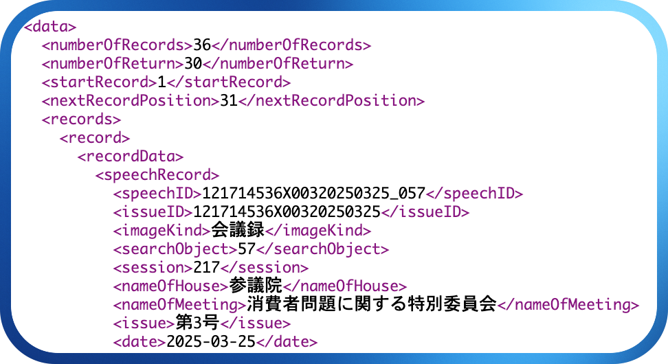
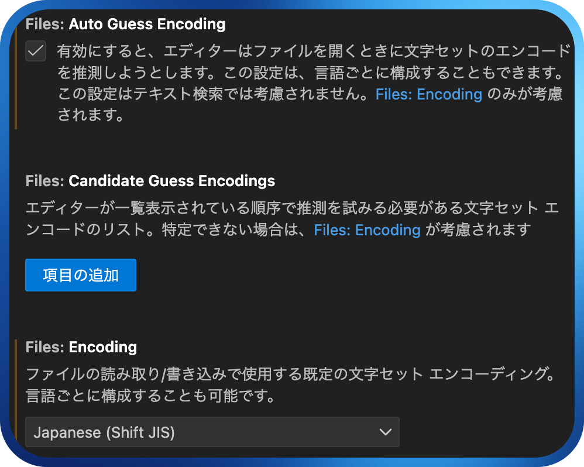
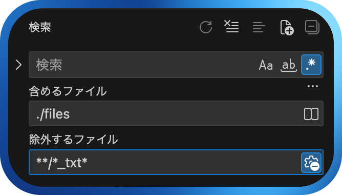
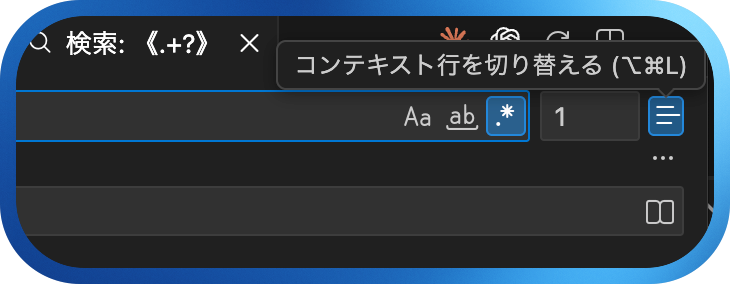

# コーパスの構築
## 自分だけの「証拠保管庫」を作る

[__8. 資料収集__](08-data-collection.md)で、私たちは「証拠保管庫を利用する探偵」から「自ら現場に赴き、新たな証拠を収集する探偵」へと変身しました。青空文庫から文学作品を、国会会議録から政治家の発言を、YouTubeから字幕データを収集する方法を学びました。

しかし、集めた証拠をそのまま段ボール箱に詰め込んでいては、いざというときに必要な証拠を素早く見つけることができません。優れた探偵は、収集した証拠を丁寧に整理し、いつでも検索・分析できる状態で保管します。

この章では、収集したテキストデータを「分析可能なコーパス」へと変換する技術を学びます。探偵に例えるなら、現場で集めた証拠品を、鑑識課が分析できる状態に整える作業です。この地道な作業を**前処理**（preprocessing）と呼びます。前処理は華やかな作業ではありませんが、良い研究の土台となる、きわめて重要なステップです。

!!! info "この章で学ぶこと"
    - 前処理とは何か、なぜ重要なのかを理解する。
    - 正規表現を使ってテキストのノイズを除去できるようになる。
    - 分析しやすいファイル構造とメタデータの付け方を身につける。
    - 複数ファイルを対象とした検索（grep）ができるようになる。

## 前処理
### なぜ前処理が必要なのか

ウェブから収集したテキストは、そのままでは分析に使えないことが多いです。たとえば、青空文庫からダウンロードした夏目漱石の『坊っちゃん』を開いてみると、以下のような内容が含まれています。

```
坊っちゃん
夏目漱石

-------------------------------------------------------
【テキスト中に現れる記号について】

《》：ルビ
（例）坊《ぼ》っちゃん

[#...]：入力者注 主に外字の説明や、傍点の位置の指定
（例）Knut Hamsum[#「Knut Hamsum」に傍点]作
-------------------------------------------------------

　親譲《おやゆず》りの無鉄砲《むてっぽう》で小供の時から損ばかりしている。
```

「親譲りの無鉄砲で小供の時から損ばかりしている」という本文を分析したいのに、ルビ（《おやゆず》）や注記（[#...]）、ヘッダー情報などの「余計なもの」が混じっています。これらを取り除かないと、たとえば「ゆず（柚）」を調べるときに、ルビに含まれている「《おやゆず》りの」の「ゆず」も、調査の対象として含まれてしまいます。このような「余計なもの」を**ノイズ**（noise）と呼びます。ノイズを取り除き、分析に適した形にデータを整える作業が前処理です。

### よくあるノイズの種類

ウェブから収集したテキストには、様々な種類のノイズが含まれています。

| ノイズの種類 | 例 | どこで発生するか |
|------------|-----|-----------------|
| ルビ・注記 | 親譲《おやゆず》り、［＃...］ | 青空文庫 |
| 余分な空白 | 半角・全角スペースの混在 | 様々なソース |
| タイムスタンプ | 0:15, 1:23 | YouTube字幕 |
| ヘッダー・フッター | 著作権表示、ナビゲーション | ウェブページ |
| 改行の乱れ | 段落途中での改行 | PDF変換、ブログ |
| HTMLタグ | `<p>`, `<br>`, `<div>` | ウェブページ |


ノイズの種類はデータソースによって異なります。どのようなノイズが含まれているかを事前に把握し、適切な方法で除去することが重要です。

## 正規表現でノイズを除去する

[__7. 正規表現—基礎編__](07a-regex-basics.md)と[__7. 正規表現—応用編__](07b-regex-advanced.md)で学んだ「魔法の呪文」が、ここで大活躍します。

### 青空文庫のルビを削除する

青空文庫のテキストには、以下のようなルビが含まれています。

```
親譲《おやゆず》りの無鉄砲《むてっぽう》で小供の時から損ばかりしている。
```

このルビを削除して、本文だけを取り出してみましょう。

!!! example "ルビを消す呪文"
    
    === "① パターンを確認"
        ルビのパターンは「《》で囲まれた部分」です。
        
        ``` { .text title="正規表現" }
        《.+?》
        ```
        
        この呪文の意味を日本語に翻訳すると、以下のようになります。
        
        - `《` → 開きカッコ（二重山括弧）
        - `.+?` → 任意の文字の1回以上の繰り返し（最短一致）
        - `》` → 閉じカッコ（二重山括弧）
        
        ここで`?`を忘れると、最長一致になってしまいます。たとえば「親譲《おやゆず》りの無鉄砲《むてっぽう》で」という文字列に対して、`《.+》`（`?`なし）を使うと、「《おやゆず》りの無鉄砲《むてっぽう》」まで一気にマッチしてしまいます。
        
    === "② VS Codeで置換する"
        VS Codeを開き、青空文庫のテキストを貼り付けます。`Ctrl + H`（Mac: `Option + Command + F`）を押して置換ウィンドウを開きます。
        
        - 検索：`《.+?》`
        - 置換：（空欄のまま）
        - 「正規表現を使用」（`.*`ボタン）をオンにする
        - 「すべて置換」をクリック
        
        ルビが削除され、本文だけが残ります。

### 青空文庫の注記を削除する

青空文庫には、ルビ以外にも`［＃...］`という形式の注記が含まれています。

```
おくれんかな［＃「おくれんかな」に傍点］、もし［＃「もし」に傍点］は生温るい言葉だ。
```

この注記も、同じ要領で削除できます。

!!! example "注記を消す呪文"
    
    ``` { .text title="正規表現" }
    ［＃.+?］
    ```
    
    注意点として、ここで使われている括弧は**全角**の`［` `］`です。半角の`[` `]`ではありません。青空文庫のテキストを見て、どのような記号が使われているかを確認しましょう。

### YouTubeの字幕からタイムスタンプを削除する

[__8. 資料収集__](08-data-collection.md)で、YouTubeの文字起こし機能を使ってデータを収集する方法を学びました。コピーした字幕には、以下のようなタイムスタンプが含まれています。

```
0:00
こんにちは、今日のニュースをお伝えします。
0:05
まず最初のトピックは...
```

!!! example "タイムスタンプを消す呪文"
    
    === "① パターンを確認"
        ``` { .text title="正規表現" }
        ^\d+:\d+\n
        ```
    
        この呪文の意味は以下の通りです。
        
        - `^` → 行頭
        - `\d+` → 数字の1回以上の繰り返し
        - `:` → コロン
        - `\n` → 改行

    === "② 改行の削除と挿入"
        文字起こしを見ると、一行には中途半端に改行が入っています。すべての改行を削除しましょう。

        ``` { .text title="正規表現" }
        \n
        ```
        
        すると、一行にすべての文字列が並びます。その状態で最後に、句点を基準として一行一文にしてみましょう。

### HTMLタグを削除する
**[HTML](https://ja.wikipedia.org/wiki/HyperText_Markup_Language)**（Hypertext Markup Language）は、ウェブページの構造や書式などを記述するための[マークアップ言語](https://ja.wikipedia.org/wiki/%E3%83%9E%E3%83%BC%E3%82%AF%E3%82%A2%E3%83%83%E3%83%97%E8%A8%80%E8%AA%9E)です。[このページ](https://www.w3schools.com/html/tryit.asp?filename=tryhtml_intro)に接続すると、HTMLがウェブページにどのように反映されるのかを確認することができます。

[__8. 資料収集__](08-data-collection.md)では、[国会会議録API](http://127.0.0.1:8000/01-special-lecture-on-linguistics/08-data-collection/#:~:text=%E5%9B%BD%E4%BC%9A%E4%BC%9A%E8%AD%B0%E9%8C%B2API)について言及しました。[利用例](https://kokkai.ndl.go.jp/api.html#:~:text=3.%20%E5%88%A9%E7%94%A8%E4%BE%8B)の中身を覗いてみると、次のような構造をしています。

<figure markdown style="text-align: center;">
{: style="width: 65%;"}
<figcaption>図1: 国会会議録APIを利用して「フライドチキン」を検索した例</figcaption>
</figure>

これは厳密に言うとHTMLタグではありませんが、この例を使ってタグを取り除いてみましょう。

!!! example "タグを消す呪文"

    === "① フライドチキン"
        まずは、会議録に[フライドチキン](https://kokkai.ndl.go.jp/api/speech?any=%E3%83%95%E3%83%A9%E3%82%A4%E3%83%89%E3%83%81%E3%82%AD%E3%83%B3)が含まれている発言例を収集しましょう。すべての文字列を選択して、VS Codeにコピペします。

    === "② タグの削除"
        以下の正規表現を使って、タグを削除してみましょう。

        ``` { .text title="正規表現" }
        <[^>]+>
        ```
    
        この呪文の意味は以下の通りです。
        
        - `<` → 開き山括弧
        - `[^>]+` → `>`**以外**の文字の1回以上
        - `>` → 閉じ山括弧
        
        ここで`[^>]`という**否定文字クラス**を使っているのがポイントです。`<.+>`としてしまうと、`<p>これは<strong>`のように、最初の`<`から最後の`>`までマッチしてしまう可能性があります。

これでタグを消すことができますが、もっとよい方法を考えてみましょう。この「フライドチキン」の例で必要なのは、「フライドチキン」が入っている発言（スピーチ）のみを取り出すことです。会議録を見ると、発言は`<speech>`と`</speech>`に囲まれています。

!!! example "必要なのは中身"

    === "① 発言の選択"
        先ほど行った作業を、元に戻しましょう。`Ctrl + Z`を押すことで、前の状態に戻すことができます。元の状態に戻ったら、以下の正規表現を書いてみましょう。

        ``` { .text title="正規表現" }
        <speech>(.*?)</speech>
        ```

    === "② すべての発言を選択"
        正規表現を入力した状態で、`Alt + Enter` (Mac: `Option + Enter`)を押すと、正規表現にマッチするすべての文字列が選択されます。その状態で、`Ctrl + C`でコピーをしましょう。

    === "③ 発言のみが残る"
        新しいテキストファイルを作って、そこに`Ctrl + V`で貼り付けてみましょう。そうすると、`<speech>`と`</speech>`で囲まれていた部分だけが残ります。最後は、以下の正規表現で置換をして、タグを削除するだけです。

        ``` { .text title="正規表現" }
        </?speech>
        ```

        それぞれの行に、ちゃんと「フライドチキン」が含まれているのか、正規表現を利用して`フライド・?チキン`を検索してみましょう。

## フォーマットの統一

複数のソースからデータを集めた場合、表記やフォーマットがバラバラになりがちです。分析の前に、これらを統一しておくことが重要です。

| 統一すべき項目 | 例 | 推奨 |
|--------------|-----|------|
| 文字コード | Shift-JIS, EUC-JP | UTF-8に統一 |
| 改行コード | CRLF, LF | LF（`\n`）に統一 |
| 句読点 | `、`, `。` vs `，`, `．` | どちらかに統一 |
| 数字 | 半角`123` vs 全角`１２３` | 半角に統一 |
| 空白 | 半角` ` vs 全角`　` | 分析目的に応じて |

### 文字コードの変換

青空文庫のテキストファイルは、**Shift-JIS**という文字コードで保存されていることがあります。現代のテキスト処理では**UTF-8**が標準なので、変換しておくと後々便利です。

!!! tip "文字コードをUTF-8で保存"

    1. VS Codeの右下にある文字コード表示（例：「UTF-8」）をクリック
    2. 「エンコード付きで保存」を選択
    3. 「UTF-8」を選択
    
    これで、UTF-8形式のファイルとして保存されます。

### 改行コードの統一

テキストファイルの改行コードは、OSによって異なります。異なる環境で作成されたファイルを混ぜると、改行がうまく認識されないことがあります。VS Codeでは、右下のステータスバーに改行コードが表示されており、クリックすることで変更できます。

## ファイルの整理とメタデータ

### フォルダ構造を決める

小規模なコーパスでも、ファイルが増えてくると管理が大変になります。あらかじめフォルダ構造を決めておくと、後から探しやすくなります。

```
my_corpus/
├── raw/                   # 収集したままのデータ
│   ├── aozora/            # 青空文庫
│   │   ├── soseki/        # 夏目漱石
│   │   └── akutagawa/     # 芥川龍之介
│   ├── kokkai/            # 国会会議録
│   └── youtube/           # YouTube字幕
├── cleaned/               # 前処理済みのデータ
│   ├── aozora/
│   ├── kokkai/
│   └── youtube/
└── metadata.csv           # メタデータ
```

このように「生データ」と「前処理済みデータ」を分けておくと、何か問題があったときに元に戻れます。

!!! tip "命名規則を決める"
    ファイル名には一貫した命名規則を使いましょう。たとえば以下のような規則が考えられます。
    
    - `作者_作品名_発表年.txt`（例：`soseki_botchan_1906.txt`）
    - `ソース_日付_番号.txt`（例：`kokkai_2024-01-15_001.txt`）
    
    日本語のファイル名は避け、半角英数字とアンダースコア（`_`）やハイフン（`-`）を使うのが無難です。

### メタデータを記録する

**メタデータ**（metadata）とは、「データについてのデータ」です。テキストそのものではなく、そのテキストがいつ、誰によって、どのような状況で作られたかという情報です。

| メタデータの例 | 内容 |
|--------------|------|
| 作者 | 夏目漱石 |
| タイトル | 坊っちゃん |
| 発表年 | 1906年 |
| ジャンル | 小説 |
| 収集日 | 2025-12-19 |
| ソース | 青空文庫 |
| URL | https://www.aozora.gr.jp/cards/000148/files/752_14964.html |

メタデータをCSVファイルなどにまとめておくと、後から「1900年代の作品だけを分析したい」「小説とエッセイを比較したい」といったことが簡単にできます。

!!! tip "メタデータのCSVファイルを作る"
    
    ```csv
    filename,author,title,year,genre,source
    soseki_botchan_1906.txt,夏目漱石,坊っちゃん,1906,小説,青空文庫
    soseki_wagahai_1905.txt,夏目漱石,吾輩は猫である,1905,小説,青空文庫
    akutagawa_rashomon_1915.txt,芥川龍之介,羅生門,1915,小説,青空文庫
    ```
    
    このようなメタデータファイルがあれば、Excelやプログラムで簡単にフィルタリングできます。ここで`filename`は、実際のテキストファイル名と一致している必要があります。PythonやRのようなプログラミング言語でテキストファイルを分析するときには、この`filename`を地図のように使って実際のテキストファイルを読み込みます。つまり、テキストファイル名が、メタデータと実際のテキストをつなげる「IDカード」の役割を担います。

## grepで複数ファイルを検索する

コーパスを構築したら、複数のファイルを対象に検索したくなります。VS Codeには、フォルダ内のすべてのファイルを対象に正規表現検索ができる**grep**（global regular expression print）機能があります。grepを使うと、複数のファイルを対象として検索した結果を表示させることができます。今回は、夏目漱石の作品を対象に、改行とルビの削除をしてみましょう。

!!! example "下ごしらえ"
    
    === "① 作品をダウンロード"
        1. [aozorabunko_text](https://github.com/aozorahack/aozorabunko_text?tab=readme-ov-file#%E3%83%80%E3%82%A6%E3%83%B3%E3%83%AD%E3%83%BC%E3%83%89)にある「Download ZIP」をクリックして、テキストファイルをダウンロード
        2. 「Download ZIP」を解凍すると「aozorabunko_text-master」というフォルダが現れるので、中に入って「cards」→「000148」フォルダを探す（夏目漱石の作者番号）

    === "② VS Codeでフォルダを開く"
        1. VS Codeで「ファイル」→「フォルダを開く」（あるいは`Ctrl + O`）
        2. 解凍した「000148」フォルダを選択
        3. 文字化けする人は、`Ctrl+,`で設定を開いて「encoding」を検索して、以下のように設定を変更

        <figure markdown style="text-align: center;">
        {: style="width: 65%;"}
        <figcaption>図2: 文字化け対策</figcaption>
        </figure>

    === "③　フォルダ内を検索"
        読み込んだフォルダの中にある「files」を右クリックして「フォルダ内を検索」を選択します。そうすると、検索窓に切り替わります。そこに正規表現を入力することで、読み込んだフォルダの中にあるすべてのファイルを対象として検索できます。

    === "④　ファイルの除外"
        ところで、開いているフォルダの中身を見ると、ルビが付いているものと、ないものがあります。全体的にルビ有りのファイルが多いですね。重複を取り除きたいので、ルビ無しのファイルは除外してから作業を進めましょう。

        <figure markdown style="text-align: center;">
        {: style="width: 65%;"}
        <figcaption>図3: 除外するファイルの指定</figcaption>
        </figure>

        図3のように「除外するファイル」に、以下の文字列を入力します。このようにすると、すべてのフォルダの中から（`**/`）、ファイル名に`_txt`という文字列が含まれているものは（`*_txt*`）、検索の対象から除外します。

        ``` { .text .copy title="文字列" }
        **/*_txt*
        ```

!!! example "最大検索件数の引き上げ"
    基本的にVS Codeでは、検索結果の上限が「20,000」となっています。これを、十分に大きい数字に変えてみましょう。

    1. `Ctrl + Shift + C`、または、左下にある歯車（設定）にある「コマンドパレット」を選択します。
    2. 窓が出てくるので「ユーザー設定を開く」と入力し、選択します。
    3. 今度は「検索結果の最大数」と入力して「Search: Max Results」にある数字を「1000000」に変更して、「✖」を押して閉じます。

    ちゃんと20,000以上の検索結果が出るのか、grep機能を使って試してみましょう。grepで100万件以上を表示させたい場合には、テキストエディタではなく、プログラミング言語を利用した方がいいでしょう。

では、クリーニングが終わったテキストファイルを対象として、オノマトペを検索してみましょう。「エディターで開く」を選択すると、より大きい画面で見ることができます。画面には、「マッチした件数」「ファイル名」「行番号」「マッチした文字列」「前後の文脈」などの情報が表示されます。この中で「前後の文脈」は、「コンテキスト行を切り替える」ボタンを押すことで、マッチした結果のみを表示させることができます。

<figure markdown style="text-align: center;">
{: style="width: 65%;"}
<figcaption>図4: コンテキスト行の切り替え</figcaption>
</figure>

## マッチした文字列だけ切り取る
今までやってきた操作は、検索結果を「行」レベルで取り出します。しかし、正確に正規表現にマッチした「文字列のみ」を取り出したい場合もあるでしょう。たとえば、オノマトペ（っぽいもの）を検索して、行レベルで取り出すのではなく、その部分だけを切り取る方法です。

!!! example "切り取り"
    今回は、3文字以上のひらがなが、2回繰り返されている例を探してみましょう。
    
    1. 検索結果が表示されているところにカーソルを置き、`Ctrl + Shift + L`（Mac：`Shift + command + L`）を押しましょう。すると、正規表現にマッチした文字列だけが選択されます。
    2. その状態で、コピー（`Ctrl + C`）をしておきます。
    3. 新しいテキストファイルを作って貼り付けると、正規表現にマッチした文字列だけが残ります。

## 💻 やってみよう！

!!! example "特定作家の作品をクリーンアップ"
    ここまで、夏目漱石の作品を対象に作業を行いました。ここでは、夏目漱石以外の作家を一人選び、その人の作品すべてを対象として、作業を行ってみましょう。オノマトペ以外に、ちょっと気になっている表現を正規表現で検索して、切り取ってみましょう。