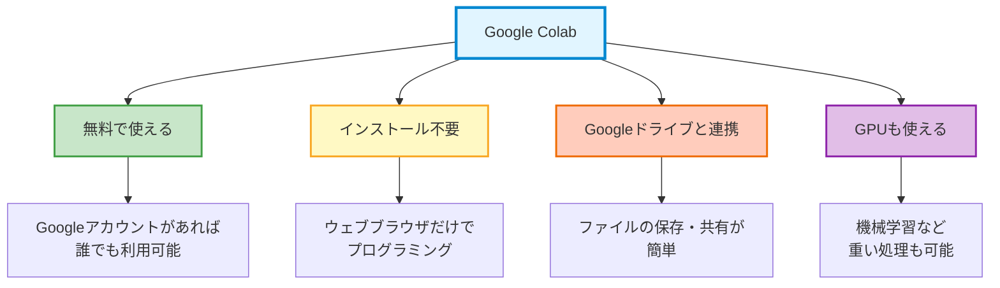
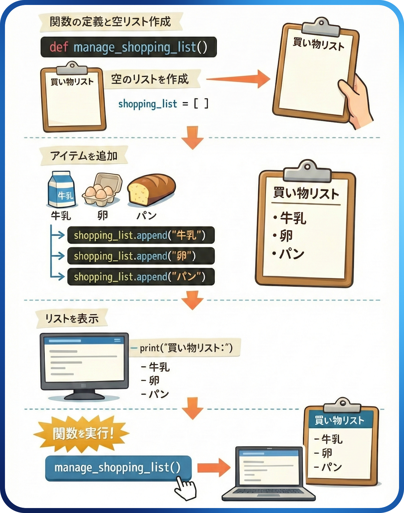
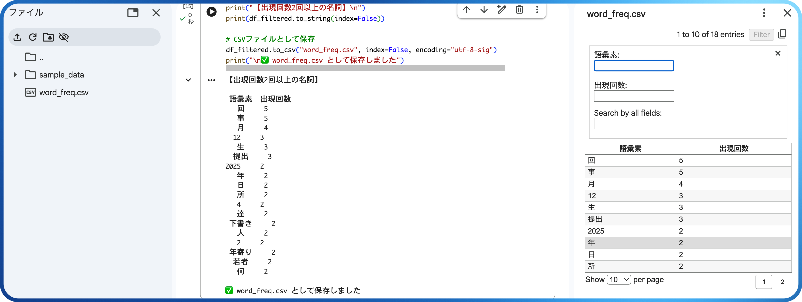
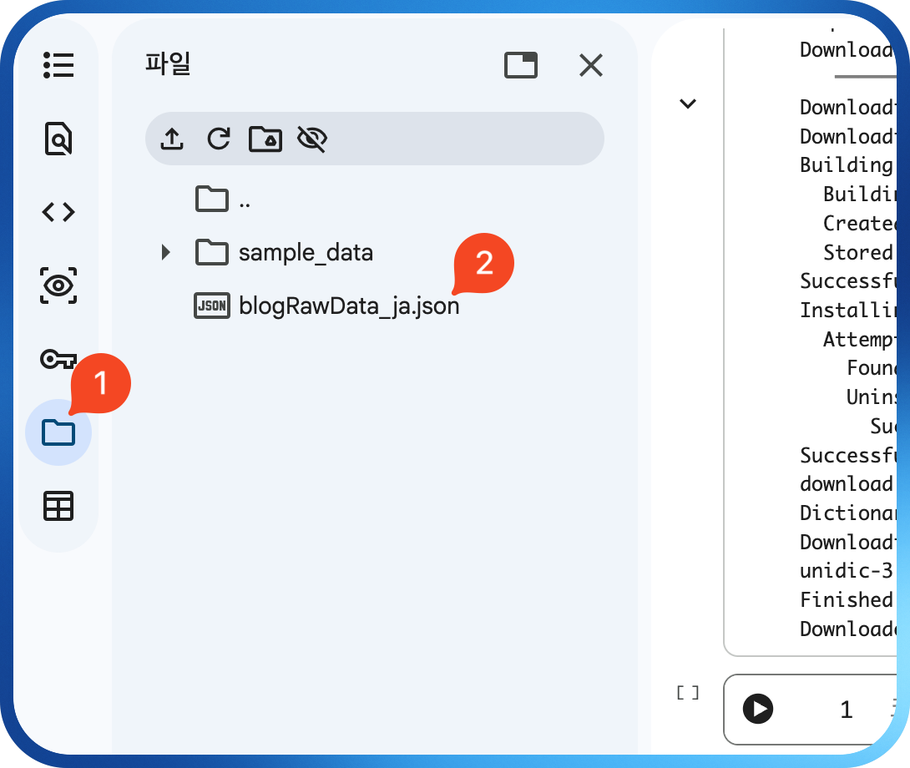

# Colabの活用—基礎編
## いよいよ「研究室」に入る
これまでの章で、私たちは言葉の探偵として多くの技術を身につけてきました。[__1. 言語研究の技法__](01-language-research.md)で「言葉のアンテナ」を立て、[__2. コーパスの種類__](02-corpus.md)で様々な「証拠保管庫」の存在を知り、[__3. 言語研究とAI__](03-ai.md)で優秀な「アシスタント」を手に入れました。[__4. 形態素と形態素解析__](04-pos.md)では「鑑識課」の仕組みを学び、[__5. NLBとNLT__](05-nlb-nlt.md)や[__6. 中納言__](06-chunagon.md)で既存のコーパス検索システムを使いこなせるようになりました。[__7. 正規表現__](07a-regex-basics.md)という「魔法の呪文」も習得し、[__8. 資料収集__](08-data-collection.md)と[__9. コーパスの構築__](09-corpus-building.md)では自ら「証拠」を集め、整理する方法も学びました。

さて、いよいよ最終章です。ここでは、これまで学んできた知識を総動員して、私たちだけの「研究室（ラボ）」を立ち上げます。その舞台となるのが、[Google Colab](https://colab.google/)です。

「えっ、プログラミング？私には無理…」と思った方、ご安心ください。2025年の今、私たちには強力な味方がいます。[__3. 言語研究とAI__](03-ai.md)で出会った「AIアシスタント」が、プログラミングの世界でも大活躍してくれます。コードを書く作業の多くをAIに任せ、私たちは「何を分析したいか」「結果をどう解釈するか」という、探偵として最も重要な部分に集中できるのです。

!!! info "この章で学ぶこと"
    - Google Colabの基本的な使い方を身につける。
    - fugashiとUniDicを使って、自分で形態素解析を実行できるようになる。
    - AIの力を借りてコードを書き、言語データを分析する方法を学ぶ。

## Google Colabとは
### クラウド上の研究室
**Google Colab**（Google Colaboratory、以下Colab）は、Googleが無料で提供しているクラウド上のプログラミング環境です。ウェブブラウザさえあれば、自分のパソコンに何もインストールすることなく、[Python](https://www.python.org/)（パイソン）というプログラミング言語を使って、データを分析することができます。



探偵の比喩で言えば、Colabは「クラウド上に借りられる研究室」です。自分の事務所に高価な分析機器を揃える必要はありません。Googleが用意してくれた最新の設備を、必要なときだけ借りて使えます。もちろん、より高性能の機材を使うためには、お金を払う必要があります。

<figure markdown style="text-align: center;">
{: style="width: 60%;"}
<figcaption>図1: <a href="https://gdep-sol.co.jp/gpu-products/nvidia-gpu/nvidia-h100-gpu/" target="_blank">H100 GPUの価格</a></figcaption>
</figure>

### あなたの知らないコーディングの世界
「中納言やNLBがあるのに、なぜわざわざプログラミングをする必要があるの？」という疑問を持つ方もいるでしょう。確かに、既存のコーパス検索システムは非常に強力です。しかし、以下のような場面では、自分でプログラムを書く必要が出てきます。

1. 独自のコーパスを分析したい：[__9. コーパスの構築__](09-corpus-building.md)で作った自分だけのコーパスは、中納言では検索できません。
2. 大量のデータを自動処理したい：大量のテキストを一括で形態素解析するのは、手作業では大変です。

!!! tip "Pythonという言語"
    世界に色々な言語・方言があるのと同じく、プログラミング言語にも色々な種類があります。[Pythonは、世界で最も人気のあるプログラミング言語の一つ](https://survey.stackoverflow.co/2025/technology#most-popular-technologies)です。特に、データ分析や機械学習、自然言語処理の分野で広く使われています。文法がシンプルで読みやすく、初心者にも学びやすい言語です。一つのプログラミング言語を学習すると、他のプログラミング言語の学習はかなり楽になります。

    本書では、Pythonの文法を一から学習することはしません。代わりに、AIの力を借りてコードを生成し、それを実行・修正していく方法を学びます。

「プログラミング」（programming）と聞くと、何か大きな仕事（システムの設計や構築）のように響くかもしれません。ここでは「プログラミング」の代わりに**コーディング**（coding）という言葉を使うことにしましょう。簡単に言うと、コーディングは「人間の指示を機械語に翻訳する作業」です。高度な数学的な知識は、本書では必要ありません。

ごく簡単なコーディングは、レゴブロックを積み上げていくような、それほど難しくない作業です。コーディングは算数レベルの知識でできると、あの有名人は言っています。

<figure markdown style="text-align: center;">
{: style="width: 60%;"}
<figcaption>図2: <a href="https://www.youtube.com/watch?v=nKIu9yen5nc" target="_blank">足し算、引き算。それだけです。</a></figcaption>
</figure>

たとえば、以下の簡単なコードを実行すると、あらかじめ入力しておいたアイテムを「買い物リスト」として出力してくれます。コードを読んで、どういう作業をしているのかを想像してみましょう。「def」はdefine（定義する）、「append」は「付け加える」、「print」は「表示する」、「for」は「繰り返し（ループ）」を意味します。

```python { .text .copy title="「買い物リスト」を出力するPythonコード" }
# 買い物リストを管理する関数を定義
def manage_shopping_list():
    # 空の買い物リストを作成
    shopping_list = []

    # 買い物リストにアイテムを追加
    shopping_list.append("牛乳")
    shopping_list.append("卵")
    shopping_list.append("パン")

    # 買い物リストを表示
    print("買い物リスト:")
    for item in shopping_list:
        print(f"- {item}")

# 関数を実行して買い物リストを管理
manage_shopping_list()
```

上のコードを実際に走らせると、次のように「print」されます。

```python { .text .copy title="出力結果" }
買い物リスト:
- 牛乳
- 卵
- パン
```

以下のように図にしてみると、もっと簡単に見えるかもしれません。

<figure markdown style="text-align: center;">
{: style="width: 60%;"}
<figcaption>図3: コードの流れと意味</figcaption>
</figure>

!!! example "ちょっとだけプログラマー気分"
    
    === "① Hello world!"
        プログラミング言語を学ぶとき、最初に出力するのは「Hello world!」という文字列です。私たちも新しい世界に挨拶を送ってみましょう。[myCompiler](https://www.mycompiler.io/ja/new/python)に接続して、`コードを実行`ボタンを押してみましょう。

    === "② 買い物リストを出力"
        今回は、先ほどの買い物リストを出力してみましょう。以下のコードをコピーして[myCompiler](https://www.mycompiler.io/ja/new/python)に貼り付けて、`コードを実行`してみましょう。

        ```python { .text .copy title="「買い物リスト」を出力するPythonコード" }
        # 買い物リストを管理する関数を定義
        def manage_shopping_list():
            # 空の買い物リストを作成
            shopping_list = []
        
            # 買い物リストにアイテムを追加
            shopping_list.append("牛乳")
            shopping_list.append("卵")
            shopping_list.append("パン")
        
            # 買い物リストを表示
            print("買い物リスト:")
            for item in shopping_list:
                print(f"- {item}")
        
        # 関数を実行して買い物リストを管理
        manage_shopping_list()
        ```

このコードを少し修正するだけで、別の結果を得ることができます。たとえば、`shopping_list.append("牛乳")`の「牛乳」を「味噌汁」に変えると、「牛乳」の代わりに「味噌汁」が結果として出力されます。「簡単すぎる」と思いましたか。そのくらい簡単なレベルのコーディングでいいです、本書では。

## Colabを使ってみよう
### ノートブックを作成する
簡単なコードは[myCompiler](https://www.mycompiler.io/ja/new/python)でもいいですが、本書ではもっと色々なことができるColabを使います。ここでもGoogleのアカウントが必要ですので、ログインしておきましょう。

!!! example "はじめてのColab"
    
    === "① Colabに接続"
        1. [Google Colab](https://colab.research.google.com/?hl=ja)に接続します。
        2. 左下にある`ノートブックを新規作成`をクリックします。
        3. しばらく待つと、新しいノートブックが開きます。
        
    === "② ノートブックの構造"
        Colabのノートブックは、「セル」と呼ばれるブロックの集まりです。セルには2種類あります。
        
        - **コードセル**：Pythonのコードを書いて実行する
        - **テキストセル**：説明文やメモを書く（Markdown形式）
        
        最初から表示されているのはコードセルです。
        
    === "③ はじめてのコード"
        コードセルに以下を入力して、`Shift + Enter`（または▶ボタン）を押してみましょう。
        
        ```python
        print("Hello world!")
        ```
        
        セルの下に「Hello world!」と表示されれば成功です。

### セルの基本操作
Colabを使いこなすために、以下の基本操作を覚えておくと便利です。

| 操作 | ショートカット | 説明 |
|------|--------------|------|
| セルを実行 | `Shift + Enter` | コードを実行して次のセルに移動 |
| セルを実行（移動なし） | `Ctrl + Enter` | コードを実行、カーソルはそのまま |
| 新しいセルを追加 | `Ctrl + M + B` | 現在のセルの下に新しいセルを追加 |
| セルを削除 | `Ctrl + M + D` | 現在のセルを削除 |
| コードセル↔テキストセル | `Ctrl + M + M` / `Ctrl + M + Y` | セルの種類を切り替え |

!!! warning "セルの実行順序に注意"
    Colabでは、セルを上から順番に実行することが基本です。たとえば、2番目のセルで定義したものを、1番目のセルで使おうとするとエラーになります。Colabのメニューにある`ランタイム`から`すべてのセルを実行`を選ぶと、上から順番にすべてのセルが実行されます。

## 形態素解析器
### fugashi
[__4. 形態素と形態素解析__](04-pos.md)で、形態素解析の仕組みを学びました。「[Web茶まめ](https://chamame.ninjal.ac.jp/)」を使えばウェブブラウザ上で手軽に形態素解析ができますが、大量のテキストを一括で処理したい場合は、自分のパソコン、あるいは先ほど使ったColabのような環境に形態素解析器をインストールした方が便利です。

日本語の形態素解析器としては、MeCabが広く知られていますが、本書では[**fugashi**](https://github.com/polm/fugashi)（ふがし）を使います。そして、辞書としては国立国語研究所が開発した[UniDic](https://clrd.ninjal.ac.jp/unidic/)を使います。UniDicを使うと、[__6. 中納言__](06-chunagon.md)で検索した『BCCWJ』や『CSJ』などのコーパスと同じ基準で形態素解析ができます。

### 形態素解析
Colabは、セッションを開始するたびに「まっさらな状態」からスタートします。そのため、fugashiとUniDicは毎回インストールする必要があります（といっても、コードをコピペして実行するだけです）。

!!! example "Colabにインストール"
    
    === "① インストールコマンド"
        新しいコードセルに以下を入力して実行します。
        
        ```python { .text .copy title="コード" }
        # MeCabライブラリのインストール（fugashiが内部で使用）
        !apt-get install -y mecab libmecab-dev
        
        # fugashiとunidicをインストール
        !pip install 'fugashi[unidic]'
        
        # 辞書のダウンロード
        !python -m unidic download
        ```
        
        `!`で始まる行は、Pythonのコードではなく、システムコマンド（bashコマンド）を実行する指示です。インストールには2〜3分程度かかります。
        
    === "② インストール確認"
        次に、新しいセルで以下のように書いて実行してみましょう。
        
        ```python { .text .copy title="コード" }
        # 「import」は、他の人が作ってくれた便利な機能（ライブラリ）を読み込む命令です。
        # 料理で言えば「調味料を棚から取り出す」ようなものです。
        from fugashi import Tagger
        
        # Taggerを初期化
        tagger = Tagger()
        
        # 「text」という変数（箱）を作ってそこに文字列を入れる
        text = "すもももももももものうち"
        
        print("【形態素解析の結果】")
        for word in tagger(text):
            print(f"形態素「{word.surface}」の品詞は「{word.pos}」で、語彙素は「{word.feature.lemma}」です。")
        ```
        
        形態素解析の結果が表示されれば成功です。

!!! tip "変数とは"
    変数は、データを一時的に保存しておく「箱」のようなものです。箱に名前をつけておくと、後からその名前でデータを取り出せます。先ほどのコードでは、`text`という文字列が「変数」の役割をしています。この変数の名前は`momo`でも`ehime`でも何でもいいですが、人間が見てわかりやすい名前を付けた方がいいでしょう。

fugashiの出力を見ると、以下のようになっています。

```
【形態素解析の結果】
形態素「すもも」の品詞は「名詞,普通名詞,一般,*」で、語彙素は「李」です。
形態素「も」の品詞は「助詞,係助詞,*,*」で、語彙素は「も」です。
形態素「もも」の品詞は「名詞,普通名詞,一般,*」で、語彙素は「桃」です。
形態素「も」の品詞は「助詞,係助詞,*,*」で、語彙素は「も」です。
形態素「もも」の品詞は「名詞,普通名詞,一般,*」で、語彙素は「桃」です。
形態素「の」の品詞は「助詞,格助詞,*,*」で、語彙素は「の」です。
形態素「うち」の品詞は「名詞,普通名詞,副詞可能,*」で、語彙素は「内」です。
```

最初の行を例にすると、コードの中に書いた`{word.surface}`が「すもも」、`{word.pos}`が「名詞,普通名詞,一般,*」、`{word.feature.lemma}`が「李」と出力されています。UniDicで`{word.surface}`は元の文字列、つまり「表層形」を意味します。そして、`{word.pos}`と`word.feature.lemma`はそれぞれ「品詞」と「語彙素」を意味します。これらの他にも、以下のような属性があります。

| 属性 | 説明 | 例 |
|------|------|-----|
| `word.surface` | 表層形（元の文字列） | すもも |
| `word.pos` | 品詞 | 名詞,普通名詞,一般,* |
| `word.feature.pos1` | 品詞大分類 | 名詞 |
| `word.feature.pos2` | 品詞中分類 | 普通名詞 |
| `word.feature.pos3` | 品詞小分類 | 一般 |
| `word.feature.pos4` | 品詞細分類 | * |
| `word.feature.lemma` | 語彙素 | 李 |
| `word.feature.lForm` | 語彙素読み | スモモ |
| `word.feature.orth` | 書字形出現形 | すもも |
| `word.feature.orthBase` | 書字形基本形 | すもも |
| `word.feature.pron` | 発音形出現形 | スモモ |
| `word.feature.goshu` | 語種 | 和 |

`word.pos`は品詞情報をコンマ区切りの文字列として返します。「名詞」や「動詞」のように、品詞の大分類のみを出力させたい場合は、`word.feature.pos1`とします。

!!! tip "goshu（語種）の見方"
    `word.feature.goshu`を使って形態素解析をすると、形態素の語種の判別ができます。たとえば、和語の場合は「和」、漢語の場合は「漢」、外来語は「外」と表示されます。その他、「本箱・トラブる」のような「混（種語）」、「韓国・アメリカ・山田・佐藤・NHK」のような「固（有名）」、「記号」や「不明」があります。

## AIにコードを書いてもらう
### プロンプトエンジニアリング
2026年1月現在のAIは、コードを書くこともサポートしてくれます。日本語で「何をしたいのか」を伝えるだけで、それなりにいい感じのコードを生成してくれます。ただし、その際には「ちゃんと説明する」必要があります。

子どもが母親に、何かを買ってもらうためにおねだりする場面を考えてみましょう。おねだりがうまく通じないのは、何の文脈なしに「買って」とだけ繰り返し言うからです。もっと具体的に、なぜそれが必要なのかを説明する必要があります。

<figure markdown style="text-align: center;">
{: style="width: 100%;"}
<figcaption>図4: 税込 5,709,000円</figcaption>
</figure>

AIから望ましい出力を得るためには、適切な指示（プロンプト）を与える必要があります。どのような指示がより良い結果を引き出すかを研究し、効果的なプロンプトを設計・改善していく技術を**プロンプトエンジニアリング**と呼びます。言語学の観点から言えば、「人間とAIとのコミュニケーションの最適化」とも言えるでしょう。文脈の明示、曖昧性の排除、タスクの構造化など、言語学の知見を活かせる分野とも言えます。

!!! example "AIにコードを書いてもらう"
    実際に、[Gemini](https://gemini.google.com/)や[ChatGPT](https://chatgpt.com/)などのAIを使って、以下のプロンプトを試してみましょう。

    === "① 悪い例"
        ``` { .text .copy title="プロンプト" }
        次のテキストを形態素解析するコード
        ---
        親譲りの無鉄砲で小供の時から損ばかりしている。
        小学校に居る時分学校の二階から飛び降りて一週間ほど腰を抜かした事がある。
        なぜそんな無闇をしたと聞く人があるかも知れぬ。
        別段深い理由でもない。新築の二階から首を出していたら、同級生の一人が冗談に、
        いくら威張っても、そこから飛び降りる事は出来まい。弱虫やーい。と囃したからである。
        小使に負ぶさって帰って来た時、おやじが大きな眼をして二階ぐらいから飛び降りて
        腰を抜かす奴があるかと云ったから、この次は抜かさずに飛んで見せますと答えた。
        ---
        ```
        
        これでは、どのように形態素解析がしたいのか、結果をどう表示したいのか、AIにはわかりません。にもかかわらず、2026年現在の気の利くAIは、かなりいい答えを生成してくれます。たとえば、ChatGPT(5.2 Extended thinking)は、[このようにコードを生成](https://chatgpt.com/share/69525735-bd08-8003-9607-4d1246dc76ed)しています。でも、もっと具体的に書くと、もっと具体的な答えが得られます。
        
    === "② 良い例"
        ``` { .text .copy title="プロンプト" }
        Google Colabで以下の作業をするPythonコードを書いてください。
        
        【環境】
        - fugashiとunidicはインストール済み
        
        【やりたいこと】
        1. 以下のテキストを形態素解析する
            ---
            親譲りの無鉄砲で小供の時から損ばかりしている。
            小学校に居る時分学校の二階から飛び降りて一週間ほど腰を抜かした事がある。
            なぜそんな無闇をしたと聞く人があるかも知れぬ。
            別段深い理由でもない。新築の二階から首を出していたら、同級生の一人が冗談に、
            いくら威張っても、そこから飛び降りる事は出来まい。弱虫やーい。と囃したからである。
            小使に負ぶさって帰って来た時、おやじが大きな眼をして二階ぐらいから飛び降りて
            腰を抜かす奴があるかと云ったから、この次は抜かさずに飛んで見せますと答えた。
            ---
        2. 各形態素について、表層形と品詞大分類を出力する
        3. 名詞だけを抽出してリストにする
        
        【出力形式】
        - 各形態素を1行ずつ表示
        - 最後に名詞のリストをコンマ区切りで表示
        ```

        このように、環境・やりたいこと・出力形式を明確に伝えると、AIはより適切なコードを生成してくれます。たとえば、ChatGPT(5.2 Extended thinking)は、[このようにコードを生成](https://chatgpt.com/s/t_695257d4825c8191b290d47f704e1158)してくれます。

    === "③ コードの実行と修正"
        AIが生成したコードをColabにコピペして実行してみましょう。もしエラーが出たら、Colabの中でGeminiを利用して修正するか、エラーメッセージをコピーして、別のAIに伝えて修正を依頼するといいでしょう。

## 頻度分析
### 単語の出現頻度を数える
コーパス言語学で最も基本的な分析方法の一つが、頻度分析です。ある単語がテキストの中に何回出現するのかを数え、その分布を調べます。

!!! example "フィクションではありません"
    
    === "① AIへのプロンプト"
        以下のプロンプトをAIに送ってみましょう。
        
        ``` { .text .copy title="プロンプト" }
        Google Colabで以下の作業をするPythonコードを書いてください。
        
        【環境】
        - fugashiとunidicはインストール済み
        
        【やりたいこと】
        1. 以下のテキストを形態素解析する
           今日は2025年12月31日。現在時刻は15時47分。
           来週の言語学特講で使用する教材を執筆している。
           ところで、ゼミの4回生たちに「12月23日（火）までに卒業論文の下書きを提出しなさい」と
           伝えているのにもかかわらず、今のところ、7人中3人しか提出していない。
           2025年2月に「4回生は12月に卒論の2回目の下書きを提出する」と伝えているのにもかかわらずだ。
           大学生を教えていて最近気づいたことの1つ。
           年寄りと若者の間には次のような共通点があるということだ。
           お年寄りは（私も）時々、以前何回も話したことを、あたかも初めてかのように話すことがある。
           これは、加齢による自然な現象ではないだろうか。
           このような傾向は、20代の若者たちにも見られる。
           授業で何回も繰り返して言っているのにもかかわらず、
           「そんなの初めて聞きました」的な振る舞いをすることがあるからである。
        2. 名詞だけを抽出する（word.posに「名詞」が含まれるもの）
        3. 語彙素（word.feature.lemma）を使って、各名詞の出現回数を数える
        4. 出現回数が多い順に並べて表示する
        
        【出力形式】
        - 「語彙素: 出現回数」の形式で表示
        ```
        
    === "② サンプルコード"
        以下のコードは、[Claude](https://claude.ai/) Opus 4.5が生成したものです。Colabで実行してみると、エラーが出ることなく、結果が得られます。
        
        ```python { .text .copy title="コード（Claude Opus 4.5）" }
        import fugashi
        from collections import Counter
        
        # テキストを定義
        text = """今日は2025年12月31日。現在時刻は15時47分。
        来週の言語学特講で使用する教材を執筆している。
        ところで、ゼミの4回生たちに「12月23日（火）までに卒業論文の下書きを提出しなさい」と
        伝えているのにもかかわらず、今のところ、7人中3人しか提出していない。
        2025年2月に「4回生は12月に卒論の2回目の下書きを提出する」と伝えているのにもかかわらずだ。
        大学生を教えていて最近気づいたことの1つ。
        年寄りと若者の間には次のような共通点があるということだ。
        お年寄りは（私も）時々、以前何回も話したことを、あたかも初めてかのように話すことがある。
        これは、加齢による自然な現象ではないだろうか。
        このような傾向は、20代の若者たちにも見られる。
        授業で何回も繰り返して言っているのにもかかわらず、
        「そんなの初めて聞きました」的な振る舞いをすることがあるからである。"""
        
        # Taggerの初期化
        tagger = fugashi.Tagger()
        
        # 形態素解析を実行
        words = tagger(text)
        
        # 名詞の語彙素を抽出
        noun_lemmas = []
        for word in words:
            # 品詞に「名詞」が含まれるものを抽出
            if "名詞" in word.pos:
                # 語彙素を取得（Noneの場合は表層形を使用）
                lemma = word.feature.lemma if word.feature.lemma else word.surface
                noun_lemmas.append(lemma)
        
        # 出現回数をカウント
        noun_counts = Counter(noun_lemmas)
        
        # 出現回数が多い順にソートして表示
        print("【名詞の出現回数（語彙素ベース）】\n")
        for lemma, count in noun_counts.most_common():
            print(f"{lemma}: {count}")
        ```
        
    === "③ コードを翻訳してもらう"
        コードに簡単な注釈が書いてありますが、コードを書いたことのない人からすると、どういう意味なのか、しっくりこないかもしれません。先ほどのコードをAIに渡して、さらにわかりやすく説明してもらうこともできます。以下は、Gemini 3 Proが生成したものです。

        ```python { .text .copy title="コード（Gemini 3 Pro）" }
        # 1. 道具箱の準備
        import fugashi
        from collections import Counter
        # 解説：解析に使う「fugashi（包丁）」と、集計に使う「Counter（カウンター）」という道具を箱から出しています。
        
        # 2. 分析対象のセット
        text = """今日は2025年12月31日。（中略）振る舞いをすることがあるからである。"""
        # 解説：分析したい文章を「text」という名前の箱に入れています。これが今回の料理の材料です。
        
        # 3. 解析エンジンの起動
        tagger = fugashi.Tagger()
        # 解説：「Tagger（タガー）」という、文章を単語に分解して品詞を判定する装置の電源を入れました。
        
        # 4. バラバラに分解する
        words = tagger(text)
        # 解説：先ほどの文章（text）を装置に通しました。これで文章が「単語（形態素）」ごとのリスト（words）に分解されました。
        
        # 5. 名詞だけを選び出す作業（ここが重要！）
        noun_lemmas = []  # 名詞を入れるための空っぽのトレイを用意
        
        for word in words: # 単語を一つずつ手に取って確認するループ処理
            
            # もし、その単語の品詞ラベルに「名詞」が含まれていたら...
            if "名詞" in word.pos:
                
                # その単語の「辞書形（見出し語）」を取得する。
                # （例：「気づい」→「気づく」、「話した」→「話す」に直す作業）
                # もし辞書形がなければ、そのままの形を使う。
                lemma = word.feature.lemma if word.feature.lemma else word.surface
                
                # 用意しておいたトレイにポイッと投げ込む
                noun_lemmas.append(lemma)
        
        # 6. 集計する
        noun_counts = Counter(noun_lemmas)
        # 解説：トレイに溜まった名詞の山を、Counterに渡して「どの単語が何回出てきたか」を一瞬で数えさせました。
        
        # 7. 結果の表示
        print("【名詞の出現回数（語彙素ベース）】\n")
        
        # 多い順（most_common）に並べ替えて、上から順に画面に表示する
        for lemma, count in noun_counts.most_common():
            print(f"{lemma}: {count}")
        ```

    === "④ テキストを変えてみる"
        「② サンプルコード」の`text = "..."`の部分を、自分が分析したいテキストに変えて、Colabで実行してみましょう（あるいは、別のAIが生成したコードを利用してもいいでしょう）。青空文庫やウェブ上に散らかっているテキストの一部を貼り付けてもいいでしょう。

### Pandasでデータを整理する
頻度分析の結果をより扱いやすくするために、**Pandas**（パンダス）というライブラリを使います。Pandasは、データを表形式で扱うためのツールで、Excelのような操作ができます。

!!! example "Pandasで頻度表を作る"
    
    === "① コードの追加生成"
        先ほど、AIが生成したコードに続いて、以下のプロンプトを送ってみましょう。

        ```text { .text .copy title="プロンプト" }
        先ほどのコードを修正して、以下の機能を追加してください。
        
        【追加機能】
        1. Pandasを使って、結果をデータフレーム（表形式）にする
        2. 列名は「語彙素」「出現回数」とする
        3. 出現回数が2回以上の単語だけを表示する
        4. 結果をCSVファイルとして保存する（ファイル名: word_freq.csv）
        ```

    === "② サンプルコード"
        以下のコードは、[Claude](https://claude.ai/) Opus 4.5が生成したものです。「pandas」を「pd」と略して読み込んでいますね。

        ```python { .text .copy title="コード" }
        import fugashi
        from collections import Counter
        import pandas as pd
        
        # テキストを定義
        text = """今日は2025年12月31日。現在時刻は15時47分。
        来週の言語学特講で使用する教材を執筆している。
        ところで、ゼミの4回生たちに「12月23日（火）までに卒業論文の下書きを提出しなさい」と
        伝えているのにもかかわらず、今のところ、7人中3人しか提出していない。
        2025年2月に「4回生は12月に卒論の2回目の下書きを提出する」と伝えているのにもかかわらずだ。
        大学生を教えていて最近気づいたことの1つ。
        年寄りと若者の間には次のような共通点があるということだ。
        お年寄りは（私も）時々、以前何回も話したことを、あたかも初めてかのように話すことがある。
        これは、加齢による自然な現象ではないだろうか。
        このような傾向は、20代の若者たちにも見られる。
        授業で何回も繰り返して言っているのにもかかわらず、
        「そんなの初めて聞きました」的な振る舞いをすることがあるからである。"""
        
        # Taggerの初期化
        tagger = fugashi.Tagger()
        
        # 形態素解析を実行
        words = tagger(text)
        
        # 名詞の語彙素を抽出
        noun_lemmas = []
        for word in words:
            if "名詞" in word.pos:
                lemma = word.feature.lemma if word.feature.lemma else word.surface
                noun_lemmas.append(lemma)
        
        # 出現回数をカウント
        noun_counts = Counter(noun_lemmas)
        
        # データフレームを作成
        df = pd.DataFrame(
            noun_counts.most_common(),
            columns=["語彙素", "出現回数"]
        )
        
        # 出現回数が2回以上のものだけをフィルタリング
        df_filtered = df[df["出現回数"] >= 2].reset_index(drop=True)
        
        # 結果を表示
        print("【出現回数2回以上の名詞】\n")
        print(df_filtered.to_string(index=False))
        
        # CSVファイルとして保存
        df_filtered.to_csv("word_freq.csv", index=False, encoding="utf-8-sig")
        print("\n✅ word_freq.csv として保存しました")
        ```

        コードを実行すると、Colabの左側にある「ファイル」に、`word_freq.csv`というファイルが作成されます。このファイルは、ダウンロードも可能ですし、ダブルクリックして右側に開くこともできます。

        <figure markdown style="text-align: center;">
        {: style="width: 100%;"}
        <figcaption>図5: Colabで表を開いた様子</figcaption>
        </figure>
        
!!! note "なぜExcelではなく、Pandasを使うのか？"
    「こういう作業はExcelでもできるのに、どうしてわざわざ、わかりにくいコードを使うの？」と思うかもしれません。確かに、数十行程度のデータであれば、Excelでも十分です。しかし、PythonのPandasを使うメリットが、いくつかあります。

    === "① 再現可能性"
        データを扱う研究において最も重要なのは**再現可能性**（replicability）です。同じデータに対して同じ分析をすれば、誰がやっても同じ結果が得られなければなりません。

        Excelの場合、手作業によるミス（誤ってセルを消すなど）が生じる可能性がありますが、Pandasはコードによって処理されるため、誰がやっても同じ結果になり、その履歴（データ処理のプロセス）が残ります。

        | Excel | Pandas |
        |-------|--------|
        | クリック操作の連続 → 何をしたか記録されない | コードがそのまま手順の記録になる |
        | 「どうやって集計したの？」と聞かれたら説明が大変 | 「このコードを実行した」で終わり |
        
        卒業論文で「名詞の出現頻度を数えた」と書くとき、Pandasならコードを載せるだけで、読者が同じ分析を再現できます。

    === "② 大規模データへの対応"
        研究では、数万〜数百万件のデータを扱うことも珍しくありません。

        | データ規模 | Excel | Pandas |
        |------------|-------|--------|
        | 100行 | 快適 | 快適 |
        | 50万行 | 動作が遅い | 快適 |
        | 104万行以上 | 読込不可 | 対応可能 |
        
        『BCCWJ』から「ありつく」の用例を100件程度収集して扱う程度ならExcelでもいいですが、『BCCWJ』におけるすべての用言の用例を分析する場合は、Excelだと限界があります。

    === "③ 作業の自動化"
        Pandasを使えば、形態素解析から集計、保存までを、一連の流れで処理できます。
        
        ```
        テキスト → fugashi（形態素解析） → Pandas（集計・整理） → CSV保存
        ```
        
        Excelだと「形態素解析の結果をコピペして、並べ替えて…」などの手作業が必要ですが、Pandasなら数行のコードで自動的に終わります。

        <figure markdown style="text-align: center;">
        {: style="width: 100%;"}
        <figcaption>図6: わくわくが止まらない</figcaption>
        </figure>

## ファイルの読み込み
コードに少量のテキストを使って、問題なく形態素解析ができることを確認しました。これからは、もっと多くのテキストを使って、形態素解析をしてみましょう。ここからは、直接テキストをコードに埋め込むのではなく、ファイルとして読み込む方法を使います。

### 直接アップロード
Googleドライブを経由せず、ファイルを直接Colabにアップロードすることもできます。

!!! example "ファイルを直接アップロード"
    
    ```python { .text .copy title="コード" }
    from google.colab import files
    
    # ファイル選択ダイアログを表示
    uploaded = files.upload()
    
    # アップロードされたファイル名を取得
    filename = list(uploaded.keys())[0]
    
    # ファイルの内容を読み込む
    with open(filename, 'r', encoding='utf-8') as f:
        text = f.read()
    
    print(f"ファイル '{filename}' を読み込みました。")
    print(f"文字数: {len(text)}")
    ```
    
    実行すると「ファイルを選択」ボタンが表示されるので、自分のパソコンからファイルを選んでアップロードできます。

### Googleドライブとの連携
Colabの強みの一つは、Googleドライブと簡単に連携できる点です。自分のGoogleドライブにテキストファイルをアップロードしておけば、Colabからそのファイルを読み込んで分析できます。

!!! example "Googleドライブをマウントする"
    
    === "① マウントコマンド"
        以下のコードを実行すると、「Googleドライブに接続」を求める画面が表示されます。「すべて」を選択して許可すると、ColabからGoogleドライブにアクセス可能になります。
        
        ```python { .text .copy title="コード" }
        from google.colab import drive
        drive.mount('/content/drive')
        ```     
        
    === "② ファイルの場所"
        マウント後、Googleドライブのファイルは以下のパスでアクセスできます。
        
        ```
        /content/drive/MyDrive/（フォルダ名）/（ファイル名）
        ```
        
        たとえば、「MyDrive」の中の「corpus」フォルダにある「soseki.txt」というファイルは、
        
        ```
        /content/drive/MyDrive/corpus/soseki.txt
        ```
        
        というパスになります。
        
    === "③ ファイルを読み込む"
        テキストファイルを読み込むには、以下のようなコードを使います。
        
        ```python
        # ファイルを開いて読み込む
        with open('/content/drive/MyDrive/corpus/soseki.txt', 'r', encoding='utf-8') as f:
            text = f.read()
        
        # 最初の100文字を表示
        print(text[:100])
        ```

## 💻 やってみよう！

!!! example "基本のおさらい"
    === "① 特定の品詞のみ抽出"
        1. Google Colabで新しいノートブックを作成する
        2. fugashiとunidicをインストールする
        3. 「② 言葉の探偵見習い」にあるテキストをを形態素解析する  
        4. 結果から、名詞と動詞をそれぞれ抽出する 

    === "② 言葉の探偵見習い"
        ``` { .text .copy }
        金曜日、4限終了5分前。
        「ねえ、正直さ」
        隣に座る木村が、ノートパソコンをそっと閉じながら囁いた。
        「この授業、意味あると思う？コーパスとか、正規表現とか。就活で『私は大学でコロケーションを学びました』とか言っても、面接官ぽかんでしょ」
        私は曖昧に笑った。実は、私も同じことを考えていた。
        言語学特講。単位が取りやすそうだと思って履修した。蓋を開けてみれば、「形態素解析」だの「MIスコア」だの、聞いたこともない用語の嵐。先生は「言葉の探偵になりましょう」なんて楽しそうに言うけれど、私が解きたい謎は「どうやったら内定がもらえるか」であって、「『全然』がなぜ肯定で使われるようになったか」ではない。
        
        三週間後。
        就職課で、エントリーシートの添削を受けていた。
        「うーん、『コミュニケーション能力が高い』って書いてるけど、これ、みんな書くんだよね」
        担当者がペンで丸をつける。
        「もっと具体的に。データで示せると強いんだけど」
        データ。
        ふと、授業で先生が言っていたことを思い出した。
        「言葉は、ただの感覚じゃなくて、データで検証できるんです」
        私は家に帰ってから、「就活」「自己PR」「強み」といった言葉を検索してみた。就活サイトの記事を読み漁るのではなく、実際の内定者のエントリーシート集を眺めながら、どんな言葉がよく使われているのかを観察してみた。
        すると、見えてきた。「コミュニケーション能力」という言葉は、確かにあふれている。でも、内定につながっている文章には、もっと具体的なエピソードと、数字があった。
        コーパスって、こういうことか。
        言葉のパターンを観察して、そこから法則を見つけ出す。私は「コミュニケーション能力が高い」を消して、アルバイト先で実際にやったことを書き直した。
        
        さらに一か月後。
        カフェでアルバイト中、店長に呼ばれた。
        「ね、最近Googleのクチコミ増えてきたじゃない？あれ、ちょっと分析してくれない？どんな言葉が多いかとか」
        普通なら面倒だと思うところだ。でも、私の頭にはすぐに方法が浮かんだ。クチコミをテキストファイルにまとめて、どんな形容詞が多いかを調べればいい。「雰囲気がいい」「落ち着く」「スタッフが親切」。ポジティブな言葉のパターンを抽出して、店長に報告した。
        「すごいね、こういうの得意なの？」
        得意、というか……。
        授業で似たようなことをやったから、抵抗がなかっただけだ。でも、それが「得意」に見えるなら、悪くない。
        
        期末試験の日。
        教室に向かう途中、木村と会った。
        「結局さ、この授業、何の役に立ったと思う？」
        私は少し考えてから答えた。
        「言葉を観察するようになった、かな」
        木村が怪訝な顔をする。
        「友達と話してるときとかさ、『この人、こういう言い方するんだな』って気づくようになった。LINEの返信も、相手がどんな言葉を使うタイプか見てから返すようになったし」
        データを見る目。パターンを見つける力。仮説を立てて検証する姿勢。
        この授業で学んだのは、コーパスの使い方だけじゃなかった。言葉という、人生で最も使う道具と、どう向き合うかということだった。
        「ふーん」
        木村は興味なさそうに言ったけれど、私にはわかっていた。
        この「なんとなく」の感覚を、データで確かめる力。それは、就活でも、仕事でも、人間関係でも、きっと私を助けてくれる。
        言葉の謎を解く探偵に、私は少しだけ近づいたのかもしれない。
        
        （完）
        ```

!!! example "強力なAIと極力協力"
    
    1. ダウンロードした青空文庫のテキストから、好きな作家の作品を選んで、Colabにアップロードする
    2. テキストの前処理（ルビや注釈などを削除）してから形態素解析を行い、名詞の頻度表を作成するコードをAIに作成させる（プロンプトエンジニアリング）
    3. コードを確認・実行してみて、結果を吟味する
    4. 想定外の結果、あるいは、エラーが出たら、改めてAIに指示をしてコードを修正する

## 最後の課題

!!! example "AIにコードを書いてもらおう"
    [ChatGPT](https://chat.openai.com/)、[Gemini](https://gemini.google.com/)、[Claude](https://claude.ai/)のいずれかのAIを使って、配布したファイル（`blogRawData_ja.json`）を分析するコードを作成し、Colabで実行してみましょう。

    手順:
    
    1. Colabで新しいノートブックを開く
    2. まず、fugashiとUniDicをインストールする
    3. Colabの左側にある「ファイル」をクリックして、ファイルをアップロードする
        <figure markdown style="text-align: center;">
        {: style="width: 50%;"}
        <figcaption>図7: ファイルをドラッグ・アンド・ドロップ</figcaption>
        </figure>
    4. タスクにあるプロンプトの例を「参考にして」、AIにコードを書いてもらう
    5. 生成されたコードをColabにコピペして実行
    6. コードが問題なく実行されて、望んでいる結果が出るまでAIとのやりとりを繰り返す
    
    課題内容:
    
    以下の3つのタスクから2つを選び、AIの力を借りてコードを作成・実行してください。以下にあるプロンプト例は、あくまでも「例」です。適当にプロンプトを修正して、カスタマイズしましょう。

    もし、以下のタスクの中に、みなさんの気に入るタスクがなかったら、独自のタスクを設けて取り組んでもいいです。そうした方が、もう少し楽しく課題に取り組むことができるでしょう。

    === "① 形容詞の抽出"
        
        テキストの中に登場する形容詞だけを抽出し、頻度順に表示してみると、次のようなことがわかるかもしれません。
        
        - テキストに見られる感情的なトーン（ポジティブ、あるいは、ネガティブな形容詞の割合）
        - 書き手の文体的な特徴（どんな形容詞を好んで使うか）
        - ジャンルによる違い（ブログ・新聞・小説など）

        プロンプト例:
        ``` { .text .copy title="プロンプト" }
        Google Colabで、fugashiとUniDicを使って日本語テキストから
        形容詞だけを抽出し、頻度順に表示するPythonコードを書いてください。
        
        【ファイル情報】
        - ファイル名: blogRawData_ja.json
        - 形式: JSON
        - 構造: [{"id": 1, "content": ["文1", "文2", ...]}, ...]
        - 分析対象: 各記事の「content」フィールド
        
        【条件】
        - fugashiとUniDicはすでにインストール済みです
        - ファイルの読み込みから書いてください
        - 形容詞は「形容詞」で始まる品詞を抽出してください
        - 結果は「語彙素: 出現回数」の形式で表示してください
        ```
        
    === "② 文の長さの平均"
        
        一文の長さ（形態素数）の平均を計算すると、以下の点について、何かしらの発見があるかもしれません。
        
        - テキストの読みやすさ（短い文が多いほど読みやすい傾向）
        - 話し言葉と書き言葉の違い（話し言葉は文が短くなりがち）
        - 作家やジャンルによる文体の違い（村上春樹と夏目漱石）

        プロンプト例:
        ``` { .text .copy title="プロンプト" }
        Google Colabで、fugashiとUniDicを使って日本語テキストの各文の
        形態素数をカウントし、平均を計算するPythonコードを書いてください。
        
        【ファイル情報】
        - ファイル名: blogRawData_ja.json
        - 形式: JSON
        - 構造: [{"id": 1, "content": ["文1", "文2", ...]}, ...]
        - 分析対象: 各記事の「content」フィールド
        

        【条件】
        - fugashiとUniDicはすでにインストール済みです
        - ファイルの読み込みから書いてください
        - 文の区切りは「。」「！」「？」とします
        - 結果は以下を表示してください
            - 文の総数
            - 平均形態素数
            - 文の長さの分布（短い文：1-5形態素、中程度：6-15形態素、長い文：16形態素以上の割合）
        ```
        
    === "③ 助詞の比較"
        
        「は」と「が」の出現回数を比較することで、次の点について、考察することができるかもしれません。       
        
        - 新情報と旧情報のバランス（「が」は新情報を導入しやすい）
        - 日本語学習者が苦手とする「は」と「が」の使い分けの実態

        プロンプト例:
        ``` { .text .copy title="プロンプト" }
        Google Colabで、fugashiとUniDicを使って日本語テキスト中の
        助詞「は」と「が」の出現回数を比較するPythonコードを書いてください。
        
        【ファイル情報】
        - ファイル名: blogRawData_ja.json
        - 形式: JSON
        - 構造: [{"id": 1, "content": ["文1", "文2", ...]}, ...]
        - 分析対象: 各記事の「content」フィールド
        
        【条件】
        - fugashiとUniDicはすでにインストール済みです
        - ファイルの読み込みから書いてください
        - 品詞が「助詞」かつ語彙素が「は」または「が」のものを数えてください
        - 結果は以下を表示してください
            - 「は」と「が」の出現回数
            - 「は」と「が」の比率（例：「が」は「は」の○倍）
            - 「は」を含む文の例を3つ
            - 「が」を含む文の例を3つ
        ```
うまくいかないときは、以下の対処法を参考にして、AIに聞いてみましょう（もちろん、私に聞いてもらってもいいです）。
    
| 状況 | 対処法 |
|------|--------|
| コードを実行したらエラーが出た | エラーメッセージ全文をコピーして、AIに「このエラーを解決してください」と送る |
| 何も表示されない | 「コードを実行しましたが何も表示されません。printで途中経過を確認できるように修正してください」と送る |
| 結果がおかしい | 具体的に何がおかしいかを伝える（例：「形容詞ではなく名詞が表示されています」） |
| AIの回答が理解できない | 「初心者向けにもっと簡単に説明してください」と頼む |
    

課題は、以下の2点をWordなどでまとめ、wordファイル（あるいはPDF形式）で提出してください。
締め切りは、1月22日（木）までです。

1. Colabノートブックのスクリーンショット（コードと実行結果が見える状態）
2. 簡単な振り返りメモ
    - どのタスクに取り組んだか
    - うまくいった点、苦労した点
    - AIとのやりとりで気づいたこと