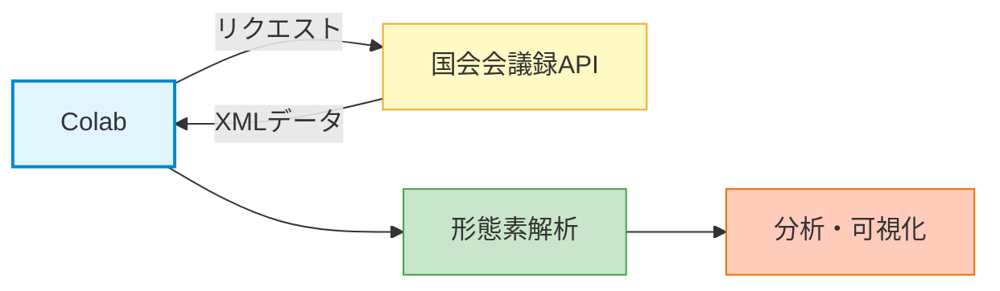
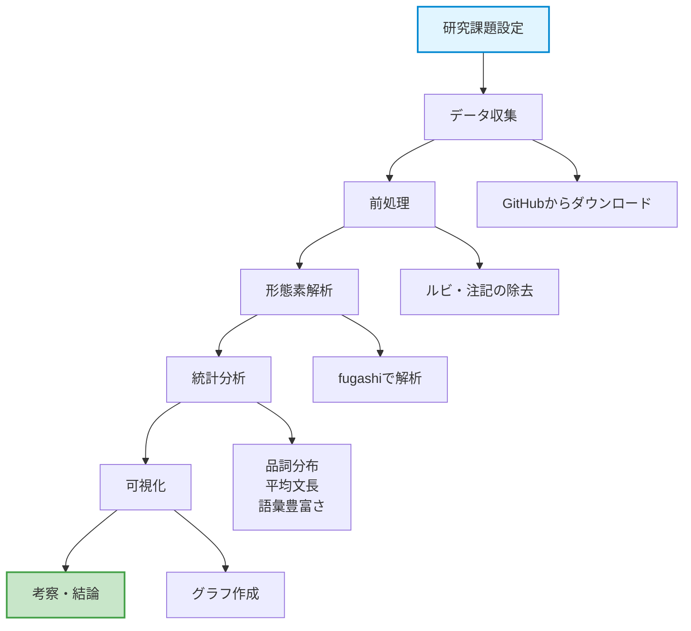
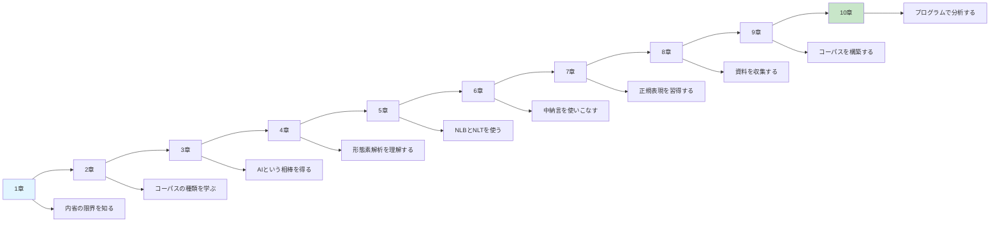

# Colabの活用—応用編
## 探偵事務所のフル稼働
[__基礎編__](10a-colab-basics.md)で、私たちは「クラウド上の研究室」を立ち上げ、fugashiとUniDicを使った形態素解析の基礎を学びました。そして、AIの力を借りてコードを生成し、テキストデータ分析の味見をしました。

しかし、現状は研究室を立ち上げただけで、まだ本格的な捜査には取り組んでいません。この応用編では、研究室の設備をフル稼働させ、より高度な分析に挑戦します。外部のデータに直接アクセスしてデータを取得してみる。大規模なテキストを一括で処理してみる。結果をグラフで可視化する。これらの技術を身につければ、あなたは言葉の謎を解き明かす本格的な探偵になれるでしょう。

!!! info "この章で学ぶこと"
    - 外部API（国会会議録）を使ってデータを収集する方法を学ぶ
    - 青空文庫のテキストをColabで直接取得・分析する方法を身につける
    - 複数のテキストファイルを一括で形態素解析する
    - 分析結果をグラフで可視化する技術を習得する

## 国会会議録APIを使う
### 国会会議録検索システム
[__8. 資料収集__](08-data-collection.md)で、国会会議録検索システムについて触れました。このシステムには[__4. 形態素と形態素解析__](04-pos.md)で使ってみたAPIが用意されていて、システムから直接データを取得することができるようになっています。ウェブサイトを手作業で検索する代わりに、Colabからコードを実行することで、必要なデータを自動的に収集することができるということです。



### 国会会議録検索システムの検索用API
国会会議録検索システムを、API経由で利用する方法として、ここでは3つの方法を試してみることにします。

| API | 説明 | 用途 |
|-----|------|------|
| `meeting_list` | 会議録の一覧を取得 | どんな会議があるか調べる |
| `meeting` | 会議単位でデータを取得 | 特定の会議の全発言を取得 |
| `speech` | 発言単位でデータを取得 | 特定のキーワードを含む発言を検索 |

!!! warning "利用条件・免責事項"
    本格的にAPIを使用する前に、[利用条件・免責事項](https://kokkai.ndl.go.jp/api.html#terms_of_condition)を確認しておきましょう。特に「短時間での大量アクセス等」には注意する必要があります。連続してリクエストを送る場合は、数秒の間隔を空けるといいでしょう（後ほど`time`ライブラリを使用します）。

!!! example "国会でのチャッピー"
    以下の作業は、まずColabに[fugashiをインストール](https://kr-jp.github.io/01-special-lecture-on-linguistics/10a-colab-basics/#_7)してから進めるようにしましょう。

    === "① 基本的なリクエスト"
        「ＧＰＴ」という言葉を含む発言を検索します。各行にコメントで説明を入れていますので、じっくり読んでみてください。
        
        ```python { .text .copy title="コード（Claude Opus 4.5）" }
        # ============================================================
        # ライブラリの読み込み（import）
        # ライブラリとは、誰かが作ってくれた便利な機能の集まりです
        # ============================================================
        
        import requests  # ウェブサイトやサーバーにアクセスするためのライブラリ
        import xml.etree.ElementTree as ET  # XMLデータを解析するためのライブラリ
        
        # ============================================================
        # APIにリクエストを送る準備
        # ============================================================
        
        # APIのURL（このアドレスにアクセスするとデータがもらえる）
        base_url = "https://kokkai.ndl.go.jp/api/speech"
        
        # 検索条件を辞書形式で指定
        # 辞書形式とは「項目名: 値」のペアで情報を整理する方法です
        params = {
            "any": "ＧＰＴ",           # 検索キーワード（この言葉を含む発言を探す）
            "from": "2022-11-30",        # 検索開始日（この日以降の発言を対象）
            "until": "2025-12-31",       # 検索終了日（この日以前の発言を対象）
            "maximumRecords": 100,        # 取得する件数（最大100件まで指定可能）
            "recordPacking": "xml"       # データの形式（XML形式で受け取る）
        }
        
        # ============================================================
        # APIにリクエストを送信
        # ============================================================
        
        # requests.get() でサーバーにデータを要求し、結果をresponseに格納
        response = requests.get(base_url, params=params)
        
        # ============================================================
        # 結果を確認
        # ============================================================
        
        # status_code（ステータスコード）はリクエストが成功したかを示す数字
        # 200 = 成功、404 = ページが見つからない、500 = サーバーエラー
        print(f"ステータスコード: {response.status_code}")
        print(f"（200なら成功、それ以外はエラーの可能性あり）")
        print(f"\n取得したデータの長さ: {len(response.text):,} 文字")
        ```
        
    === "② 検索キーワードを含む部分を抽出"
        APIから返ってくるデータには、会議の冒頭部分（委員の異動など）も含まれています「ＧＰＴ」を実際に含む部分だけを抽出して表示します。
        
        ```python { .text .copy title="コード（Claude Opus 4.5）" }
        import re  # 正規表現を使うためのライブラリ
        
        # ============================================================
        # XMLを解析して発言データを取り出す
        # ============================================================
        
        # XMLデータを解析可能な形式に変換
        root = ET.fromstring(response.content)
        
        # 検索結果の総件数を確認
        num_records = root.find('.//numberOfRecords')
        if num_records is not None:
            print(f"該当する発言の総数: {num_records.text} 件\n")
        
        # すべての発言レコードを取得
        speeches = root.findall('.//speechRecord')
        
        # ============================================================
        # 検索キーワードを含む部分を抽出して表示
        # ============================================================
        
        search_keyword = "ＧＰＴ"  # 検索に使ったキーワード
        
        print(f"【「{search_keyword}」を含む発言（上位{len(speeches)}件）】")
        print("=" * 60)
        
        for i, speech in enumerate(speeches, 1):
            # 発言者名を取得
            speaker = speech.find('speaker')
            speaker_name = speaker.text if speaker is not None else "不明"
            
            # 会議名を取得
            meeting = speech.find('nameOfMeeting')
            meeting_name = meeting.text if meeting is not None else "不明"
            
            # 日付を取得
            date = speech.find('date')
            date_text = date.text if date is not None else "不明"
            
            # 発言内容を取得
            content = speech.find('speech')
            
            if content is not None and content.text:
                full_text = content.text
                
                # キーワードを含む文を抽出
                # 「。」で文に分割し、キーワードを含む文だけを取り出す
                sentences = re.split(r'[。\n]', full_text)
                keyword_sentences = [s.strip() for s in sentences 
                                     if search_keyword in s and len(s.strip()) > 10]
                
                if keyword_sentences:
                    print(f"\n{i}. {speaker_name}")
                    print(f"   （{meeting_name}、{date_text}）")
                    print(f"   ─" * 25)
                    
                    # キーワードを含む文を最大3文まで表示
                    for j, sentence in enumerate(keyword_sentences[:3], 1):
                        # キーワード部分を【】で囲んで目立たせる
                        highlighted = sentence.replace(search_keyword, f"【{search_keyword}】")
                        # 長すぎる場合は省略
                        if len(highlighted) > 200:
                            highlighted = highlighted[:200] + "..."
                        print(f"   {j}) {highlighted}")
        
        print("\n" + "=" * 60)
        ```
        
    === "③ キーワード周辺の語を分析"
        「ＧＰＴ」という言葉がどのような文脈で使われているかを知るために、キーワードを含む文だけを対象に形態素解析を行い、一緒に使われている単語（共起語）を抽出します。
        
        ```python { .text .copy title="コード（Claude Opus 4.5）" }
        from fugashi import Tagger
        from collections import Counter
        
        # ============================================================
        # 形態素解析の準備
        # ============================================================
        
        tagger = Tagger()  # 形態素解析器を初期化
        search_keyword = "ＧＰＴ"
        
        # キーワードを含む文だけを集める
        keyword_sentences_all = []
        
        for speech in speeches:
            content = speech.find('speech')
            if content is not None and content.text:
                # 文に分割
                sentences = re.split(r'[。\n]', content.text)
                # キーワードを含む文だけを追加
                for s in sentences:
                    if search_keyword in s and len(s.strip()) > 10:
                        keyword_sentences_all.append(s.strip())
        
        print(f"「{search_keyword}」を含む文の数: {len(keyword_sentences_all)}文\n")
        
        # ============================================================
        # キーワードを含む文から名詞を抽出
        # ============================================================
        
        nouns_near_keyword = []

        for sentence in keyword_sentences_all:
            for word in tagger(sentence):
                # 普通名詞だけを抽出（ただし検索キーワード自体は除外）
                if word.pos.startswith('名詞,普通名詞'):
                    lemma = word.feature.lemma
                    if lemma is not None and lemma not in ['ＧＰＴ']:
                        nouns_near_keyword.append(lemma)
        
        # 頻度をカウント
        noun_counts = Counter(nouns_near_keyword)
        
        # ============================================================
        # 結果を表示
        # ============================================================
        
        print(f"【「{search_keyword}」と一緒に使われている名詞（上位20語）】")
        print("─" * 40)
        
        for rank, (noun, count) in enumerate(noun_counts.most_common(20), 1):
            # 棒グラフ風に表示（10回につき1つの█）
            bar = "█" * min(count // 10, 20)
            print(f"{rank:2}. {noun:<10} {count:3}回 {bar}")
        ```

### 特定のトピックの時系列分析

国会での議論がどのように変化してきたかを分析することもできます。たとえば、「AI」という言葉が国会でいつ頃から頻繁に使われるようになったのか、社会的な出来事（ChatGPTの登場など）と関連があるのかを調べることができます。

!!! example "「AI」への言及"
    
    === "① 年ごとの発言数を集計"       
        言葉の使用頻度の変化を追うことで、社会の関心の移り変わりを観察することができます。たとえば「AI」の発言数が急増した年があれば、その年に何か重要な出来事（技術革新・法整備・社会問題など）があった可能性があります。このような分析方法は、言語と社会の関係を探る**社会言語学**的な研究とも接点があります。

        ```python { .text .copy title="コード（Claude Opus 4.5）" }
        import requests
        import xml.etree.ElementTree as ET
        import time  # 待機処理に使用
        
        base_url = "https://kokkai.ndl.go.jp/api/speech"
        
        # ============================================================
        # 年ごとの発言数を格納する辞書
        # 辞書は {キー: 値} の形でデータを保存できる便利な形式
        # 例: {2020: 150, 2021: 230, 2022: 450, ...}
        # ============================================================
        yearly_counts = {}
        
        # ============================================================
        # 2016年から2025年まで、1年ずつ検索を繰り返す
        # range(2016, 2026) は 2016, 2017, ..., 2025 を順に生成
        # ============================================================
        for year in range(2016, 2026):
            # 検索条件を設定
            params = {
                "any": "ＡＩ",                      # 検索キーワード
                "from": f"{year}-01-01",          # その年の1月1日から
                "until": f"{year}-12-31",         # その年の12月31日まで
                "maximumRecords": 1,              # データは1件だけ取得（件数確認が目的）
                "recordPacking": "xml"
            }
            
            # APIにリクエストを送信
            response = requests.get(base_url, params=params)
            root = ET.fromstring(response.content)
            
            # 総件数を取得（numberOfRecordsに検索結果の総数が入っている）
            num_records = root.find('.//numberOfRecords')
            count = int(num_records.text) if num_records is not None else 0
            
            # 辞書に保存: キーが年、値が発言数
            yearly_counts[year] = count
            
            print(f"{year}年: {count:,}件")  # :, で数字を3桁区切りに
            
            # ============================================================
            # APIへの負荷を避けるため、0.5秒待機してから次のリクエスト
            # サーバーに短時間で大量のリクエストを送ると、
            # アクセス制限がかかる可能性があるため、マナーとして待機する
            # ============================================================
            time.sleep(0.5)
        
        print(f"\n全期間の合計: {sum(yearly_counts.values()):,}件")
        ```
        
    === "② 結果を可視化" 
        数字の羅列を見ただけでは、傾向をつかむのが難しいです。グラフにすると、「どの年に急増したか」「増加傾向なのか減少傾向なのか」などが一目でわかります。ここでは、簡単な棒グラフを描画してみましょう。
        
        ```python { .text .copy title="コード（Claude Opus 4.5）" }
        import matplotlib.pyplot as plt  # グラフ描画ライブラリ
        
        # ============================================================
        # 日本語フォントの設定
        # matplotlibは標準では日本語を表示できないため、
        # japanize-matplotlibをインストールして日本語対応にする
        # -q オプションは「静かに」= インストール中のメッセージを非表示
        # ============================================================
        !pip install japanize-matplotlib -q
        import japanize_matplotlib
        
        # ============================================================
        # グラフ用のデータを準備
        # 辞書から年のリストと発言数のリストを作成
        # ============================================================
        years = list(yearly_counts.keys())    # [2016, 2017, ..., 2025]
        counts = list(yearly_counts.values()) # [件数, 件数, ..., 件数]
        
        # ============================================================
        # グラフを作成
        # ============================================================
        plt.figure(figsize=(10, 6))  # 図のサイズ（横10インチ、縦6インチ）
        
        # 棒グラフを描画
        plt.bar(years, counts, color='steelblue')
        
        # 軸ラベルとタイトルを設定
        plt.xlabel('年')
        plt.ylabel('発言数')
        plt.title('国会における「AI」を含む発言数の推移')
        
        # x軸の目盛りを設定（45度回転して見やすく）
        plt.xticks(years, rotation=45)
        
        # y軸に薄いグリッド線を追加（alpha=0.3で透明度30%）
        plt.grid(axis='y', alpha=0.3)
        
        # レイアウトを自動調整（文字が切れないように）
        plt.tight_layout()
        
        # 画像ファイルとして保存（dpi=150で高解像度）
        plt.savefig('ai_kokkai_trend.png', dpi=150)
        
        # グラフを表示
        plt.show()
        
        # ============================================================
        # 簡単な考察を出力
        # ============================================================
        max_year = max(yearly_counts, key=yearly_counts.get)
        min_year = min(yearly_counts, key=yearly_counts.get)
        print(f"\n【簡易分析】")
        print(f"最も発言が多かった年: {max_year}年（{yearly_counts[max_year]:,}件）")
        print(f"最も発言が少なかった年: {min_year}年（{yearly_counts[min_year]:,}件）")
        ```
        
    === "③ 結果の読み取り方"
        グラフができたら、色々な点に注目して考察をしてみましょう。
        
        - 急増・急減した年があれば、その年に何があったのか。 
        - 全体的な傾向はどうなっているのか？右肩上がりか、横ばいか、それとも、右肩下がりなのか。
        - 他のキーワードと比較すると、どのような傾向があるのか。たとえば、「AI」と「人工知能」で傾向は同じか。

        !!! tip "視野を広げる"
            分析結果をもとに、以下のような研究に発展させることも考えられます。

            - 急増した年の発言内容を詳しく分析（どの会議録、誰の発言なのか）
            - 新聞記事におけるキーワードの出現頻度との比較
            - 法律の制定・改正との関連分析

## 青空文庫のテキストを直接取得する

### 特定の作家の全作品を取得
[__8. 資料収集__](08-data-collection.md)と[__9. コーパスの構築__](09-corpus-building.md)では、[青空文庫](https://www.aozora-renewal.cloud/)や[GitHub](https://github.com/aozorahack/aozorabunko_text)から作品を手動でダウンロードする方法を学びました。この方法でも、特定の作家の作品を集めたり、分析したりすることはできます。

実は、青空文庫のデータは、Colabから直接取得することもできます。ここでは、太宰治の全作品をColabから取得し、分析する方法を紹介します。

!!! example "太宰治の全作品を取得する"
    
    === "① GitHubからダウンロード"
        [総合インデックス](https://www.aozora-renewal.cloud/index_pages/index_top.html)の「作家別」から、「太宰治」が分類されている「[た](https://www.aozora-renewal.cloud/index_pages/person_ta.html)」に入ります。「太宰」で検索して「[作家別作品リスト](https://www.aozora-renewal.cloud/index_pages/person35.html)」に入ってみると、太宰治の番号は「35」になっていることがわかります。これを手がかりにするといいでしょう。

        ```python { .text .copy title="コード（Claude Opus 4.5）" }
        # ============================================================
        # 方法: sparse-checkout で太宰治のフォルダだけをダウンロード
        # 全リポジトリをダウンロードせず、必要な部分だけ取得できる
        # ============================================================
        
        # リポジトリを初期化（ファイルはまだダウンロードしない）
        !git clone --filter=blob:none --sparse --depth 1 \
            https://github.com/aozorahack/aozorabunko_text.git
        
        # 太宰治（000035）のフォルダだけをダウンロード
        %cd aozorabunko_text
        !git sparse-checkout set cards/000035
        %cd ..
        
        # ダウンロードしたフォルダの中身を確認（最初の10件）
        !ls aozorabunko_text/cards/000035/files/ | head -10
        
        # 展開されたテキストファイルの数を確認
        import glob
        txt_files = glob.glob('./aozorabunko_text/cards/000035/files/**/*.txt', recursive=True)
        print(f"\n作品数: {len(txt_files)}個")
        
        # ダウンロードしたサイズを確認
        !du -sh aozorabunko_text/
        ```
        
        !!! tip "他の作家を作家番号"
            `000035`を以下の番号に変えると、別の作家の作品を取得することができます。
            
            - 000148：夏目漱石
            - 000879：芥川龍之介
            - 000081：宮沢賢治
            - 000129：森鷗外


            すでにダウンロードしている作家の作品フォルダを削除せずに、別の作家のフォルダを追加したい場合は、以下のように「set」を「add」にするといいでしょう。

            ```python { .text .copy title="コード" }
            # 最初の作家（太宰治）をダウンロード
            !git sparse-checkout set cards/000035

            # 2人目以降は add で追加（既存のフォルダは保持される）
            !git sparse-checkout add cards/000148
            ```

    === "② テキストの前処理"
        青空文庫のテキストには、本文以外にルビ（ふりがな）や注記が含まれています。これらをそのまま形態素解析すると、「《わがはい》」などが1つの単語として認識されてしまいます。正確な分析のために、本文だけを抽出する[前処理](https://kr-jp.github.io/01-special-lecture-on-linguistics/09-corpus-building/#_3)が必要です。

        ```python { .text .copy title="コード（Claude Opus 4.5）" }
        import re
        
        def clean_aozora_text(text):
            """
            青空文庫のテキストからルビと注記を除去する関数
            """
            
            # ルビを除去: 《...》
            text = re.sub(r'《[^》]+》', '', text)
            
            # ルビ開始記号を除去
            text = re.sub(r'｜', '', text)
            
            # 注記を除去: ［＃...］
            text = re.sub(r'［＃[^］]+］', '', text)
            
            # 底本情報以降を削除
            if '底本：' in text:
                text = text.split('底本：')[0]
            
            # ヘッダー部分を削除（修正版）
            # 連続するハイフン（10個以上）を区切り線として認識
            parts = re.split(r'-{10,}', text)
            if len(parts) >= 3:
                # 3番目以降を本文として結合（複数の区切り線がある場合に対応）
                text = ''.join(parts[2:])
            
            return text.strip()
        
        # ============================================================
        # 動作テスト
        # ============================================================
        test_file = txt_files[0]
        with open(test_file, 'r', encoding='shift_jis', errors='ignore') as f:
            text_raw = f.read()
        
        text_cleaned = clean_aozora_text(text_raw)
        print(f"処理前: {len(text_raw):,}文字 → 処理後: {len(text_cleaned):,}文字")
        print(f"\n【処理後の最初の200文字】\n{text_cleaned[:200]}")
        ```

    === "③ 全作品を読み込んで分析"
        太宰治の全作品を読み込んで形態素解析をし、名詞の頻度を数える作業をやってみましょう。
        
        ```python { .text .copy title="コード（Claude Opus 4.5）" }
        import os
        from fugashi import Tagger
        from collections import Counter
        
        tagger = Tagger()  # 形態素解析器を初期化
        
        # ============================================================
        # 結果を格納するリスト
        # ============================================================
        all_stats = []   # 各作品の統計情報
        all_nouns = []   # 全作品から抽出した名詞
        
        # ============================================================
        # 全テキストファイルを処理
        # txt_files は①でダウンロードしたファイルのリスト
        # ============================================================
        print("分析中...")
        
        for i, txt_path in enumerate(txt_files):
            try:
                # Shift-JISで読み込み（青空文庫の標準エンコーディング）
                # errors='ignore': 読めない文字があっても無視して続行
                with open(txt_path, 'r', encoding='shift_jis', errors='ignore') as f:
                    text = f.read()
                
                # 前処理を適用
                text = clean_aozora_text(text)
                
                # 短すぎるファイルはスキップ（目次や奥付のみの場合など）
                if len(text) < 50:
                    continue
                
                # ファイル名を取得（作品の識別用）
                filename = os.path.basename(txt_path)
                
                # 形態素解析を実行
                words = list(tagger(text))
                
                # 普通名詞の語彙素（原形）を抽出
                # lemmaがNoneの場合は除外
                nouns = [w.feature.lemma for w in words 
                         if w.pos.startswith('名詞,普通名詞') 
                         and w.feature.lemma is not None]
                
                # 統計情報を記録
                all_stats.append({
                    'ファイル名': filename,
                    '文字数': len(text),
                    '形態素数': len(words),
                    '名詞数': len(nouns)
                })
                
                # 名詞を全体リストに追加
                all_nouns.extend(nouns)
                
                # 進捗を表示（50作品ごと）
                if (i + 1) % 50 == 0:
                    print(f"  {i + 1}作品を処理しました...")
                
            except Exception as e:
                pass  # エラーが出たファイルはスキップ
        
        # ============================================================
        # 結果を表示
        # ============================================================
        print(f"\n分析完了！")
        print(f"分析した作品数: {len(all_stats)}")
        print(f"総名詞数: {len(all_nouns):,}")
        print(f"異なり語数: {len(set(all_nouns)):,}")
        
        # 頻度をカウント
        noun_counts = Counter(all_nouns)
        
        print("\n【太宰治作品で頻出する名詞（上位20語）】")
        print("─" * 40)
        for rank, (noun, count) in enumerate(noun_counts.most_common(20), 1):
            bar = "█" * min(count // 100, 30)  # 100回につき1つの█
            print(f"{rank:2}. {noun:<8} {count:5,}回 {bar}")
        ```

### 作家の文体を数値で捉える
夏目漱石の全作品を分析できるようになったので、彼の文体を定量的に分析してみましょう。品詞の使い方や文の長さなどの要素を、数値化できそうです。ここでは**文体**を、作家の書き方の癖として考えておきましょう。

!!! example "夏目漱石の文体分析"
    === "① 品詞分布の分析"
        名詞が多い文章は「情報伝達型」、動詞が多い文章は「行動描写型」、形容詞・副詞が多い文章は「感情表現型」といった傾向があります。作家ごとの品詞分布を比較することで、文体の違いを客観的に捉えることができます。
        
        ```python { .text .copy title="コード（Claude Opus 4.5）" }
        # ============================================================
        # 必要なライブラリのインポート
        # ============================================================
        from collections import Counter
        # Counter: リストの要素を数えるための便利なツール
        # 例: ['名詞', '名詞', '動詞'] → Counter({'名詞': 2, '動詞': 1})
        
        
        # ============================================================
        # 全作品の品詞を集計
        # ============================================================
        # 空のリストを作成(ここに全ての品詞を入れていく)
        all_pos = []
        
        # 最初の50作品で分析(全作品だと時間がかかるため)
        print("品詞分布を分析中...")
        
        # txt_files[:50] は、txt_filesリストの最初から50番目までの要素を取得
        # for文で1作品ずつ処理していく
        for txt_path in txt_files[:50]:
            try:
                # ファイルを開いて読み込む
                # encoding='shift_jis': 青空文庫の文字コード
                # errors='ignore': 読めない文字があってもスキップ
                with open(txt_path, 'r', encoding='shift_jis', errors='ignore') as f:
                    text = clean_aozora_text(f.read())
                
                # 短すぎるテキスト(100文字未満)はスキップ
                # これでルビや注釈だけのファイルを除外できる
                if len(text) < 100:
                    continue
                
                # tagger(text)で形態素解析を実行
                # 「吾輩は猫である」→ [「吾輩」「は」「猫」「で」「ある」] のように分割
                for word in tagger(text):
                    # 品詞情報の大分類を取得
                    # word.pos の形式: 「名詞,普通名詞,一般,*,*,*」
                    # 例: 「猫」の品詞は「名詞,普通名詞,一般,*,*,*」
                    
                    # split(',') でカンマで分割 → ['名詞', '普通名詞', '一般', '*', '*', '*']
                    # [0] で最初の要素だけ取得 → '名詞'
                    pos_major = word.pos.split(',')[0]
                    
                    # 取得した品詞をリストに追加
                    # all_posには「名詞」「動詞」「助詞」...がどんどん追加されていく
                    all_pos.append(pos_major)
            
            except:
                # エラーが出ても止まらずに次のファイルへ
                pass
        
        
        # ============================================================
        # 品詞の頻度と割合を計算
        # ============================================================
        # Counterで品詞を集計
        # 例: all_pos = ['名詞', '名詞', '動詞', '助詞', '名詞']
        #     → pos_counts = Counter({'名詞': 3, '動詞': 1, '助詞': 1})
        pos_counts = Counter(all_pos)
        
        # 全品詞の合計数を計算
        # sum(pos_counts.values()) = 3 + 1 + 1 = 5
        total = sum(pos_counts.values())
        
        
        # ============================================================
        # 結果を表示
        # ============================================================
        print("\n【夏目漱石作品の品詞分布】")
        print("─" * 45)  # 区切り線(全角ダッシュ45個)
        print(f"{'品詞':<12} {'出現回数':>10} {'割合':>8}")
        print("─" * 45)
        
        # most_common(10): 出現回数が多い順に10個取得
        # 例: [('名詞', 15000), ('助詞', 12000), ('動詞', 8000), ...]
        for pos, count in pos_counts.most_common(10):
            # 割合を計算(パーセンテージ)
            # 例: 15000 / 50000 * 100 = 30.0%
            percentage = count / total * 100
            
            # 視覚化用のバーを作成
            # 2%につき1つの█を表示
            # 例: 30% → 15個の█
            bar = "█" * int(percentage / 2)
            
            # 結果を1行ずつ表示
            # f-string内の記号の意味:
            #   {pos:<12}  : posを左寄せで12文字分の幅で表示
            #   {count:>10,}: countを右寄せで10文字分、カンマ区切りで表示
            #   {percentage:>7.1f}%: percentageを右寄せ、小数点1桁で表示
            print(f"{pos:<12} {count:>10,} {percentage:>7.1f}% {bar}")
        
        print("─" * 45)
        print(f"{'合計':<12} {total:>10,}")
        ```
        
    === "② 文長の分析"      
        短い文を多用する作家はテンポの良い文体、長い文を好む作家は重厚な文体（捉え方によっては悪文）と言えるかもしれません。
        ```python { .text .copy title="コード（Claude Opus 4.5）" }
        import numpy as np  # 数値計算ライブラリ
        
        # ============================================================
        # 全作品の文長（形態素数）を収集
        # ============================================================
        sentence_lengths = []
        
        print("文長を分析中...")
        
        for txt_path in txt_files[:50]:
            try:
                with open(txt_path, 'r', encoding='shift_jis', errors='ignore') as f:
                    text = clean_aozora_text(f.read())
                
                # 文末記号で文に分割
                # 。！？のいずれかで区切る
                sentences = re.split(r'[。！？]', text)
                
                for sentence in sentences:
                    sentence = sentence.strip()
                    if len(sentence) > 0:
                        # 形態素解析して単語数をカウント
                        words = list(tagger(sentence))
                        sentence_lengths.append(len(words))
                        
            except:
                pass
        
        # ============================================================
        # 統計値を計算
        # ============================================================
        print("\n【夏目漱石作品の文長統計】")
        print("─" * 40)
        print(f"  分析した文の数: {len(sentence_lengths):,}文")
        print(f"  平均文長:       {np.mean(sentence_lengths):.1f} 形態素")
        print(f"  中央値:         {np.median(sentence_lengths):.1f} 形態素")
        print(f"  最短文:         {np.min(sentence_lengths)} 形態素")
        print(f"  最長文:         {np.max(sentence_lengths)} 形態素")
        print(f"  標準偏差:       {np.std(sentence_lengths):.1f}")
        print("─" * 40)
        
        # 文長の分布を簡易表示
        print("\n【文長の分布（簡易ヒストグラム）】")
        bins = [0, 10, 20, 30, 50, 100, float('inf')]
        labels = ['1-10', '11-20', '21-30', '31-50', '51-100', '101以上']
        
        for i in range(len(bins) - 1):
            count = sum(1 for x in sentence_lengths if bins[i] < x <= bins[i+1])
            percentage = count / len(sentence_lengths) * 100
            bar = "█" * int(percentage / 2)
            print(f"  {labels[i]:>8}形態素: {percentage:5.1f}% {bar}")
        ```
        
    === "③ 可視化の味見"       
        数値だけでは伝わりにくい「分布の形」がグラフで一目瞭然になります。夏目漱石の文長分布が正規分布に近いのか、それとも偏った形なのかを視覚的に確認できます。

        ```python { .text .copy title="コード（Claude Opus 4.5）" }
        import matplotlib.pyplot as plt
        
        # 日本語フォントを有効化
        !pip install japanize-matplotlib -q
        import japanize_matplotlib
        
        # ============================================================
        # ヒストグラムを作成
        # ============================================================
        plt.figure(figsize=(10, 6))  # 図のサイズ
        
        # ヒストグラムを描画
        # bins=50: 50個の区間に分割
        # range=(0, 100): 0〜100の範囲を表示
        # alpha=0.7: 70%の不透明度（少し透ける）
        plt.hist(sentence_lengths, bins=50, range=(0, 100), 
                 color='steelblue', edgecolor='white', alpha=0.7)
        
        # 軸ラベルとタイトル
        plt.xlabel('文長（形態素数）')
        plt.ylabel('頻度（文の数）')
        plt.title('夏目漱石作品における文長の分布')
        
        # 平均値の位置に赤い縦線を追加
        mean_val = np.mean(sentence_lengths)
        plt.axvline(mean_val, color='red', linestyle='--', linewidth=2,
                    label=f'平均: {mean_val:.1f}形態素')
        
        # 中央値の位置に緑の縦線を追加
        median_val = np.median(sentence_lengths)
        plt.axvline(median_val, color='green', linestyle=':', linewidth=2,
                    label=f'中央値: {median_val:.1f}形態素')
        
        # 凡例を表示
        plt.legend()
        
        # グリッド線を追加
        plt.grid(alpha=0.3)
        
        # レイアウト調整
        plt.tight_layout()
        
        # 画像として保存
        plt.savefig('natsume_sentence_length.png', dpi=150)
        
        # 表示
        plt.show()
        
        print("グラフを 'natsume_sentence_length.png' として保存しました")
        ```
        
!!! tip "比較対象が必要"
    夏目漱石の数値だけを見ていても、他の作家の作品を分析した結果と比べてみないと、それが本当に多いのか、それとも少ない、判断するのが難しいです。たとえば、太宰治や芥川龍之介など、他の作家と同じ方法で分析を行い、比較することで初めて、夏目漱石の特徴が浮かび上がるようになるでしょう。

## データの可視化
### なぜ可視化が重要か

「チャ・ウヌは韓国の男性アイドルで、顔立ちは全体にすごく整ってる。輪郭はすっきりしていて、眉と目の形がきれいに揃って見えるタイプ。鼻筋が通っていて、髪型も黒髪系で清潔感のあるスタイルが多い。雰囲気としては、派手というより上品で落ち着いた印象だよ。」と、文字で長々と説明するより、写真で見た方が理解しやすいです。

数字の羅列だけを眺めていても、パターンを見つけるのは難しいでしょう。データをグラフにして「見える化」することで、直感的に傾向を把握できます。探偵で言えば、捜査報告書を「文字だらけ」にするより、「写真や図表」を入れた方が、依頼人（そして自分自身）も理解しやすいでしょう。

### 棒グラフで頻度を表示

最も基本的な可視化は、棒グラフによる頻度の表示です。

!!! example "単語頻度の棒グラフ"
    
    ```python { .text .copy title="頻度の棒グラフ" }
    import matplotlib.pyplot as plt
    import japanize_matplotlib
    from collections import Counter
    
    # 先ほど集計した名詞の頻度データを使用
    top_20 = noun_counts.most_common(20)
    words = [item[0] for item in top_20]
    counts = [item[1] for item in top_20]
    
    # 棒グラフを作成
    plt.figure(figsize=(12, 8))
    plt.barh(words[::-1], counts[::-1], color='steelblue')
    plt.xlabel('出現回数')
    plt.title('夏目漱石作品における頻出名詞（上位20語）')
    plt.tight_layout()
    plt.savefig('natsume_noun_freq.png', dpi=150)
    plt.show()
    ```

### 折れ線グラフで変化を追う
折れ線グラフは「時間経過による変化」を追うのに最適です。

!!! example "複数キーワードの推移比較"
    国会会議録で「AI」と「人工知能」という2つの表現がどのように使い分けられてきたかを、折れ線グラフで比較してみましょう。

    === "① データ準備"
        ```python { .text .copy title="コード" }
        import requests
        import xml.etree.ElementTree as ET
        import time
        
        base_url = "https://kokkai.ndl.go.jp/api/speech"
        
        # ============================================================
        # 2つのキーワードの年次データを収集
        # ============================================================
        keywords = {
            'AI': 'ＡＩ',
            '人工知能': '人工知能'
        }
        
        # 結果を格納する辞書
        # 構造: {'AI': {2016: 100, 2017: 150, ...}, '人工知能': {...}}
        keyword_trends = {key: {} for key in keywords.keys()}
        
        # 各キーワードについて年次データを取得
        for label, search_term in keywords.items():
            print(f"\n「{label}」を検索中...")
            
            for year in range(2016, 2026):
                params = {
                    "any": search_term,
                    "from": f"{year}-01-01",
                    "until": f"{year}-12-31",
                    "maximumRecords": 1,
                    "recordPacking": "xml"
                }
                
                response = requests.get(base_url, params=params)
                root = ET.fromstring(response.content)
                
                num_records = root.find('.//numberOfRecords')
                count = int(num_records.text) if num_records is not None else 0
                
                keyword_trends[label][year] = count
                print(f"  {year}年: {count:,}件")
                
                time.sleep(0.5)  # API負荷軽減
        ```
    
    === "② 折れ線グラフで可視化"
        ```python { .text .copy title="コード" }
        import matplotlib.pyplot as plt
        !pip install japanize-matplotlib -q
        import japanize_matplotlib
        
        # ============================================================
        # グラフの準備
        # ============================================================
        plt.figure(figsize=(12, 6))
        
        # 各キーワードの折れ線を描画
        for label, data in keyword_trends.items():
            years = list(data.keys())
            counts = list(data.values())
            
            # 折れ線グラフを描画
            # marker='o': 各データポイントに丸印
            # linewidth=2: 線の太さ
            # markersize=6: 丸印のサイズ
            plt.plot(years, counts, marker='o', linewidth=2, 
                    markersize=6, label=label)
        
        # ============================================================
        # グラフの装飾
        # ============================================================
        plt.xlabel('年', fontsize=12)
        plt.ylabel('発言数', fontsize=12)
        plt.title('国会における「AI」と「人工知能」の使用頻度推移', fontsize=14)
        plt.legend(fontsize=11)
        plt.grid(True, alpha=0.3)  # グリッド線を表示
        
        # x軸の目盛りを全ての年で表示
        plt.xticks(years, rotation=45)
        
        plt.tight_layout()
        plt.savefig('keyword_trends_comparison.png', dpi=150)
        plt.show()
        ```

### ワードクラウドで直感的に

**ワードクラウド**は、単語の頻度を文字の大きさで表現する可視化手法です。

!!! example "ワードクラウドを作成する"
    
    ```python { .text .copy title="ワードクラウドの作成" }
    !pip install wordcloud -q
    
    from wordcloud import WordCloud
    import matplotlib.pyplot as plt
    
    # 日本語フォントのインストール
    !apt-get install fonts-ipafont-gothic -q
    font_path = '/usr/share/fonts/opentype/ipafont-gothic/ipag.ttf'
    
    # ワードクラウドを生成
    wc = WordCloud(
        font_path=font_path,
        width=1200,
        height=600,
        background_color='white',
        max_words=100,
        colormap='viridis'
    ).generate_from_frequencies(noun_counts)
    
    # 表示
    plt.figure(figsize=(15, 8))
    plt.imshow(wc, interpolation='bilinear')
    plt.axis('off')
    plt.title('夏目漱石作品のワードクラウド')
    plt.savefig('natsume_wordcloud.png', dpi=150)
    plt.show()
    ```

!!! warning "ワードクラウドの注意点"
    ワードクラウドは見た目がキャッチーですが、学術的な分析には向いていません。
    
    - 文字の大きさの差が正確に頻度の差を反映しているとは限らない
    - 配置がランダムなので、位置関係に意味はない
    - 長い単語が目立ちやすいというバイアスがある
    
    プレゼンテーションや概要把握には便利ですが、論文などでは棒グラフの方が適切です。

## 比較してみる
### 作家の文体比較
これまで学んだ技術を総動員して、作家の文体を比較する作業に取り組んでみましょう。ここでは、夏目漱石と芥川龍之介の文体を比較分析します。



!!! example "夏目漱石と芥川龍之介の文体比較"
    
    === "① データ準備"
        ```python { .text .copy title="コード（Claude Sonnet 4.5）" }
        # ============================================================
        # 夏目漱石（000148）はすでにダウンロード済み
        # 同じリポジトリに芥川龍之介（000879）を追加
        # ============================================================
        
        # 既存のリポジトリに移動
        %cd aozorabunko_text
        
        # 芥川龍之介のフォルダを追加（add を使う！）
        !git sparse-checkout add cards/000879
        
        # 元のディレクトリに戻る
        %cd ..
        
        # ダウンロードしたフォルダの中身を確認（最初の10件）
        !ls aozorabunko_text/cards/000879/files/ | head -10
        
        # ============================================================
        # 芥川龍之介のテキストファイルを取得
        # ============================================================
        import glob
        akutagawa_files = glob.glob('./aozorabunko_text/cards/000879/files/**/*.txt', recursive=True)
        print(f"\n芥川龍之介の作品数: {len(akutagawa_files)}個")
        
        # 両作家のファイルが入っているか確認
        !du -sh aozorabunko_text/cards/*/
        ```
        
    === "② 分析関数を定義"
        **TTR**（Type-Token Ratio）は、文章の「語彙の多様さ」を示す指標です。文章中に出てきた単語の総数（Token：延べ語数）に対して、異なる単語の種類数（Type：異なり語数）がどれくらいあるかを比率で表します。計算式は「TTR = Type ÷ Token」です。
        
        たとえば「犬 犬 犬 猫」という文章の場合、Token（延べ語数）は4個、Type（異なり語数）は2種類（「犬」と「猫」）なので、TTRは2÷4=0.5になります。同じ単語の繰り返しが少なく、多様な単語を使っている文章ほどTTRは高くなります。
        
        ただし、注意点として、テキストの総語数が多くなるほど同じ単語が繰り返されやすくなるため、TTRは自然に下がる傾向があります。今回は各作家50作品ずつを分析していますが、作品の長さが異なるため総語数には差が出ます。より厳密に比較するには、両作家の総語数を揃える（たとえば、両者とも10万語分だけ使う）といった調整が必要です。
    
        ```python { .text .copy title="コード（Claude Sonnet 4.5）" }
        def analyze_author(txt_files, max_files=50):
            """
            作家の文体を分析する関数
            
            Parameters:
            -----------
            txt_files : list
                分析対象のテキストファイルのパス一覧
            max_files : int
                分析する最大ファイル数（デフォルト50作品）
            
            Returns:
            --------
            dict : 文体の統計情報を含む辞書
            """
            # ============================================================
            # 【ステップ1】分析用のリストを初期化
            # ============================================================
            all_pos = []              # 全ての品詞を記録するリスト
            sentence_lengths = []     # 各文の長さ（単語数）を記録するリスト
            all_lemmas = []           # 全ての語彙（基本形）を記録するリスト
            
            # ============================================================
            # 【ステップ2】各テキストファイルを順番に処理
            # ============================================================
            for txt_path in txt_files[:max_files]:  # 指定した数だけのファイルを処理
                try:
                    # --- ファイルを開いて読み込む ---
                    # shift_jis: 青空文庫のテキストエンコーディング
                    # errors='ignore': 読めない文字は無視して続行
                    with open(txt_path, 'r', encoding='shift_jis', errors='ignore') as f:
                        text = clean_aozora_text(f.read())  # 青空文庫の注記を除去
                    
                    # --- 短すぎるテキストはスキップ ---
                    if len(text) < 100:
                        continue
                    
                    # ============================================================
                    # 【ステップ3】文に分割して形態素解析
                    # ============================================================
                    # 正規表現で句点（。！？）で文を分割
                    sentences = re.split(r'[。！？]', text)
                    
                    for sentence in sentences:
                        if len(sentence.strip()) > 0:  # 空白だけの文は無視
                            # --- 形態素解析：文を単語に分解 ---
                            words = list(tagger(sentence))
                            
                            # --- 文長を記録（この文に含まれる単語数）---
                            sentence_lengths.append(len(words))
                            
                            # --- 各単語の情報を記録 ---
                            for word in words:
                                # 品詞の大分類を取得（例：「名詞,固有名詞,人名,名」→「名詞」）
                                pos_major = word.pos.split(',')[0]
                                all_pos.append(pos_major)
                                
                                # 語彙の基本形を取得（例：「走った」→「走る」）
                                all_lemmas.append(word.feature.lemma)
                                
                except:
                    # エラーが起きたファイルは無視して次へ
                    pass
            
            # ============================================================
            # 【ステップ4】品詞の出現回数を集計
            # ============================================================
            pos_counts = Counter(all_pos)           # 各品詞が何回出現したかカウント
            total_pos = sum(pos_counts.values())    # 品詞の総数
            
            # ============================================================
            # 【ステップ5】統計指標を計算して返す
            # ============================================================
            return {
                # --- 語彙の豊富さに関する指標 ---
                '総形態素数': len(all_lemmas),                      # 全単語数（延べ語数）
                '異なり語数': len(set(all_lemmas)),                # 異なる語彙の数
                'TTR': round(len(set(all_lemmas)) / len(all_lemmas), 3) if all_lemmas else 0,
                # ↑ Type-Token Ratio（語彙の多様性）: 異なり語数 ÷ 総語数
                #   値が高いほど多様な語彙を使っている
                
                # --- 文の長さに関する指標 ---
                '平均文長': round(np.mean(sentence_lengths), 1) if sentence_lengths else 0,
                # ↑ 1文あたりの平均単語数（文が長いか短いかの指標）
                
                # --- 品詞の使用傾向 ---
                '名詞率': round(pos_counts.get('名詞', 0) / total_pos * 100, 1) if total_pos else 0,
                '動詞率': round(pos_counts.get('動詞', 0) / total_pos * 100, 1) if total_pos else 0,
                '形容詞率': round(pos_counts.get('形容詞', 0) / total_pos * 100, 1) if total_pos else 0,
                # ↑ 各品詞が全体の何%を占めるか
                #   作家ごとに品詞の使用比率が異なる → 文体の特徴
            }
        ```
        
    === "③ 比較分析を実行"
        ```python { .text .copy title="コード（Claude Sonnet 4.5）" }
        # ============================================================
        # 2人の作家の文体を分析
        # ============================================================
        print("分析中...")
        
        # 夏目漱石の作品を分析（最大50作品）
        natsume_stats = analyze_author(txt_files, max_files=50)
        
        # 芥川龍之介の作品を分析（最大50作品）
        akutagawa_stats = analyze_author(akutagawa_files, max_files=50)
        
        # ============================================================
        # 結果を見やすく表示
        # ============================================================
        print("\n【文体比較】")
        print(f"{'指標':<15} {'夏目漱石':>12} {'芥川龍之介':>12}")
        print("-" * 40)
        
        # 各指標を1行ずつ表示
        for key in natsume_stats.keys():
            print(f"{key:<15} {natsume_stats[key]:>12} {akutagawa_stats[key]:>12}")
        
        # ============================================================
        # 【解釈のヒント】
        # ============================================================
        # - TTRが高い → 語彙が多様（同じ言葉を繰り返さない）
        # - 平均文長が長い → 複雑な文構造を使う傾向
        # - 名詞率が高い → 描写的・客観的な文体
        # - 動詞率が高い → 動的・行動的な文体
        # - 形容詞率が高い → 修飾的・情緒的な文体
        # ============================================================
        ```
        
    === "④ 棒グラフで可視化"
        ```python { .text .copy title="コード（Claude Sonnet 4.5）" }
        import matplotlib.pyplot as plt
        import japanize_matplotlib  # 日本語表示のため
        import numpy as np
        
        # ============================================================
        # 【ステップ1】グラフに表示するデータを準備
        # ============================================================
        categories = ['名詞率', '動詞率', '形容詞率']  # 比較する指標
        
        # 各作家の値を取得
        natsume_values = [
            natsume_stats['名詞率'], 
            natsume_stats['動詞率'], 
            natsume_stats['形容詞率']
        ]
        akutagawa_values = [
            akutagawa_stats['名詞率'], 
            akutagawa_stats['動詞率'], 
            akutagawa_stats['形容詞率']
        ]
        
        # ============================================================
        # 【ステップ2】棒グラフの位置を設定
        # ============================================================
        x = np.arange(len(categories))  # 0, 1, 2 の位置
        width = 0.35                     # 棒の幅
        
        # ============================================================
        # 【ステップ3】グラフを作成
        # ============================================================
        fig, ax = plt.subplots(figsize=(10, 6))  # 図のサイズを設定
        
        # 夏目漱石の棒グラフ（左側）
        bars1 = ax.bar(
            x - width/2,           # 位置を少し左にずらす
            natsume_values,        # 高さ
            width,                 # 棒の幅
            label='夏目漱石',      # 凡例のラベル
            color='steelblue'      # 色
        )
        
        # 芥川龍之介の棒グラフ（右側）
        bars2 = ax.bar(
            x + width/2,           # 位置を少し右にずらす
            akutagawa_values,      # 高さ
            width,                 # 棒の幅
            label='芥川龍之介',    # 凡例のラベル
            color='coral'          # 色
        )
        
        # ============================================================
        # 【ステップ4】グラフの装飾
        # ============================================================
        ax.set_xlabel('品詞', fontsize=12)                    # X軸のラベル
        ax.set_ylabel('割合（%）', fontsize=12)              # Y軸のラベル
        ax.set_title('品詞分布の比較：夏目漱石 vs 芥川龍之介', fontsize=14)  # タイトル
        ax.set_xticks(x)                                     # X軸の目盛り位置
        ax.set_xticklabels(categories)                       # X軸の目盛りラベル
        ax.legend()                                          # 凡例を表示
        ax.grid(axis='y', alpha=0.3)                        # Y軸方向にグリッド線
        
        # ============================================================
        # 【ステップ5】グラフを保存・表示
        # ============================================================
        plt.tight_layout()                      # レイアウトを自動調整
        plt.savefig('style_comparison.png', dpi=150)  # ファイルとして保存
        plt.show()                              # 画面に表示
        
        print("\n✓ グラフを 'style_comparison.png' として保存しました")
        ```

### 散布図で関係性を見る
散布図（散布プロット）は、2つの指標の関係性を見るための可視化手法です。各データポイント（作品や発言など）を平面上の点として配置することで、「この指標が高いとき、あの指標も高い」といった相関関係を視覚的に捉えることができます。

!!! example "文の長さと名詞との関係"
    「文が長い作品ほど、名詞が多く使われる傾向があるのか？」という仮説を、散布図で検証してみましょう。

    ```python { .text .copy title="コード" }
    import matplotlib.pyplot as plt
    import japanize_matplotlib
    import numpy as np
    
    
    def collect_author_data(txt_files, max_files=50, min_length=3000, verbose=True):
        """
        指定したファイルリストから、各作品の平均文長と名詞率を収集
        
        Parameters:
        -----------
        txt_files : list
            分析対象のテキストファイルパス一覧
        max_files : int
            処理する最大ファイル数
        min_length : int
            有効なテキストの最小文字数（デフォルト3000文字）
        verbose : bool
            詳細ログを表示するか
        
        Returns:
        --------
        tuple : (平均文長のリスト, 名詞率のリスト, 処理した作品名のリスト)
        """
        avg_lengths = []
        noun_ratios = []
        valid_titles = []
        
        processed = 0  # 処理を試みたファイル数
        skipped_short = 0  # 短すぎてスキップしたファイル数
        skipped_error = 0  # エラーでスキップしたファイル数
        
        for txt_path in txt_files:
            # 目標数に達したら終了
            if len(avg_lengths) >= max_files:
                break
            
            processed += 1
            
            try:
                # --- ファイルを開いて読み込む ---
                with open(txt_path, 'r', encoding='shift_jis', errors='ignore') as f:
                    text = clean_aozora_text(f.read())
                
                # 最低文字数チェック
                if len(text) < min_length:
                    skipped_short += 1
                    if verbose and processed <= 10:
                        print(f"  スキップ（短い）: {os.path.basename(txt_path)} ({len(text)}文字)")
                    continue
                
                # ファイル名を取得
                import os
                filename = os.path.basename(txt_path).replace('.txt', '')
                
                # --- 形態素解析を実行 ---
                words = list(tagger(text))
                
                # 単語数が少なすぎる場合もスキップ
                if len(words) < 100:
                    skipped_short += 1
                    continue
                
                # --- 平均文長を計算 ---
                sentences = re.split(r'[。！？]', text)
                sentences = [s.strip() for s in sentences if len(s.strip()) > 0]
                
                if len(sentences) < 10:  # 文が少なすぎる場合もスキップ
                    skipped_short += 1
                    continue
                
                sentence_lengths = []
                for sentence in sentences:
                    sent_words = list(tagger(sentence))
                    if len(sent_words) > 0:  # 空の文は除外
                        sentence_lengths.append(len(sent_words))
                
                if len(sentence_lengths) == 0:
                    skipped_short += 1
                    continue
                
                avg_length = sum(sentence_lengths) / len(sentence_lengths)
                
                # --- 名詞率を計算 ---
                noun_count = sum(1 for w in words if w.pos.startswith('名詞'))
                noun_ratio = (noun_count / len(words) * 100)
                
                # --- リストに追加 ---
                avg_lengths.append(avg_length)
                noun_ratios.append(noun_ratio)
                valid_titles.append(filename[:30])  # 作品名（最大30文字）
                
                if verbose and len(avg_lengths) <= 5:
                    print(f"  収集: {filename[:40]} (文長:{avg_length:.1f}, 名詞率:{noun_ratio:.1f}%)")
                
            except Exception as e:
                skipped_error += 1
                if verbose and processed <= 10:
                    print(f"  エラー: {os.path.basename(txt_path)} - {str(e)[:50]}")
        
        # サマリーを表示
        if verbose:
            print(f"\n  処理結果:")
            print(f"    有効作品: {len(avg_lengths)}")
            print(f"    短すぎてスキップ: {skipped_short}")
            print(f"    エラーでスキップ: {skipped_error}")
            print(f"    処理を試みたファイル総数: {processed}")
        
        return avg_lengths, noun_ratios, valid_titles
    
    # ============================================================
    # 【ステップ2】外れ値除去関数（複数の方法を提供）
    # ============================================================
    def remove_outliers_iqr(x_data, y_data, titles=None, factor=1.5, verbose=True):
        """
        IQR（四分位範囲）法で外れ値を除外する関数
        この方法は標準偏差法より厳格で、視覚的に目立つ外れ値を除去しやすい
        
        Parameters:
        -----------
        x_data, y_data : list
            元のデータ
        titles : list
            作品名リスト（除外された作品を確認するため）
        factor : float
            IQRの何倍を外れ値とするか（デフォルト1.5、厳しくするなら1.2など）
        verbose : bool
            除外された作品を表示するか
        
        Returns:
        --------
        tuple : 外れ値を除外した(x_data, y_data, titles)
        """
        x_arr = np.array(x_data)
        y_arr = np.array(y_data)
        
        # --- X軸（平均文長）の外れ値を検出 ---
        # 第1四分位数（Q1）と第3四分位数（Q3）を計算
        x_q1 = np.percentile(x_arr, 25)
        x_q3 = np.percentile(x_arr, 75)
        x_iqr = x_q3 - x_q1  # 四分位範囲
        
        # 外れ値の境界を設定
        x_lower = x_q1 - factor * x_iqr
        x_upper = x_q3 + factor * x_iqr
        
        # --- Y軸（名詞率）の外れ値を検出 ---
        y_q1 = np.percentile(y_arr, 25)
        y_q3 = np.percentile(y_arr, 75)
        y_iqr = y_q3 - y_q1
        
        y_lower = y_q1 - factor * y_iqr
        y_upper = y_q3 + factor * y_iqr
        
        # --- 正常範囲内のデータのみを残す ---
        x_mask = (x_arr >= x_lower) & (x_arr <= x_upper)
        y_mask = (y_arr >= y_lower) & (y_arr <= y_upper)
        mask = x_mask & y_mask
        
        # 除外されたデータを表示
        if verbose and titles is not None:
            outlier_indices = np.where(~mask)[0]
            if len(outlier_indices) > 0:
                print(f"\n  除外された作品（{len(outlier_indices)}件）:")
                for idx in outlier_indices:
                    print(f"    - {titles[idx][:40]} (文長:{x_arr[idx]:.1f}, 名詞率:{y_arr[idx]:.1f}%)")
            else:
                print("\n  外れ値なし")
        
        if titles is not None:
            titles_clean = [titles[i] for i in range(len(titles)) if mask[i]]
            return x_arr[mask].tolist(), y_arr[mask].tolist(), titles_clean
        else:
            return x_arr[mask].tolist(), y_arr[mask].tolist(), None
    
    # ============================================================
    # 【ステップ3】各作家のデータを収集
    # ============================================================
    print("=" * 60)
    print("【夏目漱石のデータ収集】")
    print("=" * 60)
    natsume_x, natsume_y, natsume_titles = collect_author_data(
        txt_files, 
        max_files=50,
        min_length=3000,  # 3000文字以上
        verbose=True
    )
    
    print("\n" + "=" * 60)
    print("【芥川龍之介のデータ収集】")
    print("=" * 60)
    akutagawa_x, akutagawa_y, akutagawa_titles = collect_author_data(
        akutagawa_files, 
        max_files=50,
        min_length=3000,
        verbose=True
    )
    
    # ============================================================
    # 【ステップ4】外れ値を除外（IQR法を使用）
    # ============================================================
    print("\n" + "=" * 60)
    print("【夏目漱石の外れ値除去】")
    print("=" * 60)
    natsume_x_clean, natsume_y_clean, natsume_titles_clean = remove_outliers_iqr(
        natsume_x, natsume_y, natsume_titles,
        factor=1.5,  # 厳しくするなら1.2に変更
        verbose=True
    )
    
    print("\n" + "=" * 60)
    print("【芥川龍之介の外れ値除去】")
    print("=" * 60)
    akutagawa_x_clean, akutagawa_y_clean, akutagawa_titles_clean = remove_outliers_iqr(
        akutagawa_x, akutagawa_y, akutagawa_titles,
        factor=1.5,
        verbose=True
    )
    
    # ============================================================
    # 【ステップ5】散布図を作成
    # ============================================================
    fig, ax = plt.subplots(figsize=(12, 8))
    
    # 夏目漱石のプロット
    ax.scatter(natsume_x_clean, natsume_y_clean, s=100, alpha=0.6,
              color='steelblue', edgecolors='black', 
              linewidth=0.5, label='夏目漱石')
    
    # 芥川龍之介のプロット
    ax.scatter(akutagawa_x_clean, akutagawa_y_clean, s=100, alpha=0.6,
              color='coral', edgecolors='black',
              linewidth=0.5, label='芥川龍之介')
    
    # 各作家の平均値を×印で表示
    natsume_mean_x = np.mean(natsume_x_clean)
    natsume_mean_y = np.mean(natsume_y_clean)
    ax.scatter(natsume_mean_x, natsume_mean_y, 
              marker='X', s=400, color='darkblue', 
              edgecolors='white', linewidth=2, zorder=5,
              label='夏目漱石（平均）')
    
    akutagawa_mean_x = np.mean(akutagawa_x_clean)
    akutagawa_mean_y = np.mean(akutagawa_y_clean)
    ax.scatter(akutagawa_mean_x, akutagawa_mean_y,
              marker='X', s=400, color='darkred',
              edgecolors='white', linewidth=2, zorder=5,
              label='芥川龍之介（平均）')
    
    # グラフの装飾
    ax.set_xlabel('平均文長（形態素数）', fontsize=13)
    ax.set_ylabel('名詞率（%）', fontsize=13)
    ax.set_title('作家別：文長と名詞率の関係', fontsize=15, pad=15)
    ax.legend(fontsize=11, loc='best')
    ax.grid(True, alpha=0.3)
    
    # 軸の範囲を設定
    all_x = natsume_x_clean + akutagawa_x_clean
    all_y = natsume_y_clean + akutagawa_y_clean
    
    x_margin = (max(all_x) - min(all_x)) * 0.1
    y_margin = (max(all_y) - min(all_y)) * 0.1
    
    ax.set_xlim(min(all_x) - x_margin, max(all_x) + x_margin)
    ax.set_ylim(min(all_y) - y_margin, max(all_y) + y_margin)
    
    plt.tight_layout()
    plt.savefig('scatter_authors_comparison_improved.png', dpi=150)
    plt.show()
    
    # ============================================================
    # 【ステップ6】統計情報を表示
    # ============================================================
    print("\n" + "=" * 60)
    print("【最終統計情報】")
    print("=" * 60)
    print(f"夏目漱石:")
    print(f"  有効作品数: {len(natsume_x_clean)}")
    print(f"  平均文長: {natsume_mean_x:.1f} 形態素")
    print(f"  平均名詞率: {natsume_mean_y:.1f}%")
    print(f"\n芥川龍之介:")
    print(f"  有効作品数: {len(akutagawa_x_clean)}")
    print(f"  平均文長: {akutagawa_mean_x:.1f} 形態素")
    print(f"  平均名詞率: {akutagawa_mean_y:.1f}%")
    print("=" * 60)
    ```

## 💻 やってみよう！

!!! example "国会会議録APIを使ってみよう"
    
    1. 国会会議録APIを使って、興味のあるキーワード（例：「少子化」「環境」「教育」）を検索
    2. 検索結果から発言を10件取得し、形態素解析
    3. 頻出する名詞を棒グラフで可視化
    4. どのような議論がされているか、考察をまとめる

<iframe src="../../assets/viz/mkdocs_memo_widget.html" width="100%" height="380" frameborder="0" style="border: none; display: block;"></iframe>

!!! example "好きな作家の全作品を分析しよう"
    
    1. [青空文庫の作家リスト](https://www.aozora.gr.jp/index_pages/person_all.html)から好きな作家を選び、作家番号を確認
    2. GitHubからその作家の全作品をダウンロード
    3. 以下の項目を分析：
        - 頻出する名詞（上位20語）
        - 平均文長
        - 品詞分布
    4. ワードクラウドを作成し、その作家の特徴を考察

<iframe src="../../assets/viz/mkdocs_memo_widget.html" width="100%" height="380" frameborder="0" style="border: none; display: block;"></iframe>

!!! example "2人の作家を比較しよう"
    
    1. [青空文庫の作家リスト](https://www.aozora.gr.jp/index_pages/person_all.html)から2人の作家を選ぶ
    2. 両者の作品をダウンロードし、文体を比較分析
    3. 以下の観点から違いを考察：
        - 使用する語彙の傾向
        - 文の長さの分布
        - 品詞の使い方
    4. 結果をグラフにまとめて考察

<iframe src="../../assets/viz/mkdocs_memo_widget.html" width="100%" height="380" frameborder="0" style="border: none; display: block;"></iframe>

!!! example "国会会議録APIを使ってみよう"
    [__Colabの活用—基礎編__](10a-colab-basics.md)で課題として配布した`blogRawData_ja.json`を利用すると、どのような可視化ができるのか考えてみましょう。AIと相談しながらコードを作成して図を描き、そこからどのような情報が読み取れるのか、考えてみましょう。

<iframe src="../../assets/viz/mkdocs_memo_widget.html" width="100%" height="380" frameborder="0" style="border: none; display: block;"></iframe>

<!-- ## おわりに：探偵から研究者へ

全10章を通じて、私たちは「言葉のアンテナ」を立てる探偵見習いから、コーパスという「証拠保管庫」を自在に操る研究者へと成長してきました。

振り返ってみましょう。



- [__1章__](01-language-research.md)で「内省」の限界を知り、「データに基づく研究」の重要性を学びました。
- [__2章__](02-corpus.md)で様々なコーパスの特徴を理解し、目的に合った「地図」を選べるようになりました。
- [__3章__](03-ai.md)でAIという「新人アシスタント」との付き合い方を学びました。
- [__4章__](04-pos.md)で形態素解析という「鑑識技術」の仕組みを理解しました。
- [__5章__](05-nlb-nlt.md)と[__6章__](06-chunagon.md)で既存のコーパス検索システムを使いこなせるようになりました。
- [__7章__](07a-regex-basics.md)で正規表現という「魔法の呪文」を習得しました。
- [__8章__](08-data-collection.md)と[__9章__](09-corpus-building.md)で自らデータを収集し、コーパスを構築する技術を身につけました。
- そして[__10章__](10a-colab-basics.md)で、プログラミングとAIの協力によるデータ分析の世界に足を踏み入れました。

しかし、これは終わりではなく、始まりです。

コーパス言語学の世界は日々進化しています。新しいコーパスが公開され、新しい分析手法が開発され、AIの能力も日々向上しています。大切なのは、「なぜ？」という問いを持ち続けること。そして、その問いに答えるために、最適なツールと方法を選び、データと向き合い続けること。

あなたの「言葉のアンテナ」が捉えた疑問を、ぜひコーパスで解き明かしてみてください。この本で学んだ技術が、あなたの知的な冒険の一助となれば幸いです。

言葉の謎は、まだまだたくさんあります。さあ、探偵事務所を開設して、あなただけの捜査を始めましょう。 -->