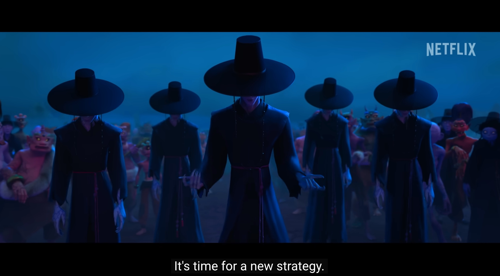

# まえがき
!!! warning "更新中（2026年9月4日）"
    完璧を目指すよりは、適当でもいいから公開して、随時更新をした方がいいと思い、アップロードしています。メモ書きのようなものも混ざっているので、お許しください。
    
    ちなみにこれは、みなさんがこれから書く卒業論文にも当てはまります。「完璧なものに仕上げてから提出しないと…」と思っている時点で、ある程度は出来上がっていると思いますので、まずそれを見てもらいましょう。

大学の教員になり、2026年度で4年目に入ります。人を教えるのが得意ではない私が、ほぼ3年間大学で授業をしてみて感じたのは、以下の点です。

- 授業で繰り返して言っても、なかなか覚えてくれない。
- 締め切りをなかなか守ってくれない。
- なかなかメール（あるいは、それに準ずる連絡手段）を確認してくれない（かといって[電話をするのはお互い嫌](https://ja.wikipedia.org/wiki/%E9%9B%BB%E8%A9%B1%E6%81%90%E6%80%96%E7%97%87)）。

これらの点はもちろん、一部の学生にのみ該当する話です。悩みどころは、「その一部の学生の割合が、思ったよりも高い」という点です。そしてこれは、卒業論文の指導をするときに、以下の問題を引き起こします。

- 研究、論文、アカデミック・ライティングなどについて、授業で繰り返し言っても覚えてもらえないので、まともな卒論が書けない。
- 「いきなり原稿を出されても困るので、下書きを決まった締め切りまでに出せ」と言っても、締め切りを守ってくれないので、まともな卒論が書けない。
- そもそも、連絡をしても確認してくれないので、手の出しようがない。

今のままでは、私自身のやる気がなくなってしまいそうなので、2026年度からは戦略を変えることにしました。

<figure markdown style="text-align: center;">
{: style="width: 100%;"}
<figcaption>図1: <a href="https://youtu.be/AzCAwdp1uIQ?si=zH4M0CeCx7ZfcxUL" target="_blank">新たな戦略で</a></figcaption>
</figure>

# 大前提
「今はAIの時代」と言っても過言ではない。しかも、その発展速度について語るには「日進月歩」が最も最適です。あまりにも速すぎて、最近（2026年）は「ついていけない」としょっちゅう思うようになりました。

ここまでくると、「卒業論文を書くことにはたして意味があるのだろうか」とか、「AIが調査をして、執筆もしてくれて、しかも学部生よりも上手に論文の形にまとめてくれる」とか、「コスパが悪い」とか…

気持ちはわかるけど、そのように言われると、「作曲する意味はあるのか？」「映画を作る必要はあるのか？」「本を書く必要はあるのか？」と聞いてみたくなります。2026年現在、これらはすべてAIが生成できるようになっていて、素人の私よりも上手に曲を作って、映画を生成し、小説も書いてくれます。だけど、作曲について学ぶことは、何の意味もない行為ではない。自分の頭を使って、考えて、調査し、一本の論文としてまとめる行為も、そのような創作行為とそれほど変わらない。

時代は変わりつつあり、これからもっと激しく変わっていくだろうと思います。しかし、そんな中でも、変わっていくことと、変わらないことがあると思います。参考文献リストを作成するときに、初めての人は数時間がかかると思いますが、AIといっしょに作業をすることで、ものの数分で終わる可能性がある。論文の形としてWordを操作するときに、AIの力を借りたり、膨大な量のウェブサイトを調査するためにAIに指示をするなどの行為は、従来はできなかったことだし、これからはそれが普通になるかもしれません。一方、自分自身で自分の専門についての基礎的な知識を調べて吸収し、問題を発見して解決に挑む。いわゆる「考える力」は、昔も、今も、そして（おそらく）これからも必要になる能力だと思います。アカデミックライティングもそのうちの一つです。基本がわからないと、AIの出力が適切なものなのかどうか、評価することすらできない。

この授業では、積極的にAIを活用することを目指します。けれども、昔ながらの方法も尊重し、色々な技法や考え方をカスタマイズして自分のものにする力を養うことも目標とします。